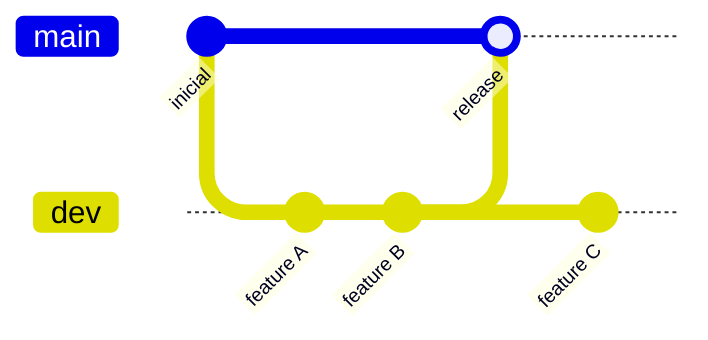

# Guia de contribucion — REV

## Estrategia de ramas

El repositorio usa dos ramas principales:

| Rama | Proposito |
|------|-----------|
| `main` | Codigo estable, listo para demo o entrega. Solo recibe merges desde `dev` cuando una iteracion esta validada. |
| `dev` | Rama de desarrollo activo. Todo el trabajo diario (features, fixes, infra) se hace aqui. |

### Flujo recomendado



1. Clonar el repo y posicionarse en `dev`:
   ```bash
   git checkout dev
   git pull origin dev
   ```
2. Desarrollar y commitear en `dev` con formato atomico (ver abajo).
3. Push a `origin/dev` cuando corresponda.
4. Integrar a `main` solo cuando el equipo valide (merge explicito, no automatico).

### Reglas

- **No commitear directamente en `main`** salvo hotfixes urgentes acordados.
- **No hacer merge a `main`** sin revision previa del estado de `dev`.
- **Push / merge / rebase** hacia remoto: solo cuando el responsable del repo lo indique explicitamente.

## Commits

### Formato

```
[ TIPO ]: Detalles del commit
```

### Tipos

| Tipo | Descripcion |
|------|-------------|
| `FEAT` | Nueva funcionalidad |
| `FIX` | Correccion de error |
| `REFACTOR` | Refactorizacion sin cambio de comportamiento |
| `DOCS` | Solo documentacion |
| `TEST` | Pruebas |
| `INFRA` | Infraestructura (Eureka, Gateway, Docker, CI) |
| `BUILD` | Build, Maven, dependencias |
| `CHORE` | Mantenimiento, config, reglas |

### Atomicidad

Cada commit debe representar **un solo cambio logico**. Ejemplos:

- Bien: `[ INFRA ]: Agregar modulo eureka-server`
- Bien: `[ FEAT ]: Implementar transicion Reportado a En Progreso`
- Mal: Mezclar nuevo MS + refactor del BFF + actualizacion del README

## Estructura del repositorio

Ver [AGENTS.md](../AGENTS.md) y el informe de arquitectura en `docs/`.

## Desarrollo local (resumen)

1. Levantar PostgreSQL y Keycloak (`docker compose up -d`)
2. Arrancar `eureka-server` (8761)
3. Arrancar microservicios y BFF
4. Arrancar `api-gateway` (8080) y frontend (5173)

## Calidad

- Tests en flujos criticos (estados de incidente, fallbacks BFF).
- JaCoCo en modulos con logica de negocio.
- No commitear secretos ni archivos en `.gitignore`.

## Roles Keycloak (dev)

- `Despachador` — acceso al panel y API via gateway
- `Brigadista` — consulta limitada
- `Admin` — administracion
