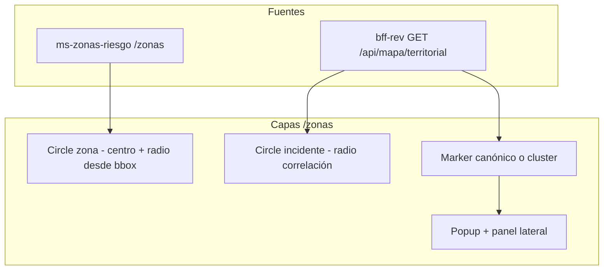

# Estándares GIS y despacho — trazabilidad REV

**Proyecto:** Red de Emergencia Valle (REV) — Municipalidad de Valle del Sol (comuna operativa: **Puente Alto**)  
**Versión:** 1.1 — zonas estratégicas circulares y referencia a incidentes

Este documento relaciona referencias profesionales de emergencias/incendios con decisiones concretas del monorepo REV. Complementa [patrones-y-arquitectura-rev.md](./patrones-y-arquitectura-rev.md) §4.1.1.

---

## Principios de diseño REV

| Capa | Estándar de referencia | Regla en REV |
|------|------------------------|--------------|
| **Detección** | CAD / NG9-1-1 (proximidad + tiempo + naturaleza) | `CorrelacionService`: radio Haversine, ventana temporal, score 0–100 |
| **Decisión** | NIMS / ICS (un incidente operativo) | Operador confirma o descarta en `/incidentes?vista=correlaciones` |
| **Visualización** | Mapas PSAP/CAD (marcadores, buffers, clusters) | Círculos de influencia + clusters en `/zonas`; **no** implica fusión automática |

---

## Matriz estándar → práctica → código REV

| Referencia | Qué recomienda | Implementación REV |
|------------|--------------|-------------------|
| **NENA NG9-1-1 GIS (STA-006)** | Capas GIS para validación de ubicación y mapas de despacho; coordenadas consistentes | WGS84 (`lat`/`lng`), `direccionReferencia`, geocodificación Nominatim en reporte público |
| **FSGDM** (Fire Service GIS Data Model) | Plantillas de mapa orientadas a tareas de bomberos; productos repetibles | Capa territorial unificada (OSM), simbología por nivel de riesgo y estado de incidente |
| **RFP CAD / duplicados** (Colonial Heights, Active911, NowForce) | Radio de búsqueda + ventana temporal; operador fusiona, ignora o crea vinculado | `rev.correlacion.*` en `ms-incidentes`; cola de sugerencias `PENDIENTE` |
| **NIMS / ICS** | Un incidente operativo con reportes asociados | `incidente_canonico_id`, despacho de brigada sobre ID canónico (`OperacionesFacadeService`) |
| **NFPA 1221 / 1710** | Tiempos objetivo de despacho y dotación | Referencia académica; fuera del alcance del mapa |
| **NWCG PMS 936 (GeoOps)** | Simbología y productos GIS en incidentes extensos (wildland) | Referencia secundaria para clustering; REV es contexto municipal urbano |
| **Clustering en mapas operativos** | Agrupar marcadores al alejar zoom; detalle al acercar | `react-leaflet-cluster` en mapa territorial; agrupación lógica por incidente canónico |

---

## Chile — MINVU, CONAF y Puente Alto

| Fuente | Qué establece | Implementación REV |
|--------|---------------|-------------------|
| **MINVU — OGUC art. 2.1.17** | Zonas de riesgo en instrumentos de planificación territorial | REV usa **zonas operativas de respuesta** (círculos), no sustituye el PRC legal |
| **MINVU — Circular DDU 269** | Incorporar riesgo de incendio en PRC / PRI | `nivelRiesgo` HIGH en sectores de interfaz (Cordillera Oriente, laderas) |
| **MINVU — [IPT](https://instrumentosdeplanificacion.minvu.cl/)** | PRC y delimitación comunal | Contexto académico; comuna demo = Puente Alto |
| **CONAF / interfaz urbano-forestal** | Prevención en zona de contacto bosque–ciudad | Zonas `ESTRATEGICA` con radio acotado en interfaz |
| **CIGIDEN / SERNAFOR (policy)** | Gestión prospectiva del riesgo | Snapshot `zona_id` + `zona_nombre` en cada incidente georreferenciado |

### Regla de asignación REV (zonas estratégicas)

1. Zona activa = círculo (`centerLat`, `centerLng`, `radioMetros`, `nivelRiesgo`).
2. Punto dentro si distancia Haversine ≤ `radioMetros`.
3. Si varias zonas contienen el punto: gana la de **menor radio**; empate por **mayor severidad** (HIGH > MEDIUM > LOW).
4. **Persistencia:** `incidentes.zona_id` + snapshot al crear/actualizar ubicación; **recálculo** vía `POST /api/incidentes/recalcular-zonas` o tras editar zonas.
5. **Baja lógica:** `DELETE /zonas/{id}` desactiva (`activa=false`), no borra histórico.

---

## Modelo visual del mapa territorial

- **Zona:** círculo nativo en BD (`center_lat`, `center_lng`, `radio_metros`); sectores Puente Alto gestionables en `/zonas` → Administración.
- **Incidente:** punto + **círculo de influencia** (`radioCorrelacionMetros`, default 500 m, alineado a `rev.correlacion.default-radio-metros`).
- **Conjunto confirmado:** un marcador por grupo canónico con badge de reportes vinculados.
- **Sugerencias pendientes:** badge y enlace a correlaciones; sin merge automático.

---

## Parámetros configurables

| Parámetro | Ubicación | Default |
|-----------|-----------|---------|
| `rev.correlacion.umbral-score` | `ms-incidentes` | 60 |
| `rev.correlacion.default-radio-metros` | `ms-incidentes` | 500 |
| `rev.correlacion.default-ventana-minutos` | `ms-incidentes` | 90 |
| `rev.mapa.radio-correlacion-metros` | `bff-rev` | 500 (visualización mapa) |

---

## API de mapa

| Método | Ruta | Descripción |
|--------|------|-------------|
| GET | `/api/mapa/territorial` | Zonas con buffer, puntos de incidente agrupables, radio de correlación |
| GET | `/api/zonas` | Listado de zonas activas |
| POST/PUT/DELETE | `/api/zonas` | CRUD (baja lógica en DELETE) |
| GET | `/zonas/resolver` (MS) | Resuelve zona para `lat`/`lng` |
| POST | `/api/incidentes/recalcular-zonas` | Recalcula snapshot de zona en incidentes con GPS |

---

## Demostración EVA2

1. Dos reportes públicos cercanos (&lt;400 m): dos círculos o cluster; sugerencia en correlaciones.
2. Confirmar correlación: un marcador con contador de reportes vinculados.
3. Desde tarjeta de incidente: **Ver en mapa** → `/zonas?incidente={id}` centra y abre detalle.
4. Zona HIGH: buffer visible; popup del incidente muestra nivel de riesgo de la zona.

---

## Referencias externas

- NENA NG9-1-1 GIS Data Model (STA-006)
- NAPSG Foundation — Fire Service GIS Data Model (FSGDM) Implementation Guide
- NWCG PMS 936 — Standards for Geospatial Operations
- NFPA 1221, 1710 — communications and staffing (contexto)
- Documentación de duplicados CAD (Active911, NowForce, RFP municipales)

---

*Documento REV — DSY1106 Duoc UC.*
