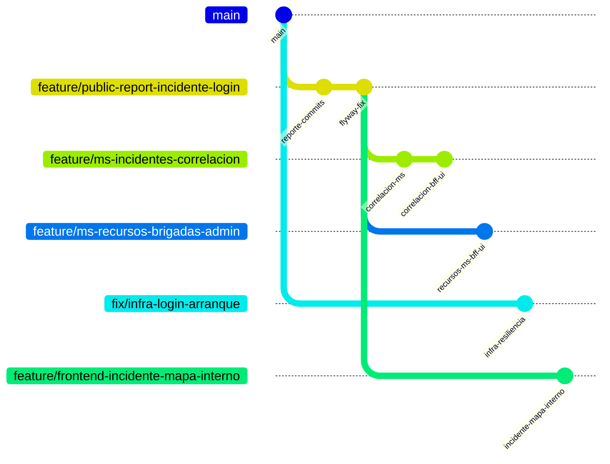

# Estrategia de ramas y commits — avances REV (EVA2)

Ramas cortas desde bases estables; commits con formato `[ TIPO ]: Detalle`.

## Mapa de ramas



| Rama | Base recomendada | Alcance |
|------|------------------|---------|
| `feature/public-report-incidente-login` | `main` / ya existente | Reporte público + fix Flyway V3/V4 |
| `feature/ms-incidentes-correlacion` | tip de reporte público | V5, motor, BFF, UI en módulo Incidentes |
| `feature/ms-recursos-brigadas-admin` | `main` o tip reporte | Brigadistas, composición, despacho, admin UI |
| `fix/infra-login-arranque` | `main` | Gateway, Keycloak adapter, BFF 503, retry login |
| `feature/frontend-incidente-mapa-interno` | tip reporte público | Formulario interno con mapa |

## Orden de commits (historial lineal antes de cherry-pick)

1. `[ INFRA ]`: Alinear puertos 15xxx/18xxx en Docker, scripts y properties`
2. `[ FIX ]: Renumerar Flyway reporte publico y corregir hash adjuntos en ms-incidentes`
3. `[ FEAT ]: Implementar motor y API de correlacion de incidentes en ms-incidentes`
4. `[ TEST ]: Agregar pruebas unitarias de correlacion en ms-incidentes`
5. `[ FEAT ]: Exponer correlacion y enriquecer dashboard en bff-rev`
6. `[ FEAT ]: Agregar brigadistas, composicion de brigada y despacho en ms-recursos`
7. `[ FEAT ]: Agregar API de administracion de recursos en bff-rev`
8. `[ FIX ]: Mejorar resiliencia de arranque en gateway, BFF y keycloak-adapter`
9. `[ FIX ]: Agregar reintentos API, BackendReadyGate y mensajes de login en frontend`
10. `[ FEAT ]: Integrar correlaciones en modulo Incidentes del dashboard`
11. `[ FEAT ]: Agregar administracion de recursos y despacho de brigada en UI`
12. `[ FEAT ]: Agregar formulario interno de incidente con mapa y direccion`
13. `[ DOCS ]: Documentar correlacion, troubleshooting login y guia local`

## Integración

El mantenedor hace merge manual a `dev` / `main` en este orden:

1. `fix/infra-login-arranque`
2. `feature/public-report-incidente-login` (si no está ya)
3. `feature/ms-incidentes-correlacion`
4. `feature/ms-recursos-brigadas-admin`
5. `feature/frontend-incidente-mapa-interno`

## Comandos útiles

```powershell
# Ver commits de una rama respecto a main
git log main..feature/ms-incidentes-correlacion --oneline

# Crear rama temática desde un commit base
git checkout -b feature/ms-incidentes-correlacion eaa56f9
git cherry-pick <hash>..<hash>
```

No se hace `git push` salvo solicitud explícita.
