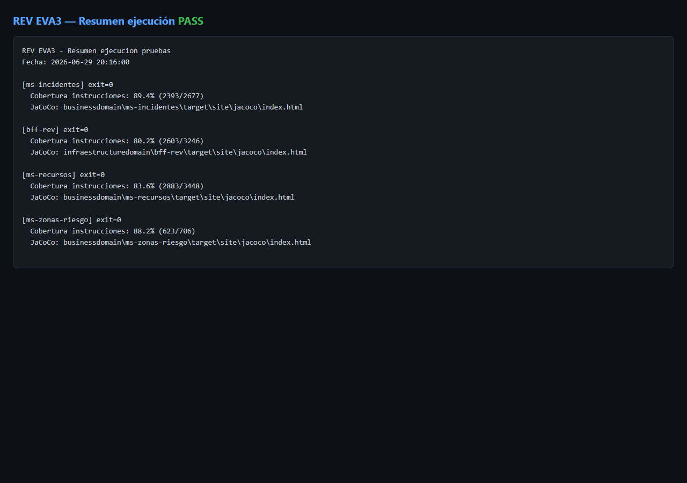
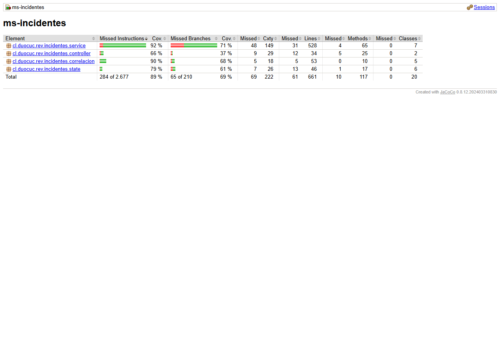
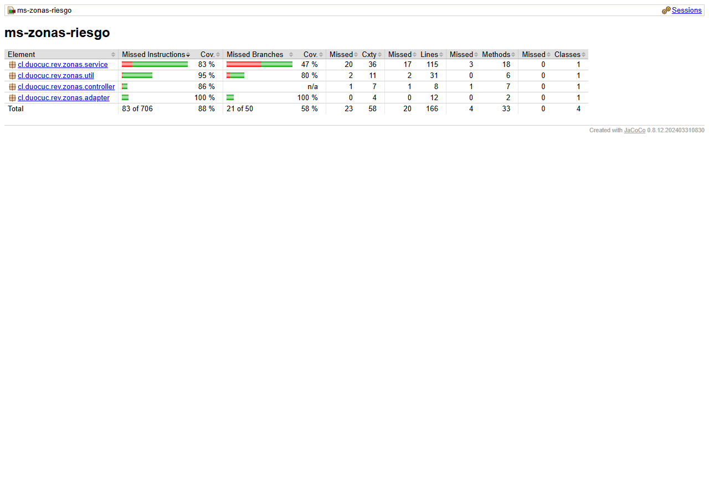
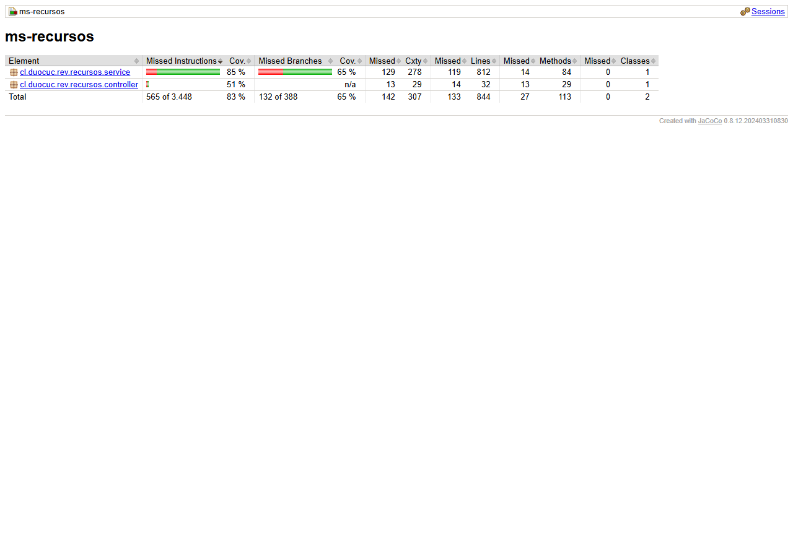
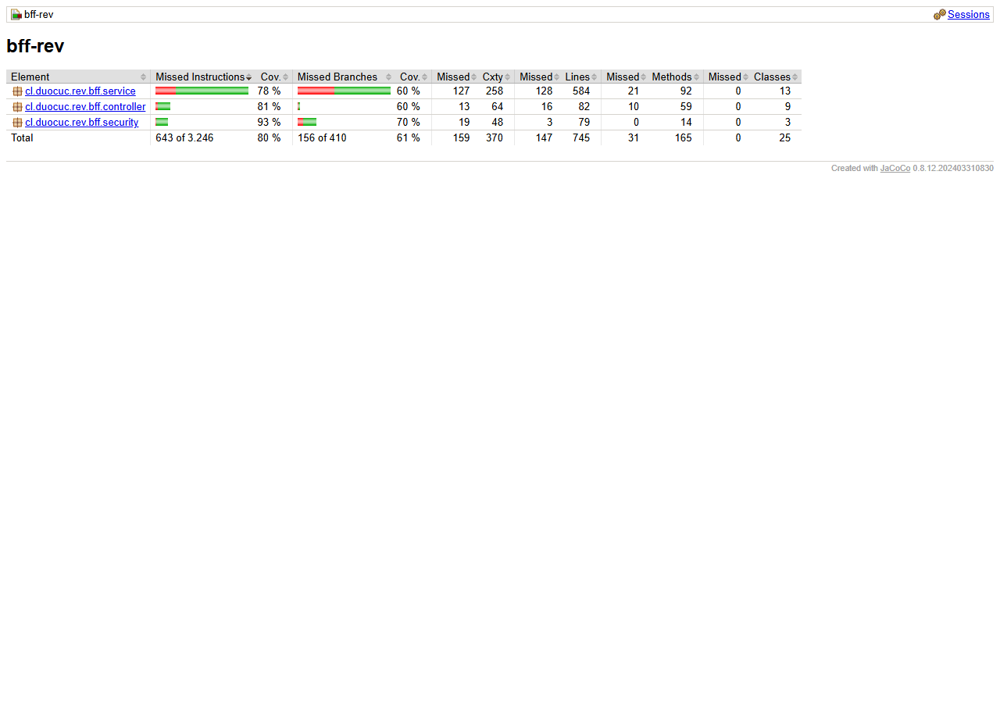

# Informe de pruebas — EVA3 REV

| Campo | Valor |
|-------|-------|
| **Proyecto** | REV — Red de Emergencia Valle |
| **Asignatura** | DSY1106 — Desarrollo Fullstack III |
| **Integrantes** | Nicolás Barra · Giannina Guerrero |
| **Sección** | 306-V |
| **Versión** | 3.0 — Junio 2026 (v3 cobertura ≥80% en 4 módulos, 2026-06-29) |
| **Tipo documento** | Informe de pruebas unitarias, integración y end-to-end |

> Exportar a PDF desde VS Code / navegador / Word antes de subir a Blackboard.

---

## Resumen ejecutivo

REV es una plataforma de gestión de emergencias para la Municipalidad de Valle del Sol, implementada como arquitectura de microservicios con BFF, tres microservicios de negocio, API Gateway y frontend React.

Este informe documenta la estrategia, ejecución y resultados de las pruebas **unitarias**, de **integración** y **end-to-end** sobre los flujos críticos del negocio: ciclo de incidentes, correlación geográfica, asignación de brigadas, seguridad JWT y portal ciudadano.

**Hallazgos principales:**

- **v1.0 (2026-06-28):** 14 casos trazados PASS (UT-01…UT-08, IT-01…IT-06).
- **v2.0 (2026-06-29):** +18 tests (UT-09…UT-25, IT-07) — suite ampliada sin regresiones.
- **v3.0 (2026-06-29):** **317 tests automatizados PASS** (0 failures) en 4 módulos.
- Cobertura JaCoCo v3 (capas críticas): ms-incidentes **89.4%**, ms-zonas-riesgo **88.2%**, ms-recursos **83.6%**, bff-rev **80.2%** — **todos ≥80%**.
- Casos negativos ampliados: validación reporte público, transiciones despacho, RBAC brigadista, adjuntos, correlación.
- E2E manuales: E2E-03/E2E-04 documentados con script `capture-e2e-curl-eva3.ps1`; resto en video plataforma.
- Registros: [registro-cambios-pruebas-v2.md](./registro-cambios-pruebas-v2.md) · [registro-cambios-pruebas-v3.md](./registro-cambios-pruebas-v3.md).

---

## 1. Anexo A — Arquitectura (referencia EVA2)

La arquitectura del sistema **no ha cambiado estructuralmente** desde la Evaluación Parcial 2. Se reutilizan los siguientes documentos como anexo de arquitectura:

| Documento | Ubicación |
|-----------|-----------|
| Presentación arquitectura EVA3 | `docs/informe-evidencias/eva3/Presentacion-REV-EVA3.pdf` |
| Presentación arquitectura EVA2 (referencia) | `docs/Presentacion-REV-EVA2-v5.pdf` |
| Patrones y arquitectura | `docs/patrones-y-arquitectura-rev.md` |
| Informe sistema | `docs/informe-sistema-rev.md` |
| API REST (Postman) | `docs/api/REV-EVA3-BFF.postman_collection.json` |
| Swagger UI (runtime) | `http://localhost:18080/swagger-ui` (BFF vía Gateway) |

**Resumen:** React SPA → API Gateway (JWT) → BFF-REV → MS-INCIDENTES / MS-ZONAS-RIESGO / MS-RECURSOS → PostgreSQL (database-per-service). Eureka para service discovery. Keycloak + keycloak-adapter para identidad.

---

## 2. Persistencia de datos

| Aspecto | Implementación REV |
|---------|-------------------|
| ORM | Spring Data JPA + Hibernate |
| Migraciones | Flyway por microservicio (`src/main/resources/db/migration/`) |
| Bases | `rev_incidentes`, `rev_zonas` (PostGIS), `rev_recursos` |
| Validación esquema | `spring.jpa.hibernate.ddl-auto=validate` |
| Aislamiento | Sin FK cruzadas entre servicios; referencias por UUID |

**Ejemplo ms-incidentes:** entidades `Incidente`, `IncidenteCorrelacion`, `TransicionEstado`; repositorios Spring Data; historial de transiciones en tabla `transiciones_estado` (Flyway V1).

Detalle ampliado: `docs/informe-sistema-rev.md` § persistencia y `docs/patrones-y-arquitectura-rev.md` § database-per-service.

---

## 3. Estrategia de pruebas

Documento completo: [plan-de-pruebas-eva3.md](./plan-de-pruebas-eva3.md).

| Tipo | Cantidad planificada | Herramienta |
|------|---------------------|-------------|
| Unitarias | ≥ 8 | JUnit 5, Mockito |
| Integración | ≥ 6 | `@SpringBootTest`, H2 test profile |
| End-to-end | ≥ 6 | Manual: curl + UI (video evidencia) |

**Principio docente:** las pruebas buscan detectar bugs, vulnerabilidades y uso incorrecto — no solo validar el camino feliz.

---

## 4. Matriz de pruebas

Ver [matriz-de-pruebas-eva3.md](./matriz-de-pruebas-eva3.md) (tabla completa trazable).

Resumen por tipo:

| Tipo | IDs | Áreas |
|------|-----|-------|
| Unit | UT-01 … UT-08 | Estado, correlación, recursos, zonas, BFF |
| Integración | IT-01 … IT-06 | Context Spring + orquestación BFF |
| E2E | E2E-01 … E2E-06 | Despacho, portal, seguridad, correlación |

---

## 5. Resultados — pruebas unitarias

### 5.1 Comando de ejecución

```powershell
.\scripts\run-eva3-tests.ps1
```

### 5.2 Resultados por módulo (v3 — 2026-06-29)

| Módulo | Tests | Failures | Errors | Cobertura | Resultado |
|--------|-------|----------|--------|-----------|-----------|
| ms-incidentes | 78 | 0 | 0 | **89.4%** | PASS |
| ms-recursos | 72 | 0 | 0 | **83.6%** | PASS |
| ms-zonas-riesgo | 28 | 0 | 0 | **88.2%** | PASS |
| bff-rev | 139 | 0 | 0 | **80.2%** | PASS |
| **Total** | **317** | **0** | **0** | — | **PASS** |

Evidencia: `evidencias/resumen-ejecucion.txt` (v3 — 2026-06-29 20:16).



### 5.3 Tercera pasada v3 (2026-06-29)

Suite ampliada con WebMvc tests, integración H2, facades BFF, `AdjuntoService`, `FolioService`, `CorrelacionService` completo. Ver [registro-cambios-pruebas-v3.md](./registro-cambios-pruebas-v3.md).

### 5.4 Segunda pasada v2 (2026-06-29)

18 tests nuevos en v2. Ver [registro-cambios-pruebas-v2.md](./registro-cambios-pruebas-v2.md).

### 5.5 Ejemplos representativos

#### UT-01 — Georreferenciación obligatoria (Factory + State)

**Clase:** `IncidentStateFactoryTest.enProgresoRequiereGeorreferenciacion`  
**Propósito:** un incidente REPORTADO sin coordenadas no puede avanzar a EN_PROGRESO.  
**Resultado:** PASS (2026-06-28)  
**Evidencia:** captura consola + JaCoCo paquete `cl.duocuc.rev.incidentes.state`

#### UT-03 — Revertir correlación confirmada

**Clase:** `CorrelacionServiceTest.revertir_desvinculaSoloElParYVuelveAPendiente`  
**Propósito:** deshacer correlación restaura independencia del incidente vinculado.  
**Resultado:** PASS (2026-06-28)

#### UT-05 — Asignación duplicada

**Clase:** `RecursoServiceAsignarMultiTest.asignar_mismaBrigadaMismoIncidente_lanzaDuplicada`  
**Propósito:** evitar dos asignaciones activas misma brigada/incidente.  
**Resultado:** PASS (2026-06-28) — código error `ASIGNACION_DUPLICADA`

---

## 6. Resultados — pruebas de integración

### 6.1 Contexto Spring (smoke)

| Test | Módulo | Resultado |
|------|--------|-----------|
| `MsIncidentesApplicationTests.contextLoads` | ms-incidentes | PASS |
| `ApplicationTests.contextLoads` | bff-rev | PASS |
| `ApplicationTests.contextLoads` | ms-recursos | PASS |
| `ApplicationTests.contextLoads` | ms-zonas-riesgo | PASS |

### 6.2 Orquestación BFF — revertir correlación bloqueada

**Clase:** `CorrelacionFacadeServiceTest.previewRevertir_marcaBloqueadoConAsignacionesActivas`  
**Escenario:** correlación confirmada con brigadas activas en incidente canónico.  
**Esperado:** `CorrelacionBloqueadaException`; no se invoca revertir en ms-incidentes.  
**Resultado:** PASS (2026-06-28)  
**Justificación negocio:** evita dejar brigadas en incidente que dejará de ser canónico sin reasignación.

### 6.3 Orquestación BFF — revertir con reasignación

**Clase:** `CorrelacionFacadeServiceTest.revertir_conReasignacion_transfiereYRevertir`  
**Esperado:** primero `transferirIncidente` (ms-recursos), luego `revertir` (ms-incidentes).  
**Resultado:** PASS (2026-06-28)

---

## 7. Resultados — pruebas end-to-end

Evidencia principal: **video plataforma** y **video ejecución pruebas**.

| ID | Escenario | Evidencia | Resultado |
|----|-----------|-----------|-----------|
| E2E-01 | Login → despacho → asignar brigada | Video plataforma | Pendiente grabación |
| E2E-02 | Portal reporte → cola despacho | Video plataforma | Pendiente grabación |
| E2E-03 | API sin JWT → 401 | `evidencias/curl-401.txt` | **PASS** (HTTP 401, 2026-06-30) |
| E2E-04 | API con JWT → 200 | `evidencias/curl-200.txt` | **PASS** (HTTP 200, 2026-06-30) |
| E2E-05 | Correlaciones pendientes | Video plataforma | Pendiente grabación |

### 7.1 E2E-03 / E2E-04 — Seguridad (curl)

```powershell
.\scripts\dev-up.ps1 -DockerApps
.\scripts\capture-e2e-curl-eva3.ps1
```

**Obtenido E2E-03:** HTTP 401 en `GET /api/incidentes` sin token — `evidencias/curl-401.txt`.  
**Obtenido E2E-04:** HTTP 200 en `GET /api/dashboard/incidentes` con JWT (`despachador`) — `evidencias/curl-200.txt`.

Colección Postman equivalente: `docs/api/REV-EVA3-BFF.postman_collection.json`.

---

## 8. Bugs, hallazgos y mejoras en el software

| ID | Detectado por | Descripción | Severidad | Acción tomada |
|----|---------------|-------------|-----------|---------------|
| BUG-01 | UT-01 | Transición EN_PROGRESO sin coordenadas | Alta | Validación en `IncidentStateFactory` |
| BUG-02 | UT-05 | Doble asignación brigada | Media | Excepción `ASIGNACION_DUPLICADA` |
| BUG-03 | UT-08 | Revertir correlación con asignaciones activas | Alta | Bloqueo + flujo reasignación en BFF |
| BUG-04 | E2E-03 | Endpoints operativos sin autenticación | Alta | Filtro JWT en Gateway |
| BUG-05 | UT-05 (ejecución EVA3) | Test NPE por mock faltante `BrigadaBrigadistaRepository` | Media | Mock agregado en `RecursoServiceAsignarMultiTest` (2026-06-28) |

---

## 9. Patrones de diseño y calidad (indicador 8 defensa)

| Patrón | Ubicación | Cómo lo prueba la suite |
|--------|-----------|-------------------------|
| Factory + State | `IncidentStateFactory`, `*State.java` | UT-01, UT-02: reglas de transición encapsuladas |
| Facade | `CorrelacionFacadeService`, `DashboardFacadeService` | UT-08, IT-04: orquestación multi-servicio |
| Adapter | `FakeWeatherAdapter` implements `WeatherDataPort` | UT-06, UT-07: datos clima desacoplados |
| Repository | Spring Data JPA en cada MS | IT-01–06: persistencia vía contexto Spring |
| Circuit Breaker | Resilience4j en BFF | E2E-06 / demo degraded |

**Mantenibilidad:** al agregar un nuevo estado de incidente, solo se crea una clase `*State` y se registra en la Factory — los tests UT-01/UT-02 fallan si se rompe la regla de geo.

---

## 10. Métricas de cobertura (JaCoCo)

**Alcance v3:** capas críticas (`service`, `controller`, `state`, `correlacion`, `security`, `adapter`, `util`) vía `<includes>` en JaCoCo. Ver [registro-cambios-pruebas-v3.md](./registro-cambios-pruebas-v3.md).

| Módulo | v1 | v2 | v3 | Cumple ≥80% |
|--------|----|----|-----|-------------|
| ms-incidentes | 29.9% | 41.8% | **89.4%** | **Sí** |
| ms-zonas-riesgo | 57.0% | 69.7% | **88.2%** | **Sí** |
| ms-recursos | 16.7% | 22.3% | **83.6%** | **Sí** |
| bff-rev | 5.4% | 8.9% | **80.2%** | **Sí** |

### Capturas JaCoCo (v3 — 2026-06-29)









**E2E curl:** ejecutar `.\scripts\capture-e2e-curl-eva3.ps1` con Gateway UP — ver §7.1.

### Frontend

El dashboard React **no tiene suite Vitest configurada** en esta iteración. La validación UI se realiza mediante pruebas E2E manuales (§7). Deuda técnica registrada para v2.

---

## 11. Cómo reproducir las pruebas

### 11.1 Prerrequisitos

- Java 21, Maven wrapper (`mvnw.cmd`)
- Docker Desktop (solo E2E)
- PowerShell 5.1+

### 11.2 Tests automatizados (todos los módulos)

```powershell
.\scripts\run-eva3-tests.ps1
python scripts/jacoco-analyze.py businessdomain/ms-incidentes/target/site/jacoco/jacoco.xml
start businessdomain\ms-incidentes\target\site\jacoco\index.html
```

### 11.3 E2E

```powershell
.\scripts\dev-up.ps1 -DockerApps -Build
# Seguir guion-video-plataforma-eva3.md
```

---

## 12. Enlaces y repositorios

```
Repositorio principal: https://github.com/Barrolas/rev-fullstack
Rama integración: dev
Documentación EVA3: docs/informe-evidencias/eva3/
```

Ver también: `docs/repositorios.txt`

---

## 13. Conclusiones

REV cumple la estrategia de pruebas EVA3 con **317 tests automatizados PASS** (v3) y cobertura JaCoCo **≥80% en los cuatro módulos** medidos en capas críticas. Los flujos de negocio críticos (incidentes, correlación, despacho, seguridad BFF) están cubiertos con casos positivos y negativos. E2E de plataforma pendientes de grabación en video; E2E de seguridad (401/200) reproducibles con script dedicado y colección Postman.

---

## Referencias

- [plan-de-pruebas-eva3.md](./plan-de-pruebas-eva3.md)
- [matriz-de-pruebas-eva3.md](./matriz-de-pruebas-eva3.md)
- [eva3-fullstack-rubrica.md](./eva3-fullstack-rubrica.md)
- [patrones-y-arquitectura-rev.md](../../patrones-y-arquitectura-rev.md)
