# Guion de video — Tour híbrido REV (demo en vivo + módulos)

Manual operativo de principio a fin para grabar un recorrido por pantalla con narración en voz alta.

| Campo | Valor |
|-------|-------|
| **Proyecto** | REV — Red de Emergencia Valle |
| **Lema** | *Conectividad que salva vidas* |
| **Formato** | Grabación de pantalla + voz en off |
| **Duración objetivo** | 6:30 ± 30 s (versión híbrida con ingreso operador + reporte en vivo) |
| **Enfoque** | **Inicio operador** (login → mapa → detalle) + datos precargados + **reporte en vivo** (portal → despacho) + módulos + Spring Boot Admin |
| **Incidente guía (mapa + detalle)** | *Humo cordillera — contexto demo REV* (folio asignado tras §3.2) |
| **URL base** | http://localhost:15173 · http://localhost:18099 (SBA) |
| **Usuarios** | Portal sin login · Despacho: `despachador` / `rev123` |

> **Grabación asistida:** durante la grabación puedes avanzar bloque a bloque con el asistente IA; responde **«listo»** al terminar cada paso.

> **Modelo v1 vs v2:** hoy cada reporte ciudadano crea un **incidente** en cola. La separación reportes/incidentes está planificada para v2 — ver [plan-reportes-vs-incidentes-v2.md](../plan-reportes-vs-incidentes-v2.md) (no implementar ahora).

---

## 1. Resumen del recorrido

### 1.1 Estrategia híbrida: qué va precargado y qué va en vivo

| Capacidad | Precargado (antes de grabar) | En vivo (durante la grabación) |
|-----------|------------------------------|--------------------------------|
| Primera impresión operador | KPIs + listado en `/inicio` | **Login** `despachador` → bienvenida |
| Ubicar incidente en mapa | Incidente A (`01004`) en panel principal | Clic botón **Ubicar en mapa** (icono pin) |
| Detalle de incidente | Datos de A precargados | Entrar a **Detalle** del mismo incidente |
| Reporte ciudadano → sistema | 2 reportes portal + 1 correlación | **1 reporte nuevo** desde `/portal` → aparece en despacho |
| Cola y activos de despacho | Incidente A (`01004`) en cola | **Asignar en vivo** `MUN-REFUERZO` al `01004` → ver en Activos |
| Asignar brigada | `MUN-REFUERZO` disponible | **Confirmar despacho** en grabación (bloque 3) |
| Nuevo incidente (operador) | — | Abrir modal **Nuevo incidente** 5 s (sin enviar) |
| Correlaciones geo | 1 sugerencia pendiente (2 reportes cercanos) | Pestaña **Correlaciones**: Pendientes + mención Confirmadas/Descartadas |
| Zonas de riesgo | 6 zonas seed | Mapa + pestaña **Administración** 10 s (formulario crear zona) |
| Brigadas / dotación | `MUN-RAPIDA` + `MUN-REFUERZO` | Inventario + pestaña **Administración** 10 s |
| Spring Boot Admin | Apps UP | Pared de aplicaciones |

**No hacer en vivo** (muy largo / frágil): crear brigada completa, wizard de dotación, CRUD completo de zona, asignación + cierre de incidente.

```mermaid
flowchart LR
  login["Login + Inicio 0:40"] --> mapa["Mapa + Detalle 0:40"]
  mapa --> despacho["Despacho 1:10"]
  despacho --> portal["Portal LIVE 0:45"]
  portal --> cola["Cola nuevo reporte 0:20"]
  cola --> incidentes["Incidentes 0:45"]
  incidentes --> zonas["Zonas 0:45"]
  zonas --> recursos["Recursos 0:40"]
  recursos --> sba["SBA 0:25"]
  sba --> cierre["Cierre 0:25"]
```



| Bloque | Tiempo | Ruta / URL |
|--------|--------|------------|
| Login + Inicio | 0:00 – 0:40 | `/login` → `/inicio` |
| Ubicar en mapa + Detalle | 0:40 – 1:20 | `/inicio` → `/incidentes/{id}` (incidente **A** `01004`) |
| Despacho operativo | 1:20 – 2:30 | `/despacho/operacion` |
| Portal — reporte en vivo | 2:30 – 3:15 | `/portal` → `#reportar` (ventana incógnito) |
| Despacho — reporte nuevo | 3:15 – 3:35 | `/despacho/operacion` (cola con reporte D) |
| Incidentes + correlaciones | 3:35 – 4:20 | `/incidentes` |
| Zonas de riesgo | 4:20 – 5:05 | `/zonas` |
| Recursos | 5:05 – 5:45 | `/recursos` |
| Spring Boot Admin | 5:45 – 6:10 | http://localhost:18099 |
| Cierre | 6:10 – 6:35 | `/inicio` + mención v2 |

**Duración total orientativa:** 6:00–7:00 según ritmo y si abres modales admin.

---

## 2. Fase A — Preparación técnica (1–2 días antes)

### 2.1 Requisitos

| Requisito | Notas |
|-----------|--------|
| Docker Desktop | Infra + backend en contenedores |
| Java 21 | Compilación de JARs (`mvnw.cmd`) |
| Node.js + npm | Frontend en `frontend/rev-dashboard` |
| PowerShell 5.1+ | Scripts en `scripts/*.ps1` |

Detalle completo: [guia-entorno-local.md](../guia-entorno-local.md).

### 2.2 Arrancar el stack

Desde la raíz del repositorio:

```powershell
.\scripts\dev-up.ps1 -DockerApps -Build
```

Este comando compila los JARs, levanta PostgreSQL, Keycloak, Eureka, Gateway, BFF y microservicios, y arranca Vite en el frontend.

### 2.3 Verificación de salud

Comprobar cada punto antes de preparar datos o grabar:

| Verificación | Cómo comprobarlo | Resultado esperado |
|--------------|------------------|-------------------|
| Frontend | Abrir http://localhost:15173 | Carga portal o login sin error |
| Login | Usuario `despachador`, clave `rev123` | Redirige a `/inicio` |
| API Gateway | http://localhost:18080 | Responde (no 502) |
| Eureka | http://localhost:18761 | `BFF-REV`, `MS-INCIDENTES`, `MS-ZONAS-RIESGO`, `MS-RECURSOS`, `KEYCLOAK-ADAPTER`, `SPRING-BOOT-ADMIN` en estado **UP** |
| Spring Boot Admin | http://localhost:18099 | Panel con aplicaciones registradas en Eureka (todas **UP**) |
| Login backend | Ver comando curl abajo | HTTP 200 |

```powershell
curl.exe -s -w "\nHTTP:%{http_code}" -X POST "http://localhost:18080/auth/login" -H "Content-Type: application/x-www-form-urlencoded" -d "username=despachador&password=rev123"
```

| Código | Significado |
|--------|-------------|
| **200** | Login OK |
| **401** | Usuario o clave incorrectos |
| **503** | Gateway sin `KEYCLOAK-ADAPTER` en Eureka — ejecutar `.\scripts\dev-up.ps1 -DockerApps -Build` |

### 2.4 URLs de referencia

| Servicio | URL |
|----------|-----|
| Frontend | http://localhost:15173 |
| Portal público | http://localhost:15173/portal |
| Despacho operativo | http://localhost:15173/despacho/operacion |
| API Gateway | http://localhost:18080 |
| Eureka | http://localhost:18761 |
| Spring Boot Admin | http://localhost:18099 |
| Keycloak Admin | http://localhost:18090 (`admin` / `admin`) |

---

## 3. Fase B — Preparación de datos demo (30 min antes de grabar)

> **Importante:** el reset deja **0 incidentes**. Precarga **contexto** (cola, activos, correlaciones); deja **un reporte en vivo** para la grabación (ver §3.2).

### 3.0 Protocolo «desde cero» (recomendado si hubo pruebas previas)

Usar siempre que quieras **una sola línea de diseño** en pantalla (sin folios viejos, correlaciones a medias ni JARs desactualizados).

| Paso | Comando / acción |
|------|------------------|
| 1 | Cerrar sesión REV y ventanas incógnito del portal |
| 2 | `.\scripts\reset-operacion-despacho.ps1 -ResetVolumes` (borra BD + recompila JARs + levanta stack) |
| 3 | Esperar ~2 min; verificar http://localhost:18761 (Eureka **UP**) y login despachador |
| 4 | Confirmar **0 incidentes** en `/incidentes` y cola vacía en `/despacho/operacion` |
| 5 | Sembrar **solo** A, B, C (§3.2) — mismo orden, mismas descripciones |
| 6 | Pre-asignar B (§3.3) — **no** confirmar correlaciones ni despachar A antes de grabar |
| 7 | Anotar folios reales que asignó el sistema (no usar UUIDs de ensayos viejos) |

**No mezclar** datos de sesiones anteriores con esta grabación. Si algo se ve distinto al guion, volver al paso 2.

### 3.1 Resetear entorno operativo

Desde la raíz del repositorio:

```powershell
# Primera vez o grabación limpia (recomendado):
.\scripts\reset-operacion-despacho.ps1 -ResetVolumes

# Solo si acabas de compilar y solo quieres vaciar incidentes sin tocar volúmenes:
.\scripts\reset-operacion-despacho.ps1 -Rebuild
```

**Estado esperado tras el reset:**

| Recurso | Estado esperado |
|---------|-----------------|
| Incidentes | Ninguno en `/incidentes` ni en cola de `/despacho/operacion` |
| Zonas | 6 zonas en Puente Alto (ver tabla abajo) |
| Brigadas | `MUN-RAPIDA` y `MUN-REFUERZO` listas para despacho |

**Zonas estratégicas (seed Flyway):**

| Zona | Nivel de riesgo |
|------|-----------------|
| Centro Puente Alto | MEDIUM |
| Alto Jahuel | HIGH |
| Bajos de Mena | MEDIUM |
| Cordillera Oriente | HIGH |
| Industrial Los Libertadores | LOW |
| Villa San José | MEDIUM |

### 3.2 Sembrar datos de contexto vía portal (fuera de cámara)

Usar ventana de incógnito en http://localhost:15173/portal → **Reportar**.

**Reporte A — cola (Cerro La Ballena)**

| Campo | Valor |
|-------|-------|
| Tipo | Forestal / vegetación |
| Descripción | `Humo cordillera — contexto demo REV` |
| **Buscar dirección** | `Cerro La Ballena` |
| Dirección de referencia | Parque Natural Cerro La Ballena, Puente Alto |
| Coordenadas (clic mapa) | lat **-33.602**, lng **-70.555** |
| Zona REV | Centro Puente Alto / cordillera oriente (cercano a zonas MEDIUM–HIGH) |

**Reporte B — para pre-asignar después**

| Campo | Valor |
|-------|-------|
| Tipo | Urbano / basura / pastizal |
| Descripción | `Humo residencial — contexto demo REV` |
| Ubicación | Cerca de **Centro Puente Alto** |

**Reporte C — correlaciones (~300 m del A, mismo sector Cerro La Ballena)**

| Campo | Valor |
|-------|-------|
| Tipo | Forestal / vegetación |
| Descripción | `Segundo aviso mismo sector — correlación REV` |
| **Buscar dirección** | `Pasaje Cerro La Ballena` (o clic al noreste del parque) |
| Coordenadas (clic mapa) | lat **-33.600**, lng **-70.553** |
| Nota | Debe quedar a ~300 m del Reporte A para disparar correlación |

Tras cada envío: mensaje de éxito con folio.

### 3.2b Reporte en vivo (reservado para la grabación)

**No enviar antes de grabar.** Tener estos datos listos en una nota:

| Campo | Valor para el video |
|-------|---------------------|
| Tipo | Forestal / vegetación |
| Descripción | `Alerta ciudadana en vivo — demo REV [tu nombre]` |
| Ubicación | **Bajos de Mena** o zona distinta a A/B para que se distinga en cola |

Este reporte es el **momento estrella**: portal → login despacho → aparece en cola.

### 3.3 Pre-asignar un incidente (fuera de cámara)

Para que la pestaña **Activos en terreno** tenga contenido durante la grabación:

1. Iniciar sesión como `despachador` / `rev123`.
2. Ir a **Despacho** → pestaña **Cola de despacho**.
3. Clic en el **Reporte B** (*Humo residencial — contexto demo REV*). Dejar A y C en cola.
4. Marcar brigada **MUN-RAPIDA** (checkbox o tarjeta) → barra de acciones → **Despacho rápido** → confirmar.
5. Verificar en pestaña **Activos en terreno** que aparece 1 registro.
6. Ir a **Recursos** y confirmar: `MUN-RAPIDA` = ASIGNADA, `MUN-REFUERZO` = DISPONIBLE.

### 3.4 Checklist de verificación final (datos)

Marcar todo antes de grabar:

- [ ] Stack levantado (`dev-up.ps1 -DockerApps` sin errores)
- [ ] Login `despachador` funciona
- [ ] `/inicio`: KPIs con total ≥ 3 (sin el reporte en vivo aún)
- [ ] `/despacho/operacion` → **Cola de despacho**: ≥ 2 pendientes (A y C; B ya asignado)
- [ ] `/despacho/operacion` → **Activos en terreno**: ≥ 1 asignación
- [ ] `/incidentes`: listado con incidentes en estado REPORTADO (y al menos uno con brigada si aplica)
- [ ] `/incidentes` → pestaña **Correlaciones**: al menos 1 pendiente (Reportes A + C)
- [ ] Reporte en vivo **no enviado** aún (reservado para grabación)
- [ ] `/zonas`: mapa con 6 zonas y marcadores de incidentes
- [ ] `/recursos`: `MUN-RAPIDA` asignada, `MUN-REFUERZO` disponible y lista para despacho
- [ ] Sin spinners eternos ni mensajes de error en pantalla
- [ ] Spring Boot Admin en http://localhost:18099 lista ≥ 5 aplicaciones **UP** (BFF, MS, Gateway, etc.)

---

## 4. Fase C — Preparación de grabación (justo antes)

### 4.1 Entorno de escritorio

- [ ] Cerrar notificaciones de Windows (modo **No molestar**)
- [ ] Cerrar pestañas personales, correo, redes sociales
- [ ] Silenciar Teams, Discord, WhatsApp Desktop
- [ ] Desactivar actualizaciones automáticas si es posible

### 4.2 Navegador

- [ ] **Ventana 1 — normal (grabación principal):** empezar en http://localhost:15173/login (sesión cerrada o cerrar sesión antes)
- [ ] Tras login: quedarse en `/inicio` para bloques 1–2; luego Despacho, Incidentes, etc.
- [ ] **Ventana 2 — incógnito:** http://localhost:15173/portal en `#reportar` (abrir antes del bloque 4; no enviar hasta grabar)
- [ ] **Pestaña extra (opcional):** http://localhost:18099 (Spring Boot Admin)
- [ ] Zoom **100–110 %** · resolución **1920×1080** o **1440×900**
- [ ] Dashboard: sidebar visible; grupos CERRADO colapsados en `/incidentes`
- [ ] SBA: aplicaciones en **UP**
- [ ] Formulario portal en `#reportar` probado una vez antes (mapa responde)

### 4.3 Herramienta de grabación

Cualquiera de estas opciones es válida:

| Herramienta | Atajo / notas |
|-------------|---------------|
| Xbox Game Bar | `Win + G` → Grabar |
| OBS Studio | Escena pantalla completa + micrófono |
| ShareX | Screen recorder |

Configuración recomendada: **1080p**, 30 fps, audio del micrófono activo, cursor visible.

### 4.4 Ensayo

- [ ] Leer el guion completo en voz alta **dos veces** con cronómetro
- [ ] Practirar movimientos de mouse (lentos, sin zigzaguear)
- [ ] Objetivo: terminar entre **5:30 y 6:15**

### 4.5 Qué cortar si te pasas de tiempo

| Prioridad | Recortar |
|-----------|----------|
| 1º | Pestañas Administración en Zonas / Recursos (solo mencionar) |
| 2º | Modal «Nuevo incidente» (solo señalar botón) |
| 3º | Detalle de servicio en Spring Boot Admin |
| 4º | Bloque Cierre / mención v2 |
| **Nunca** | Reporte en vivo portal → cola despacho |

---

## 5. Guion principal — Acción + narración

Ritmo de referencia: ~130 palabras por minuto. Habla claro, sin apresurarte.

---

### Bloque 1 — Login + primera impresión (0:00 – 0:40)

**Ruta:** http://localhost:15173/login → `/inicio`

| Acción en pantalla | Narración (texto literal) |
|--------------------|---------------------------|
| Mostrar pantalla de login REV. Ingresar `despachador` / `rev123`. Clic **Ingresar**. | «Ingresamos al panel operativo de REV — Red de Emergencia Valle — con el rol de despachador municipal.» |
| Pausar en `/inicio`: bienvenida, KPIs (total, activos, alto riesgo, correlaciones). | «El inicio concentra el estado del turno: cuántas emergencias hay, cuáles son prioritarias y si hay sugerencias de correlación.» |
| Señalar sidebar: Inicio, Despacho, Incidentes, Zonas, Recursos. | «Desde el menú lateral se accede a cada módulo del ecosistema — territorio, recursos y despacho en un solo lugar.» |
| Bajar a **Principales incidentes** (listado + mapa lateral). | «Los casos activos más relevantes aparecen de inmediato, ordenados por prioridad operativa.» |

---

### Bloque 2 — Ubicar en mapa + detalle (0:40 – 1:20)

**Ruta:** `/inicio` → **Detalle** del incidente A (buscar descripción *Humo cordillera — contexto demo REV*; el folio lo asigna el sistema tras §3.2)

| Acción en pantalla | Narración (texto literal) |
|--------------------|---------------------------|
| En la fila **FORESTAL** — *Humo cordillera — contexto demo REV*, clic en el botón **Ubicar en mapa** (icono pin / `geo-alt`). | «Cada incidente georreferenciado puede ubicarse en el mapa sin salir del inicio.» |
| Señalar que el mapa resalta el marcador del incidente seleccionado. | «El operador ve de un vistazo dónde ocurre la emergencia dentro del territorio municipal.» |
| En la misma fila, clic **Detalle** (flecha). | «Para más contexto abrimos la ficha completa del incidente.» |
| En detalle: señalar folio, estado **REPORTADO**, tipo, descripción, coordenadas, referencia de dirección, badge de riesgo de zona. | «La ficha reúne folio, estado, descripción, coordenadas y nivel de riesgo de la zona — toda la información para decidir el despacho.» |
| (Opcional 3 s) Señalar panel lateral de recursos / zona si está visible. | «También se cruza con zonas de riesgo y recursos asociados cuando el backend los entrega.» |

---

### Bloque 3 — Despacho en vivo del mismo incidente (1:20 – 2:30) ⭐

**Ruta:** Sidebar → **Despacho** → `/despacho/operacion`

**Coherencia narrativa:** despachar el **mismo caso** del bloque 2 — *Humo cordillera — contexto demo REV* (incidente A). **No** abrir primero Activos ni comentar la pre-asignación de B.

| Acción en pantalla | Narración (texto literal) |
|--------------------|---------------------------|
| Ir a **Despacho**. Pestaña **Cola de despacho**. | «Desde despacho priorizamos y asignamos la respuesta en terreno.» |
| Clic en **Humo cordillera — contexto demo REV** (el mismo del detalle). Señalar zona y coordenadas en el panel central. | «Retomamos el incidente forestal que acabamos de revisar: mismo folio, misma ubicación en cordillera.» |
| Columna **Brigadas**: marcar checkbox o tarjeta de **Brigada Municipal Refuerzo** (`MUN-REFUERZO`, estado **Lista**). Aparece la barra naranja de acciones. | «Elegimos una brigada disponible y con dotación completa para salir al terreno.» |
| Clic **Despacho rápido** (verde) → confirmar en el diálogo. (Alternativa: **Despacho con asistente** si quieres mostrar el wizard.) | «Al confirmar, la brigada queda asignada al incidente y sale de la cola pendiente.» |
| Pestaña **Activos en terreno**: mostrar el incidente A recién despachado con **MUN-REFUERZO**. | «El despacho confirmado pasa a activos en terreno, con brigada y vehículo de salida.» |

> Si en cola aparecen otros incidentes (reporte en vivo, etc.), **no los comentes** en este bloque; mantén el foco en *Humo cordillera*.

---

### Bloque 4 — Reporte ciudadano en vivo (2:30 – 3:15) ⭐

**Ruta:** Ventana incógnito → `/portal` → **Reportar** (`#reportar`)

| Acción en pantalla | Narración (texto literal) |
|--------------------|---------------------------|
| Cambiar a ventana **incógnito** del portal. Mostrar landing y entrar a **Reportar**. | «El canal ciudadano es público: no requiere cuenta para alertar al municipio.» |
| Tipo **Forestal / vegetación**. Descripción de §3.2b. | «El vecino describe lo que observa y el tipo de emergencia.» |
| Marcar **Bajos de Mena** en el mapa (o buscar dirección). Clic **Enviar reporte**. Esperar folio. | «Al enviar, la alerta queda georreferenciada y entra al sistema en tiempo real.» |

> **Narración v2 (una línea, opcional):** «En v1 cada alerta ingresa como incidente reportado; en v2 separaremos reportes e incidentes operativos.»

---

### Bloque 5 — El reporte aparece en despacho (3:15 – 3:35) ⭐

**Ruta:** Ventana normal → `/despacho/operacion` → **Cola de despacho**

| Acción en pantalla | Narración (texto literal) |
|--------------------|---------------------------|
| Volver a la ventana del despachador. Ir a **Cola** (o pulsar **Actualizar** si hace falta). | «El operador ve la misma alerta sin recargar toda la aplicación.» |
| Localizar el reporte recién creado (descripción en vivo / folio nuevo). | «El nuevo incidente ya está disponible para priorizar y asignar brigada.» |

---

### Bloque 6 — Incidentes y correlaciones (3:35 – 4:20)

**Ruta:** `/incidentes`

| Acción en pantalla | Narración (texto literal) |
|--------------------|---------------------------|
| Clic en **Incidentes**. Señalar botón **Nuevo incidente** (abrir modal 5 s; cerrar sin enviar). | «Además de los reportes ciudadanos, el despachador puede registrar incidentes internos.» |
| Vista agrupada por estado (sin repetir detalle de A; ir directo si hace falta). | «Aquí se gestiona el ciclo de vida: reportado, en progreso, controlado, cerrado.» |
| Pestaña **Correlaciones** del módulo. Sub-pestaña **Pendientes**: par *Humo cordillera* ↔ *Segundo aviso mismo sector*, score y mapa. **No confirmar en cámara** (dejar pendiente). | «El sistema sugiere agrupar alertas cercanas en geo y tiempo — el operador decide si son el mismo evento.» |
| (Opcional 3 s) Mencionar sub-pestañas **Confirmadas** / **Descartadas** sin datos si están vacías. | «Las decisiones quedan en historial cuando el operador confirma o descarta.» |

---

### Bloque 7 — Zonas de riesgo (4:20 – 5:05)

**Ruta:** `/zonas`

| Acción en pantalla | Narración (texto literal) |
|--------------------|---------------------------|
| Pestaña **Mapa territorial**. Señalar zonas y marcadores de incidentes. | «PostGIS y mapa territorial cruzan zonas de riesgo con incidentes activos.» |
| Clic en zona **Alto Jahuel** (o la del reporte en vivo). | «Cada zona tiene nivel de riesgo que condiciona la priorización.» |
| Cambiar a pestaña **Administración** (10 s). Mostrar formulario / listado CRUD. | «Los operadores autorizados pueden crear y ajustar zonas estratégicas sin desplegar código.» |
| Volver a **Mapa**. | |

---

### Bloque 8 — Recursos (5:05 – 5:45)

**Ruta:** `/recursos`

| Acción en pantalla | Narración (texto literal) |
|--------------------|---------------------------|
| Pestaña **Inventario** → **Brigadas**. `MUN-REFUERZO` DISPONIBLE, `MUN-RAPIDA` ASIGNADA. | «El catálogo refleja el estado real de cada brigada.» |
| Señalar **lista para despacho** en brigada disponible. | «Solo unidades completas — jefe, dotación y vehículo — pueden salir.» |
| Pestaña **Administración** (10 s). Mostrar sección brigadas / dotación. | «Desde administración se gestionan brigadas, integrantes, vehículos y herramientas.» |

**No abrir en vivo:** wizard completo de alta de brigada (demasiado largo).

---

### Bloque 9 — Spring Boot Admin (5:45 – 6:10)

**URL:** http://localhost:18099

| Acción en pantalla | Narración (texto literal) |
|--------------------|---------------------------|
| Cambiar a pestaña SBA. Pared de aplicaciones **UP**. | «La plataforma corre sobre microservicios registrados en Eureka.» |
| Señalar `MS-INCIDENTES`, `BFF-REV`, `MS-RECURSOS`. | «Spring Boot Admin centraliza health y métricas de cada servicio.» |

---

### Bloque 10 — Cierre (6:10 – 6:35)

**Ruta:** `/inicio`

| Acción en pantalla | Narración (texto literal) |
|--------------------|---------------------------|
| Mostrar menú lateral y KPIs actualizados (incluye reporte en vivo). | «Canal ciudadano, despacho operativo, territorio, recursos y monitorización en un solo ecosistema REV.» |
| Pausar en logo. | «Conectividad que salva vidas.» |

---

## 5.1 Listo para grabar — orden del día desde cero (≈50 min)

| Paso | Acción | Tiempo |
|------|--------|--------|
| 1 | `.\scripts\reset-operacion-despacho.ps1 -ResetVolumes` | 10–20 min |
| 2 | Verificar login, Eureka, SBA (§2.3) | 5 min |
| 3 | Portal incógnito: reportes A, B, C (§3.2) en orden — **no** el en vivo | 10 min |
| 4 | Pre-asignar B con `MUN-RAPIDA` (§3.3) | 3 min |
| 5 | Checklist §3.4 — anotar folios reales en una nota | 3 min |
| 6 | Ensayo bloques 1–3 con cronómetro | 10 min |
| 7 | **Grabar** desde `/login` (sesión cerrada) | 6–7 min |

**Identificadores en pantalla:** usar siempre las **descripciones** del guion (*Humo cordillera…*, *Humo residencial…*, *Segundo aviso…*), no folios ni UUID de grabaciones anteriores.

---

## 6. Frases de transición reutilizables

Usar entre bloques si necesitas ganar tiempo o recuperar el hilo:

| De → A | Frase |
|--------|-------|
| Inicio → Detalle | «Abrimos la ficha para ver todo el contexto del caso.» |
| Detalle → Despacho | «Con esa información, pasamos al despacho operativo.» |
| Despacho → Portal | «Veamos ahora el canal por el que ingresa un reporte ciudadano.» |
| Portal → Despacho | «Veamos cómo recibe esa alerta el centro de operaciones.» |
| Despacho → Incidentes | «El ciclo de vida y las sugerencias de agrupación están en Incidentes.» |
| Incidentes → Zonas | «El contexto territorial está en Zonas de riesgo.» |
| Zonas → Recursos | «Para responder en terreno, gestionamos Recursos.» |
| Recursos → Spring Boot Admin | «Detrás del panel, la infraestructura microservicios.» |
| Spring Boot Admin → Cierre | «Cerramos el recorrido en el dashboard operativo.» |

---

## 7. Plan B — Contingencias durante la grabación

| Problema | Qué hacer |
|----------|-----------|
| Cola de despacho vacía | Decir: «La cola muestra incidentes sin brigada asignada» y pasar directo a **Activos en terreno** |
| Mapa lento o sin tiles | Decir: «El mapa carga la capa territorial» y mostrar KPI strip de zonas |
| Spinner / «Conectando con servicios REV» | **Pausar grabación**, esperar carga o pulsar reintentar; no improvisar con pantalla en blanco |
| Error 503 en algún módulo | Pausar, verificar Eureka; si persiste: `docker compose -p rev restart bff-rev` |
| Correlaciones en cero | Omitir pestaña; decir una línea: «El módulo también agrupa reportes duplicados por proximidad» |
| Spring Boot Admin no carga o vacío | Verificar Eureka y contenedor `rev-spring-boot-admin`; si falla en vivo, mencionar monitorización en voz y saltar al cierre |
| Reporte en vivo falla al enviar | Usar el último de la cola precargada; mencionar flujo portal en voz |
| Te pasas de tiempo | Cortar admin Zonas/Recursos o Cierre; nunca acortes portal → despacho |

---

## 8. Post-grabación

1. Revisar que el audio se escuche claro (sin clipping ni eco).
2. Recortar pausas mayores a 2 segundos y falsos inicios.
3. Verificar duración final ≤ **6:30** (objetivo 6:00).
4. Exportar en **1080p** (H.264 o similar).
5. Nombrar el archivo: `REV-tour-hibrido-6min.mp4`
6. Guardar una copia del proyecto de edición por si necesitas reexportar.

---

## 9. Anexo — Checklist imprimible (orden secuencial)

Copiar y marcar en orden:

### Día anterior o mismo día (temprano)

- [ ] Docker Desktop en ejecución
- [ ] `.\scripts\dev-up.ps1 -DockerApps -Build` sin errores
- [ ] Frontend responde en http://localhost:15173
- [ ] Login `despachador` / `rev123` OK
- [ ] Eureka muestra servicios UP (incl. `SPRING-BOOT-ADMIN`)
- [ ] Spring Boot Admin en http://localhost:18099 con apps UP
- [ ] `curl` login devuelve HTTP 200

### 30 minutos antes

- [ ] `.\scripts\reset-operacion-despacho.ps1 -ResetVolumes` (desde cero)
- [ ] 6 zonas visibles en `/zonas`
- [ ] Brigadas `MUN-RAPIDA` y `MUN-REFUERZO` en `/recursos`
- [ ] 3 reportes portal (A, B, C) — **no** el reporte en vivo
- [ ] 1 pre-asignación `MUN-RAPIDA` (Reporte B)
- [ ] Cola ≥ 2 (A + C), Activos ≥ 1
- [ ] Correlaciones ≥ 1 (A + C)
- [ ] Nota con datos del reporte en vivo (§3.2b)

### Justo antes de grabar

- [ ] Notificaciones silenciadas
- [ ] Navegador limpio, zoom 100–110 %
- [ ] Grabación empieza en `/login` (sesión cerrada)
- [ ] Ventana incógnito: `/portal` en `#reportar` (lista para bloque 4)
- [ ] SBA `:18099` en pestaña aparte (opcional)
- [ ] Micrófono probado
- [ ] Ensayo cronometrado (≤ 6:15)
- [ ] Guion impreso o en segundo monitor

### Durante la grabación

- [ ] Login + Inicio (0:40)
- [ ] Ubicar en mapa + Detalle A `01004` (0:40)
- [ ] Despacho cola + activos (1:10)
- [ ] Portal reporte en vivo (0:45)
- [ ] Despacho — nuevo en cola (0:20)
- [ ] Incidentes + correlaciones (0:45)
- [ ] Zonas (0:45)
- [ ] Recursos (0:40)
- [ ] Spring Boot Admin (0:25)
- [ ] Cierre (0:25)

### Después

- [ ] Duración ≤ 6:30
- [ ] Audio audible
- [ ] Exportado como `REV-tour-hibrido-6min.mp4`

---

## Referencias

- [guia-entorno-local.md](../guia-entorno-local.md) — arranque, troubleshooting, login
- [flujo-despacho-rev.md](../flujo-despacho-rev.md) — reglas de brigadas y asignación
- [scripts/reset-operacion-despacho.ps1](../../scripts/reset-operacion-despacho.ps1) — reset de datos demo
- [presentacion-rev-final.md](../presentacion-rev-final.md) — contexto de arquitectura y patrones
- Módulo Spring Boot Admin: `infraestructuredomain/spring-boot-admin/` — monitor en puerto **18099**
- [plan-reportes-vs-incidentes-v2.md](../plan-reportes-vs-incidentes-v2.md) — separación reportes / incidentes (próxima versión)
