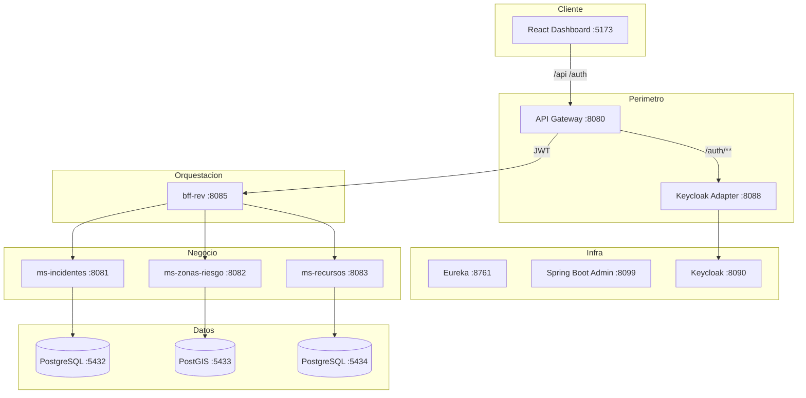
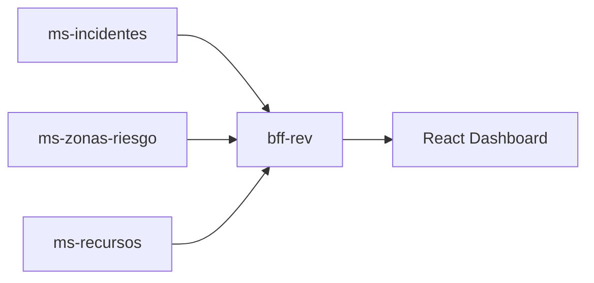

# Informe integral del sistema REV
## Red de Emergencia Valle — Municipalidad de Valle del Sol

**Versión:** corregida y verificada contra código (actualización UX/UI y patrones — mayo 2026)  
**Fecha de referencia:** mayo 2026  
**Alcance:** funcionalidades expuestas en UI, capacidades backend, arquitectura, perfiles, design system, patrones UX/UI y trazabilidad de patrones de diseño

> Este documento integra el *Informe Técnico de Diseño de Arquitectura* del proyecto con el estado real del repositorio. Distingue explícitamente lo que el usuario puede hacer hoy en pantalla de lo que existe solo en la capa de servicios.
>
> **Documento complementario:** [patrones-y-arquitectura-rev.md](./patrones-y-arquitectura-rev.md) — trazabilidad detallada arquitectura / arquetipo / patrón → código.

---

## Tabla de contenidos

1. [Introducción y contexto estratégico](#1-introducción-y-contexto-estratégico)
2. [Requerimientos del sistema](#2-requerimientos-del-sistema)
3. [Arquitectura técnica](#3-arquitectura-técnica)
4. [Patrones de diseño, arquetipos y marco ético](#4-patrones-de-diseño-arquetipos-y-marco-ético)
5. [Funcionalidades expuestas en UI](#5-funcionalidades-expuestas-en-ui-verificadas)
6. [Capacidades backend sin interfaz](#6-capacidades-backend-sin-interfaz-gap-actual)
7. [Matriz de permisos por perfil y pantalla](#7-matriz-de-permisos-por-perfil-y-pantalla)
8. [API consumida por el frontend](#8-api-consumida-por-el-frontend)
9. [Sistema de diseño — paleta, tipografía y UX/UI](#9-sistema-de-diseño--paleta-tipografía-y-uxui)
10. [Despliegue, calidad y proyecciones](#10-despliegue-calidad-y-proyecciones)
11. [Resumen ejecutivo](#11-resumen-ejecutivo)

---

## 1. Introducción y contexto estratégico

REV (*Red de Emergencia Valle*) es una plataforma de **misión crítica** para la gestión de emergencias municipales. Surge bajo el lema **«Conectividad que salva vidas»** y la identidad de marca **«Innovación que resguarda el mañana»**.

| Elemento | Valor |
|----------|-------|
| **Institución** | Municipalidad de Valle del Sol |
| **Nombre** | Red de Emergencia Valle (REV) |
| **Contexto académico** | DSY1106 — Duoc UC |
| **Problema** | Modelos monolíticos no absorben picos de demanda en crisis |
| **Solución** | Ecosistema cloud-native de microservicios desacoplados |

**Propósito humano:** reducir la carga cognitiva del personal de emergencia, acelerar tiempos de respuesta y mantener operatividad parcial ante fallas de servicios secundarios.

---

## 2. Requerimientos del sistema

### 2.1 Cuatro pilares operativos

| Pilar | Descripción | Implementación |
|-------|-------------|----------------|
| **Gestión de incidentes** | Ciclo de vida: reporte → seguimiento → cierre | `ms-incidentes` |
| **Monitoreo de zonas de riesgo** | Territorio clasificado LOW / MEDIUM / HIGH | `ms-zonas-riesgo` + PostGIS |
| **Logística de recursos** | Brigadas, vehículos, herramientas | `ms-recursos` |
| **Orquestación e interfaz** | Visión unificada para despacho | `bff-rev` + React |

### 2.2 Atributos de calidad

| Atributo | Implementación |
|----------|----------------|
| **Elasticidad** | Microservicios + Eureka + Docker |
| **Protección de datos** | JWT, Keycloak, UUID (IEEE P7002) |
| **Continuidad operativa** | Resilience4j + fallbacks + flag `degraded` |
| **Precisión territorial** | PostGIS + coordenadas en incidentes |
| **Sostenibilidad** | Contenedores livianos (JRE Alpine 21) |

### 2.3 Requisitos de entorno

| Componente | Versión |
|------------|---------|
| Java | 21 |
| Spring Boot | 4.0.x |
| Spring Cloud | 2025.1.x |
| Node.js + npm | Frontend Vite |
| Docker Desktop | Infra local |

**Arranque:** `.\scripts\dev-up.ps1 -DockerApps`

---

## 3. Arquitectura técnica

### 3.1 Diagrama lógico



### 3.2 Componentes y puertos

| Componente | Puerto | Rol |
|------------|--------|-----|
| Frontend Vite | 5173 | UI React |
| API Gateway | 8080 | Enrutamiento + filtro JWT en `/api/**` |
| Keycloak Adapter | 8088 | Autenticación |
| BFF-REV | 8085 | Facade / agregación dashboard |
| ms-incidentes | 8081 | Núcleo operativo |
| ms-zonas-riesgo | 8082 | Motor territorial |
| ms-recursos | 8083 | Logística de activos |
| Eureka | 8761 | Service discovery |
| Keycloak | 8090 | Identidad (realm `rev`) |
| Spring Boot Admin | 8099 | Monitorización |

### 3.3 Flujo de datos agregado (Dashboard)

Cada ítem del dashboard combina tres fuentes:

```typescript
{
  incidente: { id, tipo, estado, lat, lng, descripcion },
  zonaRiesgo: { nivel, cached },
  recursos: [{ tipo, descripcion, estado }],
  degraded: boolean
}
```

El BFF consulta ms-incidentes, ms-zonas-riesgo (con caché) y ms-recursos. Si un servicio falla, `degraded: true` activa modo degradado en UI.

### 3.4 Monorepo y arquetipo Maven

| Elemento | Ruta | Rol |
|----------|------|-----|
| Parent POM | `pom.xml` (`rev-parent`) | Versiones Spring Boot / Cloud centralizadas |
| Dominio negocio | `businessdomain/` | Tres microservicios |
| Infraestructura | `infraestructuredomain/` | Gateway, BFF, Eureka, Keycloak adapter |
| Arquetipo MS | `archetypes/rev-microservice-archetype/` | Plantilla reutilizable para nuevos servicios |
| Frontend | `frontend/rev-dashboard/` | SPA React |

Ver [patrones-y-arquitectura-rev.md §3](./patrones-y-arquitectura-rev.md#3-arquetipos-aplicados) para uso del arquetipo.

---

## 4. Patrones de diseño, arquetipos y marco ético

Esta sección resume la aplicación de **arquitectura**, **arquetipos** y **patrones** exigidos en DSY1106. La trazabilidad completa (clase → archivo → test) está en [patrones-y-arquitectura-rev.md](./patrones-y-arquitectura-rev.md).

### 4.1 Jerarquía conceptual (curso → REV)

| Nivel | Qué es | Instancia en REV |
|-------|--------|------------------|
| **Arquitectura** | Sistema concreto con componentes y tecnologías | Gateway + BFF + 3 MS + Eureka + Keycloak + React + 3 BD |
| **Arquetipo** | Estilo estructural reutilizable | Microservicio Spring Cloud; hexagonal parcial; capas Controller → Service → Repository |
| **Patrón** | Solución a un problema de diseño recurrente | Factory, State, Adapter, Facade, Repository, Circuit Breaker |

### 4.2 Patrones de diseño (GoF / Spring)

| Patrón | Ubicación | Problema que resuelve |
|--------|-----------|----------------------|
| **Factory Method** | `ms-incidentes` → `IncidentStateFactory` | Seleccionar handler de transición según estado actual |
| **State** | `ms-incidentes` → `ReportadoState`, `EnProgresoState`, etc. | Reglas de transición encapsuladas por estado |
| **Adapter** | `ms-zonas-riesgo` → `FakeWeatherAdapter` / `WeatherDataPort` | Fuente de clima intercambiable (IoT futuro) |
| **Facade** | `bff-rev` → `DashboardFacadeService`, `OperacionesFacadeService` | Una API agregada para el dashboard React |
| **Repository** | Cada MS → `*Repository` (Spring Data JPA) | Desacoplar persistencia del servicio |
| **Builder** | DTOs con `@Builder` (Lombok) | Construcción legible de respuestas compuestas |
| **Strategy** (relacionado) | Handlers de estado + puerto climático | Algoritmos intercambiables sin modificar el núcleo (OCP) |
| **Singleton** | Contenedor Spring (`@Service`, `@Component`) | Una instancia gestionada por IoC (no manual) |

**Regla de negocio destacada:** transición `REPORTADO` → `EN_PROGRESO` exige georreferenciación (`ReportadoState`).

**Tests de patrones:** `IncidentStateFactoryTest`, `ZonaServiceTest`, tests BFF con fallbacks.

### 4.3 Patrones arquitectónicos e integración

| Patrón | Componente | Función |
|--------|------------|---------|
| **Microservicios** | `ms-incidentes`, `ms-zonas-riesgo`, `ms-recursos` | Dominios autónomos, despliegue independiente |
| **API Gateway** | `api-gateway` | Punto único de entrada, routing, JWT |
| **Gateway Filter** | `AuthenticationFilter` | Validación de token en `/api/**` |
| **BFF** | `bff-rev` | API específica para el frontend web |
| **Service Discovery** | `eureka-server` | Registro dinámico de instancias |
| **Circuit Breaker** | Resilience4j en `DashboardFacadeService` | Fallbacks; flag `degraded` en JSON |
| **Cache-aside** | `ZonaRiesgoCache` | Riesgo cacheado si ms-zonas no responde |
| **Database per Service** | 3 instancias PostgreSQL/PostGIS | Aislamiento de datos por dominio |
| **Endpoint público** | `PublicController`, ruta `/api/public/**` | Reporte ciudadano sin JWT (portal) |

### 4.4 DDD — bounded contexts

REV implementa tres **bounded contexts** como microservicios con base de datos propia:

| Contexto | Microservicio | Entidades principales |
|----------|---------------|----------------------|
| **Incidentes** | ms-incidentes | Incidente, TransicionEstado |
| **Zonas de riesgo** | ms-zonas-riesgo | Zona, CondicionClimatica |
| **Recursos** | ms-recursos | Brigada, Vehiculo, Herramienta, Asignacion |

El **BFF** actúa como capa anticorrupción: traduce tres modelos de dominio al contrato `DashboardResponse` consumido por React.



### 4.5 Arquetipo Maven custom

| Recurso | Ruta |
|---------|------|
| Arquetipo | `archetypes/rev-microservice-archetype/` |
| Instalación | `mvn install` dentro del directorio del arquetipo |
| Generación | `mvn archetype:generate` (ver README del arquetipo) |

Los microservicios actuales siguen la misma estructura que genera el arquetipo (Eureka, Actuator, Flyway, capas estándar).

### 4.6 Patrones frontend (React)

El componente NPM `frontend/rev-dashboard` cumple el requisito de **componente frontend empaquetado** de la EVA2. No orquesta microservicios: actúa como **cliente del Facade BFF**, consumiendo el contrato agregado `DashboardItem`.

Documentación ampliada: [patrones-y-arquitectura-rev.md §7](./patrones-y-arquitectura-rev.md#7-patrones-frontend-react).

#### 4.6.1 Patrones principales (≥3 exigidos por rúbrica)

| # | Patrón | Problema | Solución en REV | Archivos |
|---|--------|----------|-----------------|----------|
| 1 | **Provider (Context)** | Estado global (modal, toasts, sidebar) sin prop drilling | Context API + Providers en layout protegido | `UiContext`, `ToastContext`, `LayoutContext`, `ProtectedLayout` |
| 2 | **Custom Hook** | Repetición de loading/error/refetch en cada página | `useApiQuery<T>` genérico + hooks de dominio | `useApiQuery.ts`, `useAuth.ts`, `useWeather.ts` |
| 3 | **Facade** | URLs, JWT y errores HTTP dispersos | Módulo único `api.ts` con `apiFetch` | `api.ts` |
| 4 | **Observer** | Refrescar listas tras crear incidente sin acoplar modal y páginas | `incidentCreatedTick` + `notifyIncidentCreated()` | `UiContext`, `IncidentFormModal`, `IncidentesPage` |
| 5 | **Composite** | Módulos comparten layout KPI + toolbar + rail | `ModuleHub` con slots composables | `ModuleHub.tsx`, `IncidentesPage`, `RecursosPage` |

#### 4.6.2 Patrones complementarios

| Patrón | Uso | Archivos |
|--------|-----|----------|
| **Strategy** (funciones puras) | Filtros y ordenamiento intercambiables | `incidentesFilters.ts`, `recursosUtils.ts`, `zonasFilters.ts` |
| **State** (UI) | Pantallas async: loading / error / empty / idle | `StateView.tsx` |
| **Guard** | Rutas autenticadas | `ProtectedLayout.tsx` |
| **Adapter** | Clima Open-Meteo → modelo UI | `useWeather.ts` |
| **Presentational** | Cards y badges sin lógica de red | `IncidentCard`, `KpiCard`, `RiskBadge` |

#### 4.6.3 Relación con patrones backend

| Backend | Frontend | Coherencia arquitectónica |
|---------|----------|---------------------------|
| Facade (`DashboardFacadeService`) | Facade cliente (`fetchDashboard`) | Una llamada UI = agregación BFF |
| Circuit Breaker + `degraded` | `DegradedAlert`, KPI degradados | Resiliencia visible al despachador |
| Adapter (`FakeWeatherAdapter`) | `useWeather` (Open-Meteo) | Adaptar fuente externa al modelo de presentación |
| Factory + State (transiciones) | Solo visualiza `estado` | Reglas de negocio no se reimplementan en React |

#### 4.6.4 Estructura NPM y buenas prácticas

| Elemento | Ubicación |
|----------|-----------|
| `package.json` + scripts | `frontend/rev-dashboard/package.json` |
| Código fuente | `src/pages`, `src/components`, `src/hooks`, `src/contexts` |
| Assets públicos | `public/assets/` |
| Design system | `src/theme.css`, `src/styles/*.css` |
| Arranque | `npm run dev` (proxy Vite → Gateway :8080) |

**Argumento de mantenibilidad:** separar pages (contenedores), hooks (lógica), `api.ts` (red) y componentes presentacionales permite evolucionar Incidentes, Recursos o Portal sin duplicar fetch ni romper el shell común (`AppShell`, `ModuleHub`).

### 4.7 Marco IEEE P7000 / P7002

- **Gateway:** escudo de identidad en el perímetro.
- **Privacy by Design:** UUID e identificadores anonimizados para reportantes.
- **Spring Boot Admin:** vigilancia preventiva de salud del sistema.
- **Docker:** eficiencia energética y aislamiento operativo.
- **Modo degradado:** continuidad operativa parcial ante fallos (Circuit Breaker visible en UI).

---

## 5. Funcionalidades expuestas en UI (verificadas)

Esta sección refleja **exactamente** lo implementado en `frontend/rev-dashboard` a la fecha del informe.

### 5.1 Autenticación y sesión

| Funcionalidad | Detalle |
|---------------|---------|
| Login | `POST /auth/login` con usuario/contraseña (form-urlencoded) |
| Almacenamiento de sesión | JWT en `localStorage` (`rev_token`) |
| Protección de rutas | `ProtectedLayout` redirige a `/login` sin token; rutas públicas en `/portal` |
| Post-login | Redirect a `/inicio` (no al Despacho directamente) |
| Expiración / 401 | `apiFetch` limpia token y redirige a login |
| Logout | `ConfirmDialog` → `clearToken()` → redirect `/login` (**solo local**, no llama `/auth/logout`) |
| Boot splash | Animación de arranque (`BootSplash`) antes de mostrar la app |
| Usuarios dev en login | Panel colapsable con `despachador`, `brigadista`, `admin` (clave `rev123`) |

**Archivos:** `LoginPage.tsx`, `api.ts`, `ProtectedLayout.tsx`, `Sidebar.tsx`

### 5.2 Pantalla de login (`/login`)

| Elemento | Descripción |
|----------|-------------|
| Layout | Split 50/50 responsive (hero izquierda, formulario derecha) |
| Hero | Imagen `login-hero.jpg`, fade inferior, logo horizontal, eslogan, municipalidad |
| Cards expandibles | 3 acordeones de valor (sin tecnicismos): *Situación clara*, *El valle bien ubicado*, *Equipos coordinados* |
| Formulario | Usuario, contraseña, estados loading/error |
| Acceso dev | Sección colapsable con usuarios de prueba |

### 5.3 Shell de aplicación (vistas autenticadas)

| Funcionalidad | Detalle |
|---------------|---------|
| Sidebar | 5 módulos: Inicio, Despacho, Incidentes, Zonas, Recursos |
| Sidebar colapsable | Ancho compacto expandido / colapsado (desktop) |
| Drawer mobile | Backdrop + sidebar deslizable (< 992px) |
| Topbar | Título, subtítulo, breadcrumbs, acciones contextuales, chip de clima (`WeatherChip`) |
| Footer | Minimal — «REV · Red de Emergencia Valle» (`AppFooter`) |
| Tarjeta usuario | Avatar inicial, nombre, rol |
| Admin Keycloak | Enlace externo solo rol Admin → `http://localhost:8090/admin/rev/console` |
| Patrón de página | `AppPage` + `ModuleHub` (KPIs, toolbar, rail lateral, contenido primario) |

**Archivos:** `AppShell.tsx`, `Sidebar.tsx`, `Topbar.tsx`, `AppFooter.tsx`, `ModuleHub.tsx`, `LayoutContext.tsx`

### 5.4 Inicio — bienvenida (`/inicio`)

| Funcionalidad | Detalle |
|---------------|---------|
| Propósito | Pantalla de aterrizaje post-login con saludo personalizado |
| Banner | Nombre, rol, KPIs del turno (activos, alto riesgo, degradados), reloj en vivo |
| Accesos rápidos | Grid 2×2 a Despacho, Incidentes, Zonas, Recursos |
| Guía del turno | Lista compacta de buenas prácticas operativas |
| Imágenes | Assets institucionales en `public/assets/images/` |
| Clima | `WeatherChip` integrado (Open-Meteo, coords Valle del Sol) |

**Archivos:** `InicioPage.tsx`, `InicioWelcome.tsx`, `inicio.css`

### 5.5 Despacho — Dashboard (`/`)

| Funcionalidad | Detalle |
|---------------|---------|
| KPIs | Total incidentes, Activos (≠ CERRADO), Alto riesgo (HIGH), Modo degradado |
| Accesos rápidos | Cards a Incidentes, Zonas, Recursos |
| Badge en card Incidentes | Muestra total registrados si > 0 |
| CTA activos | Botón «Ver N incidente(s) activo(s)» si hay activos |
| Auto-refresco | Tras crear incidente vía `incidentCreatedTick` (UiContext) |
| Estados UI | loading / error (con reintentar) vía `StateView` |

**Archivo:** `DashboardPage.tsx`

### 5.6 Incidentes — listado (`/incidentes`)

| Funcionalidad | Detalle |
|---------------|---------|
| Layout | `ModuleHub` con KPIs, toolbar, rail lateral y panel de filtros |
| Vistas | **Tarjetas** (agrupadas por estado) o **Tabla** compacta |
| Filtros | Búsqueda, chips de riesgo, estado, orden, switches «Solo activos» / «Sin recursos» |
| Paleta filtros | Monocromático institucional + naranja REV (sin azules/verdes Bootstrap) |
| Tarjetas | Grid responsive; borde izquierdo por estado; meta en banda (riesgo, coords, recursos) |
| Agrupación | Secciones colapsables por estado con icono y acento de color |
| Rail lateral | Barra apilada de distribución + leyenda + atajos (alto riesgo, sin recursos, degradados) |
| KPIs | Total, Activos, Alto riesgo, Modo degradado |
| Badge riesgo | `RiskBadge` monocromático + indicador «Cache» si aplica |
| Degradado | Tag inline en tarjeta/tabla si `degraded: true` |
| Refresco manual | Botón «Actualizar» en toolbar |
| Nuevo incidente | Botón visible solo si `canManageIncidents` (Admin, Despachador) |
| Modal global | `IncidentFormModal` montado en layout |
| Estado vacío / filtrado | Mensajes dedicados con acción «Limpiar filtros» |

**Archivos:** `IncidentesPage.tsx`, `IncidentCard.tsx`, `IncidentesFilters.tsx`, `IncidentesViews.tsx`, `incidentesFilters.ts`, `incidentes.css`, `cards.css`

### 5.7 Registro de incidente (modal)

| Campo | Validación |
|-------|------------|
| **Tipo** | Obligatorio — opciones: `FORESTAL`, `URBANO`, `ESTRUCTURAL` |
| **Descripción** | Obligatoria |
| **Latitud / Longitud** | Obligatorias, numéricas |
| Hint dev | «Valle del Sol: prueba con lat -33.5, lng -70.5» |
| Submit | `POST /api/incidentes` |
| Feedback | Toast éxito «Incidente registrado correctamente» + cierre modal + notifica refresco |

**Archivos:** `IncidentFormFields.tsx`, `IncidentFormModal.tsx`, `UiContext.tsx`, `ToastContext.tsx`

### 5.8 Detalle de incidente (`/incidentes/:id`)

| Funcionalidad | Detalle |
|---------------|---------|
| Datos principales | Tipo, estado, descripción, coordenadas, UUID completo |
| Rail lateral | Nivel de riesgo + badge; recursos asignados; banner degradado |
| Indicador cache | Texto «(cache)» si riesgo viene de caché |
| Asignar recurso | Botón en topbar y rail — solo Admin/Despachador |
| Modal asignación | Brigada obligatoria; vehículo opcional |
| Post-asignación | Toast «Recurso asignado correctamente» + refetch detalle |

**Archivos:** `IncidentDetailPage.tsx`, `AssignResourceModal.tsx`

### 5.9 Zonas de riesgo (`/zonas`) — solo lectura

| Funcionalidad | Detalle |
|---------------|---------|
| Layout | Split mapa + listado; KPI strip; filtros por nivel de riesgo y búsqueda |
| Mapa | `ZonasMap` con Leaflet; polígonos/ marcadores por zona; selección sincronizada con lista |
| KPIs | Total, LOW, MEDIUM, HIGH |
| Vista lista | Items seleccionables con badge de riesgo y coordenadas |
| Tabla resumen | ID, nombre, nivel, límites geográficos |
| Refresco manual | Botón «Actualizar» |
| Estados UI | loading / error / empty / idle |

**No disponible en UI:** crear, editar o eliminar zonas.

**Archivos:** `ZonasPage.tsx`, `ZonasMap.tsx`, `ZonasFilters.tsx`, `zonas.css`

### 5.10 Recursos (`/recursos`) — solo lectura

| Funcionalidad | Detalle |
|---------------|---------|
| Layout | `ModuleHub` con KPIs, toolbar, rail lateral y filtros |
| Filtros | Búsqueda, disponibilidad, stock bajo; paleta REV unificada |
| Vista desktop | Grid de tablas (`rev-data-table`) con barras de stock en herramientas |
| Vista mobile | Tabs: brigadas / vehículos / herramientas |
| Rail lateral | Distribución por tipo + atajos (disponibles, en uso, stock bajo) |
| KPIs | Brigadas disp., Vehículos disp., En uso, Stock bajo |
| Refresco manual | Botón «Actualizar» |

**No disponible en UI:** alta de recursos ni desasignación desde esta pantalla.

**Archivos:** `RecursosPage.tsx`, `RecursosFilters.tsx`, `RecursosViews.tsx`, `recursosUtils.ts`, `recursos.css`

### 5.11 Portal ciudadano (`/portal`) — público

| Funcionalidad | Detalle |
|---------------|---------|
| Acceso | Sin JWT; usuarios autenticados redirigen a `/inicio` |
| Landing | Hero institucional, navegación ancla, chip de clima |
| ¿Qué hace REV? | Cards expandibles con diagramas inline compactos |
| Cómo funciona el reporte | Timeline de 4 pasos + diagrama flujo Usted → REV → Despacho → Terreno |
| Formulario público | Reutiliza `IncidentFormFields` en modo `publicMode` |
| Submit | `POST /api/public/incidentes` (sin autenticación) |
| CTA despacho | Enlace a `/login` para operadores |

**Archivos:** `PortalPage.tsx`, `PortalFeatureCards.tsx`, `PortalReportFlow.tsx`, `portal.css`, `PublicController.java`

### 5.12 Componentes transversales de UX

| Componente | Uso |
|------------|-----|
| `StateView` | Estados loading, error (reintentar), empty |
| `ToastContext` | Notificaciones temporales (4s, top-end) |
| `DegradedAlert` | Aviso modo degradado / circuit breaker |
| `RiskBadge` | Badge monocromático LOW / MEDIUM / HIGH |
| `RevModal` | Modales estilizados |
| `ConfirmDialog` | Confirmación de logout |
| `ModuleHub` | Shell de módulo: KPIs + toolbar + rail + contenido |
| `KpiCard` | Tarjeta métrica con icono y subtexto |
| `WeatherChip` | Clima actual vía Open-Meteo (sin API key) |
| `BootSplash` | Splash de arranque con logo REV |
| `useApiQuery` | Hook de fetch con loading/error/refetch |
| `RevLogo` | Logos institucionales reutilizables |

### 5.13 Rutas completas

| Ruta | Componente | Auth |
|------|------------|------|
| `/portal` | PortalPage | Público |
| `/login` | LoginPage | Público (redirect a `/inicio` si autenticado) |
| `/inicio` | InicioPage | Protegido |
| `/` | DashboardPage | Protegido |
| `/incidentes` | IncidentesPage | Protegido |
| `/incidentes/nuevo` | NewIncidentPage → redirect + abre modal | Protegido |
| `/incidentes/:id` | IncidentDetailPage | Protegido |
| `/zonas` | ZonasPage | Protegido |
| `/recursos` | RecursosPage | Protegido |
| `*` | Redirect a `/portal` (sin token) o `/inicio` (con token) | — |

---

## 6. Capacidades backend sin interfaz (gap actual)

Funcionalidades **implementadas en microservicios** pero **no expuestas** en el dashboard React.

### 6.1 ms-incidentes

| Endpoint | Capacidad | Estado en UI |
|----------|-----------|--------------|
| `GET /incidentes` | Listar incidentes (crudo) | ✗ BFF agrega vía dashboard |
| `GET /incidentes/{id}` | Obtener incidente (crudo) | ✗ BFF agrega vía dashboard |
| `PUT /incidentes/{id}/transicion` | Cambiar estado (Factory Method) | ✗ **No hay UI de transición** |

**Estados soportados en backend:** `REPORTADO`, `EN_PROGRESO`, `CONTROLADO`, `ESCALADO`, `CERRADO`

### 6.2 ms-zonas-riesgo

| Endpoint | Capacidad | Estado en UI |
|----------|-----------|--------------|
| `GET /zonas/riesgo?lat=&lng=` | Riesgo por coordenadas | ✗ Usado internamente por BFF |
| `GET /zonas/{id}` | Detalle de zona | ✗ |
| `POST /zonas` | Crear zona | ✗ |
| `PUT /zonas/{id}` | Editar zona | ✗ |

### 6.3 ms-recursos

| Endpoint | Capacidad | Estado en UI |
|----------|-----------|--------------|
| `GET /recursos/incidente/{id}` | Recursos por incidente | ✗ BFF agrega en dashboard |
| `POST /recursos/brigadas` | Alta brigada | ✗ |
| `POST /recursos/vehiculos` | Alta vehículo | ✗ |
| `POST /recursos/herramientas` | Alta herramienta | ✗ |
| `DELETE /recursos/asignar/{id}` | Desasignar recurso | ✗ |

### 6.4 keycloak-adapter

| Endpoint | Capacidad | Estado en UI |
|----------|-----------|--------------|
| `POST /auth/login` | Login | ✓ Usado |
| `POST /auth/logout` | Logout con refresh_token | ✗ UI solo borra token local |
| `POST /auth/refresh` | Renovar token | ✗ |
| `GET /auth/valid` | Validar token | ✗ |
| `GET /auth/roles` | Roles del token | ✗ (roles se leen del JWT en cliente) |

### 6.5 bff-rev — endpoint público (expuesto en UI)

| Endpoint | Capacidad | Estado en UI |
|----------|-----------|--------------|
| `POST /api/public/incidentes` | Reporte ciudadano sin JWT | ✓ Portal `/portal` |

Gateway: ruta `/api/public/**` **sin** filtro JWT (`application.yml`).

### 6.6 Resumen del gap

```
┌─────────────────────────────────────────────────────────────┐
│  BACKEND COMPLETO          │  FRONTEND ACTUAL               │
├────────────────────────────┼────────────────────────────────┤
│  CRUD incidentes           │  Crear + consultar agregado    │
│  Transiciones de estado    │  Solo visualización de estado  │
│  CRUD zonas                │  Solo lectura                  │
│  CRUD recursos             │  Solo lectura + asignar        │
│  Desasignar recursos       │  No disponible                 │
│  Reporte ciudadano         │  ✓ Portal público              │
│  Auth refresh/logout       │  Login básico                  │
│  Mapa geográfico           │  ✓ Zonas (Leaflet) + coords    │
└────────────────────────────┴────────────────────────────────┘
```

---

## 7. Matriz de permisos por perfil y pantalla

Usuarios Keycloak (realm `rev`):

| Usuario | Rol | Nombre | Clave dev |
|---------|-----|--------|-----------|
| `despachador` | Despachador | Ana Despacho | `rev123` |
| `brigadista` | Brigadista | Luis Brigada | `rev123` |
| `admin` | Admin | Carlos Admin | `rev123` |

Lógica de permisos: `useAuth.ts` → `canManageIncidents` = Admin **o** Despachador.

### 7.1 Por pantalla

| Pantalla / acción | Despachador | Brigadista | Admin |
|-------------------|:-----------:|:----------:|:-----:|
| **Login** — autenticarse | ✓ | ✓ | ✓ |
| **Portal** — reporte ciudadano | ✓ (público) | ✓ (público) | ✓ (público) |
| **Inicio** — bienvenida y accesos | ✓ | ✓ | ✓ |
| **Despacho** — ver KPIs y accesos | ✓ | ✓ | ✓ |
| **Incidentes** — listar / ver cards | ✓ | ✓ | ✓ |
| **Incidentes** — botón «Nuevo incidente» | ✓ | ✗ | ✓ |
| **Incidentes** — modal registrar | ✓ | ✗ | ✓ |
| **Detalle** — ver ficha completa | ✓ | ✓ | ✓ |
| **Detalle** — asignar recurso | ✓ | ✗ | ✓ |
| **Zonas** — consultar (cards + tabla) | ✓ | ✓ | ✓ |
| **Recursos** — consultar tablas | ✓ | ✓ | ✓ |
| **Sidebar** — Admin Keycloak | ✗ | ✗ | ✓ |
| **Sidebar** — contraer menú | ✓ | ✓ | ✓ |
| **Sidebar** — cerrar sesión | ✓ | ✓ | ✓ |
| **Navegación** — todos los módulos | ✓ | ✓ | ✓ |

### 7.2 Perfiles en la operación

**Despachador (Ana Despacho)**  
Operador principal. Puede registrar incidentes, asignar brigadas/vehículos y monitorear KPIs. Es el usuario objetivo del panel de mando.

**Brigadista (Luis Brigada)**  
Perfil de consulta. Accede al mismo panel para ver incidentes activos, riesgo territorial y disponibilidad de recursos, pero **no puede crear incidentes ni asignar recursos** desde la UI.

**Admin (Carlos Admin)**  
Todas las capacidades operativas del Despachador más acceso a la consola Keycloak para gestión de identidades del realm `rev`.

---

## 8. API consumida por el frontend

El dashboard **solo** consume estos endpoints (vía Gateway `:8080`, proxy Vite):

| Método | Ruta | Pantalla(s) |
|--------|------|-------------|
| POST | `/auth/login` | Login |
| POST | `/api/public/incidentes` | Portal ciudadano (sin JWT) |
| GET | `/api/dashboard/incidentes` | Dashboard, Incidentes, Inicio |
| GET | `/api/dashboard/incidente/{id}` | Detalle incidente |
| POST | `/api/incidentes` | Modal nuevo incidente |
| GET | `/api/zonas` | Zonas |
| GET | `/api/recursos/disponibles` | Recursos, modal asignación |
| POST | `/api/recursos/asignar` | Modal asignación |

**Total: 8 endpoints** (+ login). Clima usa Open-Meteo directo desde el frontend (sin backend REV).

---

## 9. Sistema de diseño — paleta, tipografía y UX/UI

El frontend adopta un **design system monocromático institucional** con un único acento cromático: el naranja REV. No se usan azules, verdes ni amarillos semánticos de Bootstrap en la UI operativa; los componentes Bootstrap se sobreescriben en `theme.css`.

### 9.1 Principios UX/UI

| Principio | Implementación |
|-----------|----------------|
| **Monocromático + acento** | Fondos navy oscuros, texto en escala de grises, naranja solo para CTA, foco y prioridad |
| **ModuleHub** | Patrón repetible: KPIs → toolbar → cuerpo (filtros + contenido) + rail lateral opcional |
| **Densidad operativa** | Tipografía compacta, meta en `0.6875rem`, cards con información escaneable |
| **Estados visibles** | `StateView` unifica loading / error / empty en todos los módulos |
| **Resiliencia visible** | Tags y banners de modo degradado cuando `degraded: true` |
| **Responsive** | Sidebar drawer (< 992px), grids adaptativos, tabs móvil en Recursos |
| **Accesibilidad** | Labels ARIA en filtros, timelines y controles de vista |

### 9.2 Colores — tokens actuales (`theme.css`)

| Token | Valor | Uso |
|-------|-------|-----|
| `--rev-bg` | `#07111f` | Fondo general |
| `--rev-bg-secondary` | `#0b172a` | Paneles, filtros |
| `--rev-surface` | `#10233e` | Cards, rails |
| `--rev-surface-elevated` | `#142c4e` | Hover, badges secundarios |
| `--rev-border` | `rgba(255,255,255,0.08)` | Bordes sutiles |
| `--rev-text` | `#ffffff` | Texto principal |
| `--rev-text-secondary` | `#a7b4c7` | Texto secundario |
| `--rev-text-tertiary` | `#73839a` | Meta, placeholders |
| `--rev-orange` | `#f97316` | **Único acento** — CTA, foco, alto riesgo, escalado |
| `--rev-orange-hover` | `#fb923c` | Hover botones |
| `--rev-orange-muted` | `rgba(249,115,22,0.12)` | Fondos de acento |
| `--rev-orange-border` | `rgba(249,115,22,0.28)` | Bordes activos |

> Los alias legacy (`--rev-navy`, `--rev-cyan`, `--rev-danger`, etc.) apuntan a tokens monocromáticos o naranja para compatibilidad.

### 9.3 Semántica de color (sin colores externos)

| Elemento | Tratamiento visual |
|----------|-------------------|
| **Riesgo HIGH** | Naranja sólido (`badge-risk-high`) |
| **Riesgo MEDIUM / LOW** | Grises con borde (`--rev-surface-elevated`) |
| **Estados incidente** | Intensidad de gris + naranja solo en ESCALADO |
| **Badges Bootstrap** | `bg-info/warning/success` → gris institucional |
| **Botones primarios / danger** | Naranja REV |
| **Links y foco** | Naranja REV (no azul Bootstrap) |
| **Filtros Incidentes** | Switches, selects y chips activos en naranja; chips medio/bajo activos en gris |

### 9.4 Tipografía

| Familia | Stack | Rol |
|---------|-------|-----|
| **Inter** | `'Inter', 'Segoe UI', system-ui` | UI completa |
| **JetBrains Mono** | `'JetBrains Mono', 'Cascadia Code'` | Coordenadas, IDs |

| Token | Tamaño | Uso |
|-------|--------|-----|
| `--rev-text-meta` / `--rev-text-xs` | 0.6875rem | Meta, filtros, badges |
| `--rev-text-sm` | 0.8125rem | Nav, subtítulos de card |
| `--rev-text-body` | 0.875rem | Cuerpo |
| `--rev-text-title` | 1.375rem | Títulos de módulo |

### 9.5 Layout y forma

| Token / elemento | Valor |
|------------------|-------|
| `--rev-radius-sm` → `--rev-radius-card` | 8px → 16px |
| `--rev-space-1` → `--rev-space-5` | 8px → 32px |
| Sidebar | Compacto, colapsable, logo `emblemColorAlt` |
| Topbar | Margen inferior, breadcrumbs, acciones |
| Footer | Una línea minimal |

### 9.6 Hojas de estilo por módulo

| Archivo | Alcance |
|---------|---------|
| `theme.css` | Tokens globales, Bootstrap overrides |
| `shell.css`, `topbar.css`, `footer.css` | Layout autenticado |
| `module-hub.css`, `app-internal.css` | Patrón ModuleHub |
| `cards.css` | IncidentCard, ZoneCard, métricas |
| `incidentes.css` | Filtros, rail, agrupación, tabla |
| `recursos.css` | Filtros, tablas, stock bars, rail |
| `zonas.css` | Mapa Leaflet, filtros, lista |
| `portal.css` | Landing pública, timeline, acordeones |
| `inicio.css` | Bienvenida post-login |
| `login.css` | Pantalla de autenticación |
| `boot-splash.css` | Splash de arranque |
| `weather.css` | Chip de clima |

### 9.7 Assets de marca

| Recurso | Ruta |
|---------|------|
| Logos | `/public/assets/logos/` (7 variantes) |
| Hero login | `/public/assets/images/login-hero.jpg` |
| Inicio / portal | `rev-field-team.png`, `rev-device.png` |
| Componente | `<RevLogo variant="…" />` en `src/branding/` |

---

## 10. Despliegue, calidad y proyecciones

### 10.1 URLs de desarrollo

| Servicio | URL |
|----------|-----|
| Frontend | http://localhost:5173 |
| Gateway | http://localhost:8080 |
| Eureka | http://localhost:8761 |
| Keycloak | http://localhost:8090 |
| Spring Boot Admin | http://localhost:8099 |

### 10.2 Calidad

- Tests JUnit 5 en flujos críticos (estados, zonas, fallbacks BFF)
- Tests de patrones: `IncidentStateFactoryTest`, `ZonaServiceTest`
- JaCoCo en parent POM
- Flyway por microservicio
- springdoc-openapi por servicio expuesto
- Documentación de patrones: [patrones-y-arquitectura-rev.md](./patrones-y-arquitectura-rev.md)

### 10.3 Proyecciones (priorizadas por gap)

| Prioridad | Evolución |
|-----------|-----------|
| Alta | UI de transiciones de estado del incidente |
| Alta | Mapa interactivo con PostGIS |
| Media | CRUD zonas y recursos desde panel Admin |
| Media | Desasignación de recursos |
| Media | Logout/refresh token real vía Keycloak |
| Media | UI pública ampliada (seguimiento de reporte ciudadano) |
| Baja | App móvil para brigadistas en terreno |
| Baja | Integración IoT vía Adapter de clima |

---

## 11. Resumen ejecutivo

REV es una plataforma de microservicios de misión crítica cuyo **frontend ha evolucionado significativamente** hacia un panel operativo completo con portal ciudadano, mapa de zonas, filtros avanzados y un design system monocromático coherente.

| Capa | Madurez |
|------|---------|
| **Arquitectura backend** | Alta — Eureka, BFF, resiliencia, 3 MS, Keycloak, endpoint público |
| **Patrones de diseño** | Alta — Factory+State, Adapter, Facade, Repository, Circuit Breaker documentados |
| **Arquetipos** | Media-alta — MS alineados + arquetipo Maven custom disponible |
| **DDD (bounded contexts)** | Media — tres contextos implícitos; BFF como anticorrupción |
| **Frontend operativo** | Media-alta — lectura completa + escritura parcial + portal público |
| **Design system / UX** | Alta — paleta unificada, ModuleHub, módulos estilizados por dominio |
| **Autorización fina** | Media — roles en UI; backend sin `@PreAuthorize` por rol |

**Flujos cubiertos en UI:** reporte ciudadano (portal) → consulta despacho → gestión incidentes con filtros → mapa zonas → logística recursos → asignación en detalle.

**Patrones y arquitectura:** ver [patrones-y-arquitectura-rev.md](./patrones-y-arquitectura-rev.md) para mapa completo curso → código, context map DDD y guion de evaluación.

**Tríada de resiliencia:** Eureka (orquestación dinámica) + Resilience4j (contención de fallos) + persistencia aislada (integridad por dominio).

**Compromiso ético:** IEEE P7000/P7002 — privacidad del ciudadano, continuidad operativa y eficiencia sostenible al servicio de la protección civil en Valle del Sol.

---

*Documento generado a partir del Informe Técnico de Diseño de Arquitectura REV y verificación directa del código en `rev-fullstack`. Patrones detallados en [patrones-y-arquitectura-rev.md](./patrones-y-arquitectura-rev.md).*
