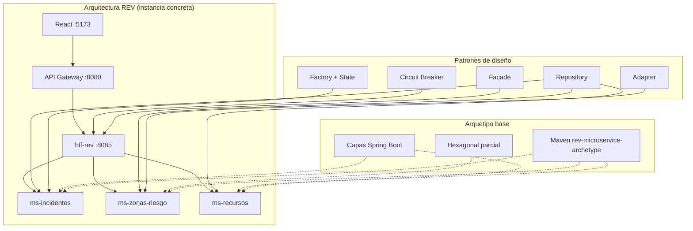
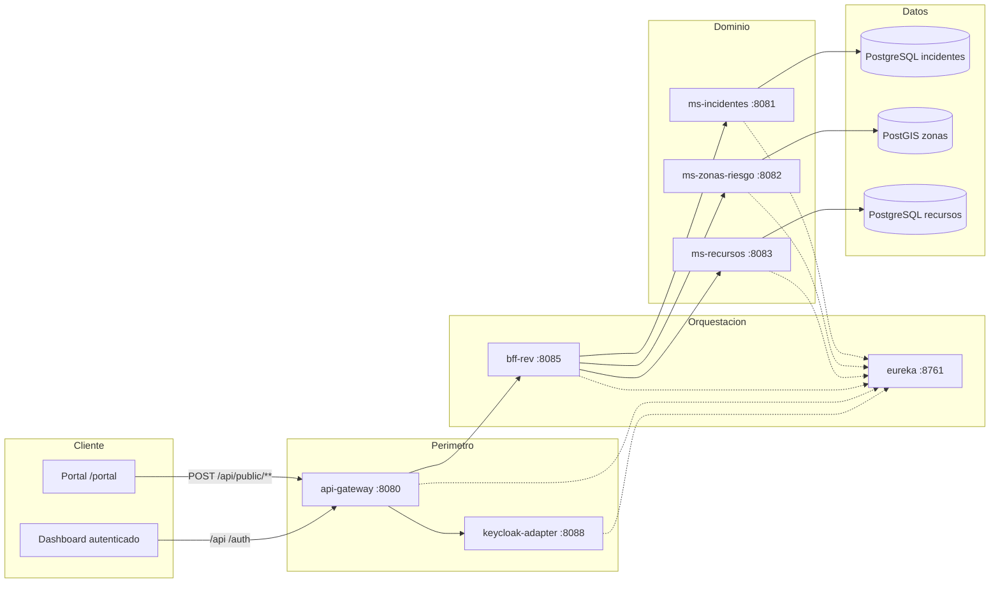
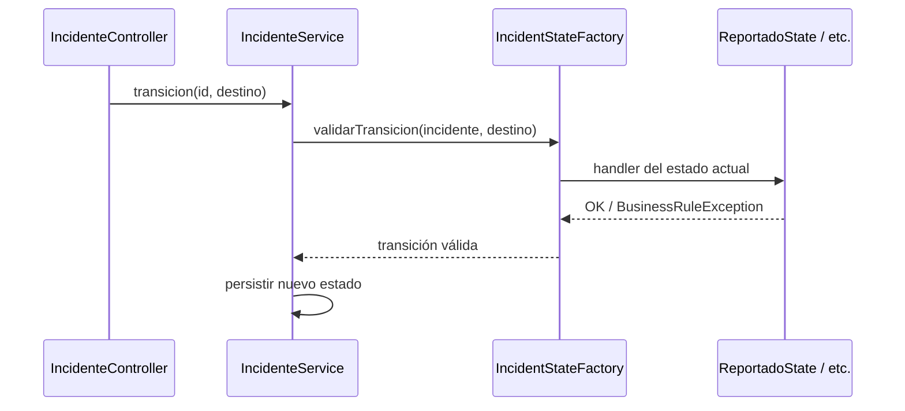
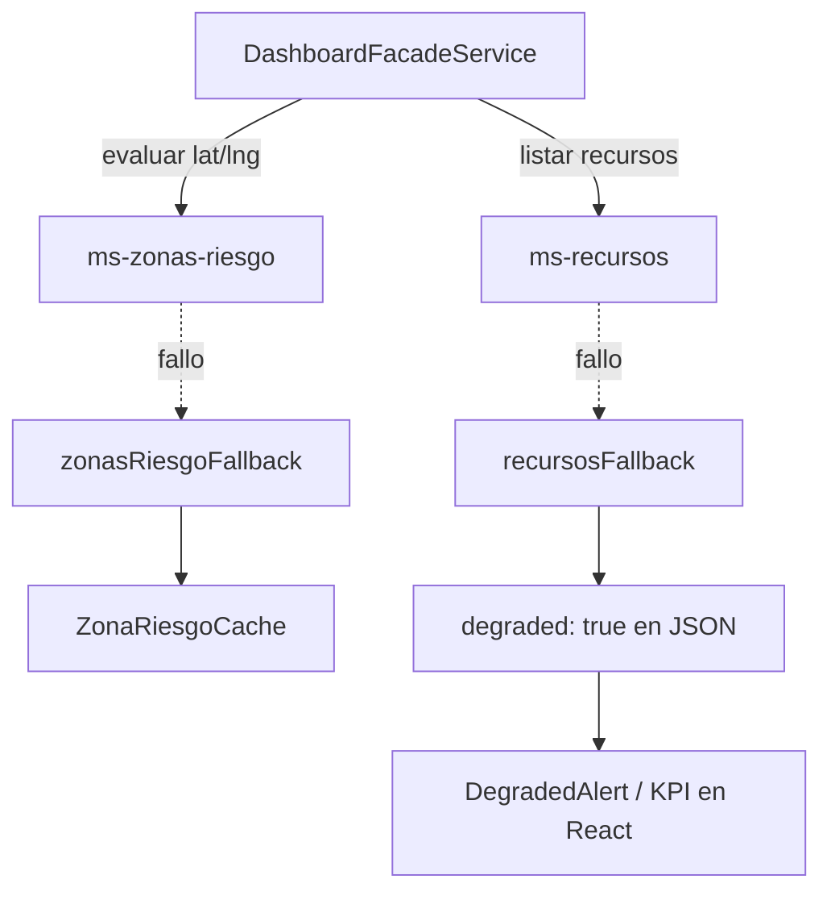
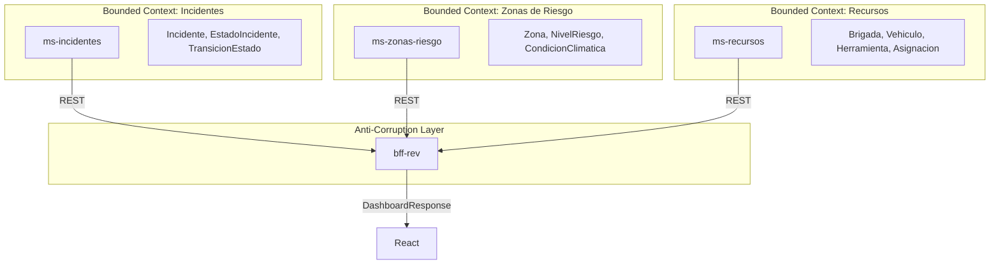
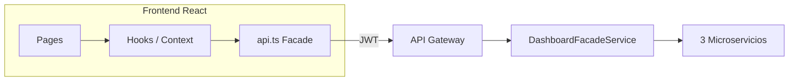
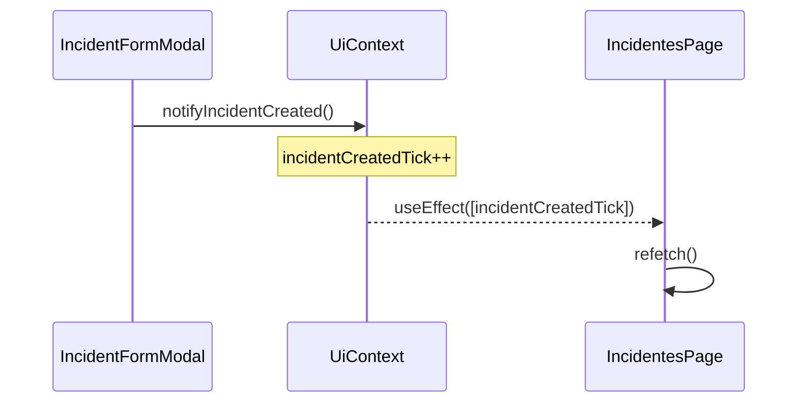

# Patrones y arquitectura — REV
## Red de Emergencia Valle — DSY1106 Duoc UC

**Versión:** 1.0 — verificada contra código  
**Fecha:** mayo 2026  
**Documento complementario de:** [informe-sistema-rev.md](./informe-sistema-rev.md)

Este documento responde a la distinción del curso **Arquitecturas Modernas, Patrones y Ecosistemas de Microservicios** entre **arquitectura**, **arquetipo** y **patrón**, y traza cada uno a archivos concretos del repositorio `rev-fullstack`.

---

## Tabla de contenidos

1. [Jerarquía conceptual](#1-jerarquía-conceptual)
2. [Arquitectura concreta de REV](#2-arquitectura-concreta-de-rev)
3. [Arquetipos aplicados](#3-arquetipos-aplicados)
4. [Patrones de diseño (GoF y Spring)](#4-patrones-de-diseño-gof-y-spring)
5. [Patrones arquitectónicos y de integración](#5-patrones-arquitectónicos-y-de-integración)
6. [DDD — bounded contexts](#6-ddd--bounded-contexts)
7. [Patrones frontend (React)](#7-patrones-frontend-react)
8. [Matriz de trazabilidad](#8-matriz-de-trazabilidad)
9. [Cómo demostrar en evaluación](#9-cómo-demostrar-en-evaluación)
10. [Evoluciones recomendadas](#10-evoluciones-recomendadas)

---

## 1. Jerarquía conceptual

| Nivel | Definición (curso) | En REV |
|-------|-------------------|--------|
| **Arquitectura** | Estructura concreta del sistema: componentes, tecnologías, comunicación | Gateway + BFF + 3 microservicios + Eureka + Keycloak + React + 3 bases de datos |
| **Arquetipo** | Estilo organizacional reutilizable | Microservicios Spring Cloud; hexagonal parcial (ports/adapters); capas Controller → Service → Repository |
| **Patrón** | Solución técnica a un problema recurrente | Factory, State, Adapter, Facade, Repository, Circuit Breaker, Builder, etc. |



---

## 2. Arquitectura concreta de REV

### 2.1 Estilo general

| Atributo | Decisión |
|----------|----------|
| Estilo | Microservicios desacoplados |
| Comunicación | REST síncrona (WebClient + Eureka) |
| Persistencia | Database per service |
| Perímetro | API Gateway con filtro JWT |
| Cliente | SPA React (Vite) + portal público |
| Identidad | Keycloak (realm `rev`) vía adapter dedicado |

### 2.2 Diagrama de despliegue lógico



### 2.3 Módulos Maven (monorepo)

```
rev-parent/
├── businessdomain/          ← dominio de negocio
│   ├── ms-incidentes/
│   ├── ms-zonas-riesgo/
│   └── ms-recursos/
├── infraestructuredomain/   ← plataforma
│   ├── api-gateway/
│   ├── bff-rev/
│   ├── eureka-server/
│   ├── keycloak-adapter/
│   └── spring-boot-admin/
├── archetypes/
│   └── rev-microservice-archetype/
└── frontend/rev-dashboard/
```

---

## 3. Arquetipos aplicados

### 3.1 Arquetipo de microservicio Spring Cloud

Cada MS de negocio sigue la misma estructura organizacional:

| Capa | Responsabilidad | Ejemplo |
|------|-----------------|---------|
| `controller/` | Adaptador entrante HTTP | `IncidenteController` |
| `service/` | Reglas de aplicación | `IncidenteService` |
| `repository/` | Persistencia | `IncidenteRepository` |
| `entity/` | Modelo persistente | `Incidente` |
| `dto/` | Contratos API | `IncidenteResponse` |
| `exception/` | Manejo de errores | `BusinessRuleException` |

**Infraestructura común:** Eureka client, Actuator, Flyway, springdoc-openapi, PostgreSQL.

### 3.2 Arquetipo Maven custom

| Elemento | Ruta |
|----------|------|
| Descriptor | `archetypes/rev-microservice-archetype/` |
| Metadata | `META-INF/maven/archetype-metadata.xml` |
| Guía de uso | `archetypes/rev-microservice-archetype/README.md` |

Genera un microservicio con `@EnableDiscoveryClient`, `application.properties` y estructura base alineada al monorepo.

```bash
cd archetypes/rev-microservice-archetype
mvn install

# Desde businessdomain/
mvn archetype:generate \
  -DarchetypeGroupId=cl.duocuc.rev \
  -DarchetypeArtifactId=rev-microservice-archetype \
  -DarchetypeVersion=1.0-SNAPSHOT \
  -DgroupId=cl.duocuc.rev \
  -DartifactId=ms-nuevo \
  -Dpackage=cl.duocuc.rev.nuevo
```

Los tres MS actuales fueron implementados manualmente pero **replican este arquetipo** en estructura y dependencias (`businessdomain/pom.xml` compartido).

### 3.3 Arquetipo hexagonal (parcial)

Implementación de referencia en **ms-zonas-riesgo**:

| Concepto hexagonal | Implementación REV |
|--------------------|-------------------|
| **Puerto** | `port/WeatherDataPort.java` |
| **Adaptador** | `adapter/FakeWeatherAdapter.java` |
| **Núcleo** | `service/ZonaService.java` (depende del puerto, no del adaptador concreto) |

El dominio de clima es intercambiable: hoy `FakeWeatherAdapter`; mañana un adaptador REST hacia sensores IoT sin modificar `ZonaService`.

---

## 4. Patrones de diseño (GoF y Spring)

### 4.1 Factory Method + State — ciclo de vida de incidentes

**Microservicio:** `ms-incidentes`  
**Problema:** validar transiciones de estado sin acoplar `IncidenteService` a reglas de cada estado.

| Rol | Clase | Ruta |
|-----|-------|------|
| Producto / estrategia | `IncidentStateHandler` | `state/IncidentStateHandler.java` |
| Productos concretos | `ReportadoState`, `EnProgresoState`, `ControladoState`, `EscaladoState` | `state/*.java` |
| Factory | `IncidentStateFactory` | `state/IncidentStateFactory.java` |
| Cliente | `IncidenteService` | `service/IncidenteService.java` |

**Flujo:**



**Regla de negocio ejemplo:** desde `REPORTADO` → `EN_PROGRESO` exige coordenadas (`ReportadoState.requireGeo`).

**Tests:** `IncidentStateFactoryTest.java`

> **Nota académica:** además de Factory Method, las clases `*State` implementan el patrón **State** (comportamiento variable según estado del objeto).

### 4.2 Adapter — fuente de datos climáticos

**Microservicio:** `ms-zonas-riesgo`

| Rol | Clase |
|-----|-------|
| Target (puerto) | `WeatherDataPort` |
| Adaptee (impl. actual) | `FakeWeatherAdapter` |
| Cliente | `ZonaService` |

```java
// ZonaService inyecta la abstracción, no la implementación concreta
private final WeatherDataPort weatherDataPort;
```

**Beneficio:** cumple **Inversión de dependencias (SOLID-D)** y prepara integración IoT.

### 4.3 Facade — orquestación para el frontend

**Componente:** `bff-rev`

| Facade | Responsabilidad | Archivo |
|--------|-----------------|---------|
| Dashboard | Agrega incidente + riesgo + recursos + flag `degraded` | `DashboardFacadeService.java` |
| Operaciones | Crear incidente, listar zonas, asignar recursos | `OperacionesFacadeService.java` |

**Problema resuelto:** el React dashboard necesita **una sola llamada** (`GET /api/dashboard/incidentes`) en lugar de orquestar 3 microservicios desde el cliente.

### 4.4 Repository — acceso a datos

Patrón **Repository / DAO** vía Spring Data JPA en los tres MS:

| MS | Repositorios |
|----|--------------|
| ms-incidentes | `IncidenteRepository`, `TransicionEstadoRepository` |
| ms-zonas-riesgo | `ZonaRepository`, `CondicionClimaticaRepository` |
| ms-recursos | `BrigadaRepository`, `VehiculoRepository`, `HerramientaRepository`, `AsignacionRepository` |

Abstrae SQL/JPA del servicio de aplicación.

### 4.5 Builder — construcción de DTOs

Lombok `@Builder` en respuestas inmutables del BFF y MS, por ejemplo:

- `DashboardResponse`, `IncidenteDto`, `ZonaRiesgoDto` (`bff-rev/dto/`)
- `IncidenteResponse`, `WeatherDataDto`

Evita constructores telescópicos y facilita composición en el Facade.

### 4.6 Strategy (relación con State y Adapter)

| Contexto | Interpretación Strategy |
|----------|------------------------|
| `IncidentStateHandler` | Cada estado es una estrategia de validación de transición |
| `WeatherDataPort` | Estrategia intercambiable de obtención de clima |

Cumple **Open/Closed Principle:** nuevos estados o adaptadores sin modificar el servicio central.

### 4.7 Singleton (vía contenedor Spring)

Spring gestiona beans `@Component` / `@Service` como **singletons** en el contenedor IoC. No se implementa Singleton manual (anti-patrón); el framework lo provee de forma controlada.

---

## 5. Patrones arquitectónicos y de integración

| Patrón | Implementación | Archivo / componente |
|--------|----------------|----------------------|
| **API Gateway** | Enrutamiento, auth, rutas públicas | `infraestructuredomain/api-gateway/` |
| **Gateway Filter** | Validación JWT en `/api/**` | `AuthenticationFilter.java` |
| **BFF (Backend for Frontend)** | API orientada al dashboard React | `bff-rev/` |
| **Service Discovery** | Registro dinámico de instancias | `eureka-server/` + `@EnableDiscoveryClient` |
| **Client-side load balancing** | `WebClient` + Eureka | `*ClientService.java` en BFF |
| **Circuit Breaker** | Resilience4j con fallbacks | `DashboardFacadeService` (`@CircuitBreaker`) |
| **Cache-aside** | Caché de riesgo ante fallo de zonas | `ZonaRiesgoCache.java` |
| **Database per Service** | 3 instancias PostgreSQL/PostGIS | `docker-compose` |
| **Adapter (identidad)** | Keycloak desacoplado del Gateway | `keycloak-adapter/` |
| **Strangler / API pública** | Endpoint sin JWT para portal | `PublicController.java`, ruta `/api/public/**` |

### 5.1 Circuit Breaker — detalle



**Configuración:** Resilience4j en `bff-rev/src/main/resources/application.properties`

---

## 6. DDD — bounded contexts

REV modela tres **subdominios** como microservicios autónomos (= bounded contexts con API propia y BD propia).

### 6.1 Context Map



El BFF actúa como **capa anticorrupción** que traduce tres modelos de dominio a un contrato único para la UI.

### 6.2 Lenguaje ubicuo (glosario)

| Término | Contexto | Significado en REV |
|---------|----------|-------------------|
| **Incidente** | Incidentes | Emergencia reportada con tipo, coords y ciclo de vida |
| **Estado** | Incidentes | REPORTADO → EN_PROGRESO → CONTROLADO / ESCALADO → CERRADO |
| **Zona** | Zonas | Polígono territorial con nivel LOW / MEDIUM / HIGH |
| **Riesgo** | Zonas | Evaluación por coordenadas (zona + clima) |
| **Brigada / Vehículo** | Recursos | Activos asignables al incidente |
| **Degradado** | Orquestación (BFF) | Modo parcial por fallo de dependencia (no es entidad de dominio) |

### 6.3 Entidades y agregados (simplificado)

| Contexto | Agregado raíz | Invariantes relevantes |
|----------|---------------|------------------------|
| Incidentes | `Incidente` | Transiciones vía Factory/State; UUID como identidad |
| Zonas | `Zona` | Coordenadas dentro de límites; nivel de riesgo |
| Recursos | `Asignacion` | Una asignación activa por incidente; brigada obligatoria |

---

## 7. Patrones frontend (React)

El dashboard (`frontend/rev-dashboard`) es un **cliente del BFF**: no orquesta microservicios ni duplica reglas de negocio del backend. Su responsabilidad es presentación, navegación, permisos de UI y consumo del contrato agregado `DashboardItem`.

### 7.1 Rol del frontend en la arquitectura



| Principio | Cómo se cumple |
|-----------|----------------|
| **Sin orquestación en cliente** | Una sola llamada `fetchDashboard()` en lugar de 3 requests a MS |
| **Separación de capas** | Pages → hooks/context → `api.ts` → red |
| **Reglas de negocio en backend** | Transiciones de estado, riesgo y asignación viven en Java |
| **UI reactiva al BFF** | Flag `degraded` y `cached` se muestran sin reinterpretar el dominio |

### 7.2 Estructura del paquete NPM

| Carpeta | Responsabilidad | Ejemplo |
|---------|-----------------|---------|
| `src/pages/` | Vistas por ruta (contenedores) | `IncidentesPage.tsx`, `PortalPage.tsx` |
| `src/components/` | UI reutilizable y por dominio | `IncidentCard`, `ModuleHub`, `ZonasMap` |
| `src/hooks/` | Lógica de estado y efectos reutilizable | `useApiQuery`, `useAuth`, `useWeather` |
| `src/contexts/` | Estado global vía Provider | `UiContext`, `ToastContext`, `LayoutContext` |
| `src/utils/` | Funciones puras (filtros, agregados) | `incidentesFilters.ts`, `dashboardAggregates.ts` |
| `src/api.ts` | Facade HTTP — único punto de acceso al backend REV | `fetchDashboard`, `createIncidente` |
| `src/styles/` | Design system por módulo | `incidentes.css`, `portal.css`, `theme.css` |

**Estándar NPM:** `package.json` con scripts `dev`, `build`, `preview`; dependencias React 18 + Vite 5 + Bootstrap 5.

### 7.3 Patrones de diseño — argumentación para evaluación

La rúbrica EVA2 exige **al menos tres patrones en frontend y backend**. En REV el frontend implementa **cinco patrones identificables**, cada uno con problema, solución y beneficio de mantenibilidad.

#### 7.3.1 Provider (Context) — estado global sin prop drilling

| Aspecto | Detalle |
|---------|---------|
| **Problema** | Modal de incidente, toasts y layout del sidebar deben ser accesibles desde muchas páginas sin pasar props por cada nivel |
| **Solución** | React Context API con Providers anidados en `ProtectedLayout` |
| **Archivos** | `UiContext.tsx`, `ToastContext.tsx`, `LayoutContext.tsx`, composición en `ProtectedLayout.tsx` |
| **Mantenibilidad** | Nuevo módulo consume `useUi()` o `useToast()` sin modificar el árbol de componentes padre |

```tsx
// ProtectedLayout.tsx — composición de providers
<LayoutProvider>
  <UiProvider>
    <ToastProvider>
      <AppShell>...</AppShell>
    </ToastProvider>
  </UiProvider>
</LayoutProvider>
```

#### 7.3.2 Custom Hook — extracción de lógica reutilizable

| Aspecto | Detalle |
|---------|---------|
| **Problema** | Cada página repetiría loading/error/refetch al llamar al BFF |
| **Solución** | Hook genérico `useApiQuery<T>` encapsula ciclo async |
| **Archivos** | `hooks/useApiQuery.ts` — usado en `IncidentesPage`, `DashboardPage`, `ZonasPage`, etc. |
| **Mantenibilidad** | Cambiar manejo de errores una vez afecta todas las pantallas |

Hooks especializados complementarios:

| Hook | Problema que resuelve | Archivo |
|------|----------------------|---------|
| `useAuth` | Decodificar JWT y derivar permisos UI | `hooks/useAuth.ts` |
| `useWeather` | Clima Open-Meteo desacoplado del BFF | `hooks/useWeather.ts` |
| `useLiveClock` | Reloj en banner de Inicio | `hooks/useLiveClock.ts` |

#### 7.3.3 Facade — capa única de acceso HTTP (`api.ts`)

| Aspecto | Detalle |
|---------|---------|
| **Problema** | URLs, headers JWT, manejo 401 y formato de error dispersos en componentes |
| **Solución** | Módulo `api.ts` centraliza `apiFetch`, token y funciones de dominio |
| **Archivos** | `api.ts` — `fetchDashboard`, `createIncidente`, `createPublicIncidente`, etc. |
| **Relación con backend** | Es el **cliente del Facade BFF**: el frontend ve una API simple aunque el BFF agregue 3 MS |
| **Mantenibilidad** | Cambiar Gateway o rutas solo requiere editar `api.ts` |

Comportamiento transversal en `apiFetch`:

- Inyecta `Authorization: Bearer` desde `localStorage`
- Ante 401/403: limpia token y redirige a login (fail-safe de sesión)

#### 7.3.4 Observer (publicación / suscripción simplificada)

| Aspecto | Detalle |
|---------|---------|
| **Problema** | Tras crear un incidente en el modal, Despacho e Incidentes deben refrescar listas sin acoplar el modal a cada página |
| **Solución** | `notifyIncidentCreated()` incrementa `incidentCreatedTick`; páginas suscritas reaccionan con `useEffect` |
| **Archivos** | Emisor: `UiContext.tsx` + `IncidentFormModal.tsx` · Receptores: `IncidentesPage.tsx`, `DashboardPage.tsx` |
| **Mantenibilidad** | Nueva página que necesite refresco solo escucha el tick, sin importar el modal |



#### 7.3.5 Composite — layout modular (`ModuleHub`)

| Aspecto | Detalle |
|---------|---------|
| **Problema** | Incidentes, Recursos y Zonas comparten estructura KPI + toolbar + rail + contenido |
| **Solución** | Componente compuesto `ModuleHub` acepta slots opcionales |
| **Archivos** | `ModuleHub.tsx`, usado en `IncidentesPage`, `RecursosPage`, `DashboardPage` |
| **Mantenibilidad** | Nuevo módulo operativo reutiliza el mismo shell visual sin duplicar markup |

#### 7.3.6 Patrones complementarios (refuerzo académico)

| Patrón | Implementación | Argumento |
|--------|----------------|-----------|
| **Strategy** (funciones puras) | `incidentesFilters.ts`, `recursosUtils.ts`, `zonasFilters.ts` | Algoritmos de filtrado/orden intercambiables sin tocar JSX |
| **State** (UI) | `StateView.tsx` — estados `loading` / `error` / `empty` / `idle` | Comportamiento de pantalla según estado async |
| **Guard / Proxy** | `ProtectedLayout.tsx` — redirige sin token | Protege rutas autenticadas antes de renderizar shell |
| **Adapter** (externo) | `useWeather.ts` — traduce Open-Meteo a `WeatherSnapshot` | Fuente climática externa intercambiable (paralelo a `FakeWeatherAdapter` en backend) |
| **Presentational components** | `KpiCard`, `RiskBadge`, `IncidentCard` | UI sin lógica de fetch; datos vienen del contenedor (página) |

### 7.4 Relación frontend ↔ backend (para defensa oral)

| Backend | Frontend | Mensaje clave |
|---------|----------|---------------|
| `DashboardFacadeService` (Facade) | `api.fetchDashboard()` (cliente Facade) | El React no conoce los 3 MS |
| `Circuit Breaker` + `degraded` | `DegradedAlert`, KPI «Modo degradado» | La resiliencia del BFF es **visible** en UI |
| `IncidentStateFactory` (Factory) | Solo **muestra** estado; no valida transiciones | Reglas de negocio permanecen en Java |
| `FakeWeatherAdapter` (Adapter) | `useWeather` (Adapter a Open-Meteo) | Mismo concepto: adaptar fuente externa al dominio UI |
| `PublicController` | `createPublicIncidente()` en portal | Rutas públicas sin JWT, alineadas con Gateway |

### 7.5 Buenas prácticas frontend aplicadas

| Práctica | Evidencia |
|----------|-----------|
| TypeScript estricto | Interfaces `DashboardItem`, `Zona`, props tipadas |
| Componentes por dominio | `components/incidentes/`, `recursos/`, `zonas/`, `portal/` |
| Design system centralizado | `theme.css` + CSS por módulo; paleta monocromática + naranja |
| Rutas declarativas | `App.tsx` — `/portal` público, rutas protegidas con `ProtectedLayout` |
| Formularios reutilizables | `IncidentFormFields` con `publicMode` para portal y modal interno |
| Accesibilidad básica | `aria-label` en filtros, timelines y controles de vista |

### 7.6 Respuestas modelo — defensa individual (frontend)

**P1 — ¿Qué patrones hay en el frontend?**  
«Usamos Provider para estado global, Custom Hooks para fetch y auth, Facade en `api.ts`, Observer con `incidentCreatedTick` para refrescar listas, y Composite en `ModuleHub` para el layout de módulos.»

**P2 — ¿Por qué no llaman ustedes a los 3 microservicios?**  
«Porque el BFF ya aplica Facade y Circuit Breaker. El frontend consume un JSON agregado; eso reduce latencia, simplifica el cliente y mantiene las reglas de negocio en el backend.»

**P3 — ¿Dónde está el Observer?**  
«Al registrar un incidente, el modal llama `notifyIncidentCreated()`. Las páginas suscritas al tick en `UiContext` ejecutan `refetch()` sin importar el modal directamente.»

**P4 — ¿Qué aporta `useApiQuery`?**  
«Unifica loading, error y refetch. Evita duplicar try/catch en cada página y facilita probar pantallas con distintos estados vía `StateView`.»

---

## 8. Matriz de trazabilidad

| # | Patrón / concepto | Tipo | Ubicación en código | Test / evidencia |
|---|-------------------|------|---------------------|------------------|
| 1 | Microservicios | Arquitectura | `businessdomain/ms-*` | Docker Compose |
| 2 | API Gateway | Arquitectura | `api-gateway/` | `AuthenticationFilter` |
| 3 | BFF | Arquitectura | `bff-rev/` | `DashboardController` |
| 4 | Maven Archetype | Arquetipo | `archetypes/rev-microservice-archetype/` | README + `mvn install` |
| 5 | Capas Spring | Arquetipo | `controller/service/repository` en cada MS | Estructura de paquetes |
| 6 | Hexagonal | Arquetipo | `ms-zonas-riesgo/port`, `adapter/` | `ZonaServiceTest` |
| 7 | Factory Method | Patrón | `IncidentStateFactory` | `IncidentStateFactoryTest` |
| 8 | State | Patrón | `*State.java` | Mismos tests |
| 9 | Adapter | Patrón | `FakeWeatherAdapter` | `ZonaServiceTest` |
| 10 | Facade | Patrón | `DashboardFacadeService` | Tests BFF |
| 11 | Repository | Patrón | `*Repository.java` | Tests de servicio |
| 12 | Circuit Breaker | Patrón | `@CircuitBreaker` en BFF | Fallbacks + UI `degraded` |
| 13 | Builder | Patrón | `@Builder` en DTOs | — |
| 14 | Bounded Context | DDD | 3 MS + 3 BD | Context map §6 |
| 15 | Provider (Context) | Patrón FE | `contexts/*.tsx` | `ProtectedLayout` |
| 16 | Custom Hook | Patrón FE | `useApiQuery`, `useAuth` | Uso en pages |
| 17 | Facade API | Patrón FE | `api.ts` | Cliente del BFF Facade |
| 18 | Observer | Patrón FE | `incidentCreatedTick` | Modal → pages refetch |
| 19 | Composite | Patrón FE | `ModuleHub.tsx` | Incidentes, Recursos |
| 20 | Strategy (filtros) | Patrón FE | `incidentesFilters.ts` | Funciones puras |
| 21 | Adapter (clima) | Patrón FE | `useWeather.ts` | Open-Meteo → UI |

---

## 9. Cómo demostrar en evaluación

### 9.1 Guión oral (2 minutos)

1. **Arquitectura:** «REV es un ecosistema de microservicios con Gateway, BFF y tres servicios de dominio con base de datos propia.»
2. **Arquetipo:** «Estandarizamos nuevos MS con `rev-microservice-archetype`; el de zonas aplica hexagonal con puertos y adaptadores.»
3. **Patrones backend:** «Factory+State en incidentes, Adapter en clima, Facade en el BFF, Circuit Breaker con degradado visible en UI.»
4. **Patrones frontend:** «Provider y Hooks para estado, Facade en `api.ts`, Observer con `incidentCreatedTick`, Composite en `ModuleHub`.»
5. **DDD:** «Tres bounded contexts — incidentes, zonas, recursos — integrados por el BFF como anticorrupción.»

### 9.2 Demostración en vivo

| Paso | Acción |
|------|--------|
| 1 | Abrir `IncidentStateFactory.java` y un `*State.java` |
| 2 | Abrir `WeatherDataPort` + `FakeWeatherAdapter` |
| 3 | Abrir `DashboardFacadeService` y mostrar `@CircuitBreaker` |
| 4 | Abrir `api.ts` + `useApiQuery.ts` — cliente Facade del BFF |
| 5 | Abrir `UiContext.tsx` — flujo Observer al crear incidente |
| 6 | Crear incidente en UI → observar refresco en Incidentes/Despacho |
| 7 | (Opcional) `mvn archetype:generate` para mostrar arquetipo |

### 9.3 Documentos de soporte

| Documento | Contenido |
|-----------|-----------|
| Este archivo | Trazabilidad completa patrón → código |
| [informe-sistema-rev.md](./informe-sistema-rev.md) §4 | Resumen integrado + marco ético |
| [Resumen EA2_...md](./Resumen%20EA2_%20Arquitecturas%20Modernas,%20Patrones%20y%20Ecosistemas%20de%20Microservicios.md) | Marco teórico del curso |
| [guia-entorno-local.md](./guia-entorno-local.md) | Arranque del entorno para demo |

---

## 10. Evoluciones recomendadas

Priorizadas para reforzar la evaluación académica sin reescribir el sistema:

| Prioridad | Evolución | Patrón reforzado |
|-----------|-----------|------------------|
| Alta | UI de transición de estados | Factory + State visible en frontend |
| Media | `ApplicationEvent` al crear incidente | Observer explícito |
| Media | Segundo adaptador de clima (REST) | Adapter + Strategy |
| Media | Documentar generación de MS desde arquetipo en README principal | Arquetipo Maven |
| Baja | Extraer `domain/` en ms-incidentes | DDD táctico puro |

---

*Documento alineado con el código en `rev-fullstack` y el marco del curso DSY1106 — Arquitecturas Modernas, Patrones y Ecosistemas de Microservicios.*
