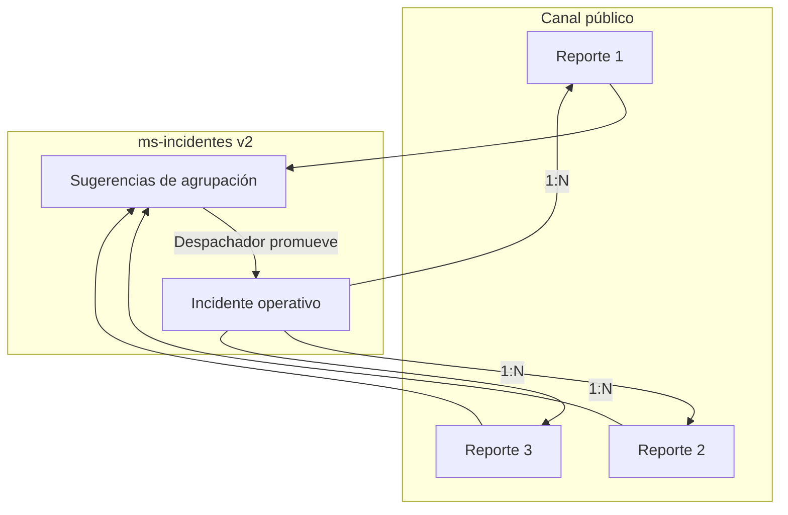

# Plan futuro — Reportes ciudadanos vs Incidentes operativos (v2)

> **Estado:** planificado · **no implementar en la versión actual del video ni del entregable académico inmediato**  
> **Versión objetivo:** próxima iteración de REV (post-demo / v2)

---

## 1. Problema que resuelve

Hoy el ciudadano y el operador trabajan sobre el **mismo agregado** (`incidentes` en `ms-incidentes`). Un reporte público crea directamente un registro con estado `REPORTADO` y folio de incidente. Eso sirve para la demo académica, pero en operación real:

| Concepto | Quién lo crea | Jerarquía | Ejemplo |
|----------|---------------|-----------|---------|
| **Reporte** | Cualquier persona (portal, sin login) | Bajo nivel, volumen alto, posible ruido | «Veo humo en la esquina» |
| **Incidente** | Personal autorizado (despachador / operador) | Unidad operativa de despacho | «Incendio forestal sector Alto Jahuel — 3 reportes confirmados» |

**Regla de negocio v2:** muchos reportes pueden alimentar **un** incidente. La decisión es humana (despachador); el sistema **sugiere** agrupaciones por geolocalización, tiempo y tipo.

---

## 2. Estado actual del repositorio (v1)

### 2.1 Lo que ya existe

| Pieza | Ubicación | Comportamiento actual |
|-------|-----------|----------------------|
| Reporte público | Portal → `POST` público vía BFF | Crea fila en `incidentes` con `origen_reporte = PUBLICO` |
| Incidente interno | Dashboard → «Nuevo incidente» | Crea fila con `origen_reporte = INTERNO` |
| Correlación automática | `CorrelacionService` + `CorrelacionScorer` | Al crear un incidente, busca pares cercanos en tiempo/espacio y genera sugerencias `PENDIENTE` |
| Scoring geo | `CorrelacionScorer` | Distancia Haversine, ventana temporal, mismo tipo, bonus si ambos son públicos |
| UI correlaciones | `/incidentes?vista=correlaciones` | Despachador **confirma** o **descarta** fusionar dos incidentes en un canónico |
| Asignación de zona | `ZonaAsignacionService` | Al crear, asigna `zona_id` según coordenadas |

### 2.2 Limitación respecto al modelo deseado

- No hay tabla ni entidad **Reporte** separada.
- «Correlacionar» hoy significa **fusionar dos incidentes**, no «promover N reportes → 1 incidente nuevo».
- Un reporte ciudadano ya **es** un incidente operativo en cola de despacho.
- No existe bandeja «solo reportes sin promover».

**Conclusión:** la correlación actual es un **anticipo técnico** del agrupamiento geo-temporal; en v2 se reutiliza la lógica de scoring pero cambia el dominio.

---

## 3. Modelo de dominio propuesto (v2)

### 3.1 Entidades nuevas (borrador)

**`reportes`**

| Campo | Notas |
|-------|-------|
| `id` | UUID |
| `folio_reporte` | Secuencia distinta a folio incidente (ej. `REP-2026-0001`) |
| `tipo`, `descripcion`, `lat`, `lng` | Igual que hoy en portal |
| `estado_reporte` | `RECIBIDO` · `EN_REVISION` · `ASOCIADO` · `DESCARTADO` |
| `incidente_id` | NULL hasta asociación; FK cuando se promueve |
| `origen` | `PUBLICO` · `TELEFONO` · … |
| `created_at` | Timestamp |

**`incidentes` (ajuste)**

| Cambio | Detalle |
|--------|---------|
| Creación | Solo rol Despachador/Admin (o automática al confirmar sugerencia) |
| Estado inicial | `ABIERTO` o mantener `REPORTADO` según convención |
| Relación | `incidente_reportes` (N reportes por incidente) |

**`sugerencias_agrupacion` (evolución de `incidente_correlacion`)**

| Campo | Notas |
|-------|-------|
| `reporte_ids[]` o tabla puente | Conjunto sugerido |
| `score` | Reutilizar `CorrelacionScorer` adaptado a reportes |
| `estado` | `PENDIENTE` · `PROMOVIDA` · `DESCARTADA` |
| `incidente_id` | Incidente creado al promover |

### 3.2 Flujo operativo v2

1. Ciudadano envía **reporte** → estado `RECIBIDO`; **no** entra directo a cola de despacho como incidente.
2. Motor de sugerencias agrupa reportes por geo + tiempo + tipo (misma lógica que `CorrelacionScorer`).
3. Despachador abre **Bandeja de reportes** / **Sugerencias**:
   - Ver cluster en mapa.
   - **Promover a incidente** → crea incidente + asocia reportes.
   - **Descartar** reporte spam / duplicado.
4. Incidente promovido pasa a **cola de despacho** actual (asignación de brigadas sin cambios en `ms-recursos`).

---

## 4. Cambios por capa (alcance estimado)

### 4.1 ms-incidentes

- [ ] Migración Flyway: tabla `reportes`, `incidente_reportes`, ajuste estados.
- [ ] `ReporteService` + endpoints `POST /reportes/publico`, `GET /reportes`, `POST /reportes/{id}/promover`.
- [ ] Refactor `CorrelacionService` → `SugerenciaAgrupacionService` (reportes como unidad).
- [ ] Mantener Factory Method de estados en **incidentes** (no en reportes).

### 4.2 bff-rev

- [ ] Facade: dashboard separa KPIs `reportesPendientes` vs `incidentesActivos`.
- [ ] Endpoints públicos de reporte sin crear incidente.
- [ ] Orquestación «promover sugerencia».

### 4.3 frontend

- [ ] Portal: mensaje «Su reporte fue recibido» (no «incidente creado»).
- [ ] Nueva vista o pestaña **Reportes** (bandeja + mapa).
- [ ] **Incidentes** solo para ciclo operativo post-promoción.
- [ ] Renombrar copy en correlaciones → «Sugerencias de agrupación».

### 4.4 ms-recursos / ms-zonas-riesgo

- Sin cambios estructurales; el despacho sigue asignando brigadas a **incidentes** promovidos.

---

## 5. Reutilización del código actual

| Componente v1 | Uso en v2 |
|---------------|-----------|
| `CorrelacionScorer` | Scoring entre reportes (distancia, tiempo, tipo) |
| `GeoUtils.haversineMetros` | Clusters geo |
| `CorrelacionProperties` (radios por tipo) | Config de sugerencias |
| UI mapa `/zonas` | Visualizar reportes + incidente promovido |
| `ZonaAsignacionService` | Ejecutar al promover incidente, no al recibir reporte |

---

## 6. Criterios de aceptación v2

1. Un reporte público **no** aparece en cola de despacho hasta promoción.
2. Despachador puede crear incidente manual sin reportes (caso interno / llamada).
3. Despachador puede promover un cluster de ≥ 2 reportes en un incidente con un clic.
4. Sugerencias muestran score y motivo (distancia, minutos, tipo) como hoy en correlaciones.
5. Historial: incidente conserva trazabilidad de reportes asociados.

---

## 7. Relación con el video demo actual (v1)

En la grabación **v1** se muestra el comportamiento actual:

- Reporte portal → aparece como incidente en despacho (modelo unificado).
- Pestaña **Correlaciones** → anticipo de agrupación geo; narrar como «el sistema sugiere reportes relacionados».

**Frase sugerida en el video (sin implementar v2):**

> «Hoy cada alerta ciudadana ingresa al despacho como incidente en estado reportado. En la próxima versión separaremos reportes e incidentes: el operador decidirá cuándo varios reportes de una zona se convierten en un incidente operativo, con sugerencias automáticas por geolocalización — la base ya está en el módulo de correlaciones.»

---

## 8. Orden de implementación sugerido

1. **Fase A — Dominio:** tablas `reportes` + API pública sin tocar flujo despacho.
2. **Fase B — Sugerencias:** migrar scorer a reportes; UI bandeja.
3. **Fase C — Promoción:** flujo despachador + cola solo incidentes promovidos.
4. **Fase D — Deprecación:** migrar datos `incidentes` con `origen=PUBLICO` existentes a reportes (script Flyway).

---

## Referencias en el repo

- [CorrelacionScorer.java](../businessdomain/ms-incidentes/src/main/java/cl/duocuc/rev/incidentes/correlacion/CorrelacionScorer.java)
- [CorrelacionService.java](../businessdomain/ms-incidentes/src/main/java/cl/duocuc/rev/incidentes/service/CorrelacionService.java)
- [OrigenReporte.java](../businessdomain/ms-incidentes/src/main/java/cl/duocuc/rev/incidentes/model/OrigenReporte.java)
- [guion-video-tour-modulos.md](./informe-evidencias/guion-video-tour-modulos.md) — demo v1 con momento en vivo portal → despacho
