<!-- _class: lead -->

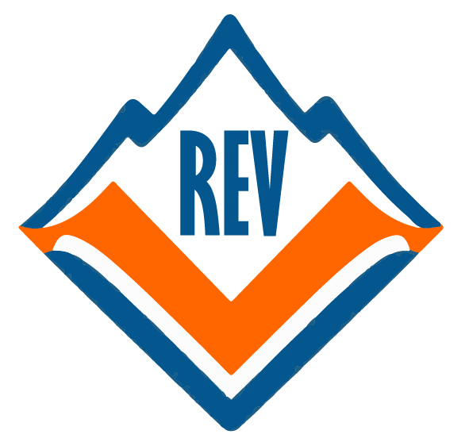

# RED DE EMERGENCIA VALLE

## REV — Municipalidad de Valle del Sol

Conectividad que salva vidas

Innovación que resguarda el mañana · DSY1106 EVA2 · Mayo 2026

Nicolás Barra
Giannina Guerrero
Prof. Israel Alejandro Villagra Riquelme

Plataforma de **misión crítica** en microservicios Spring Cloud. Esta presentación resume el **informe técnico integral** con evidencias en código, capturas del dashboard y arquitectura desplegada en Docker.

<!--
Notas del expositor:
Abrir con el lema institucional. REV no es solo un proyecto académico: responde a un problema real de gestión de emergencias en Valle del Sol. Mencionar que todo lo que verán está verificado en el repositorio rev-fullstack.
Posible pregunta: «¿Por qué microservicios y no un monolito?» → Picos de demanda en crisis, despliegue independiente por dominio, resiliencia perimetral.
-->

---

<!-- _class: dense -->

# Entregables EVA2 — Segunda evaluación

## Documentación e implementación alineada al informe integral

Informe integral
14 capítulos · fig. 1–20
informe-tecnico-integral-rev.html

Ecosistema
BFF + 3 MS + Gateway
Keycloak · Eureka · Docker

Frontend
Dashboard operacional
frontend/rev-dashboard/

Arquetipo
Maven custom
rev-microservice-archetype/

Evidencias
Capturas UX + código
docs/informe-evidencias/

Git + CI
main / dev
commits [ TIPO ]: · GitHub Actions

**Metodología:** cada afirmación del informe se vincula a archivos del monorepo. Las figuras 14–16b son **screenshots reales** con datos del stack local.

---

# Problema identificado

## ¿Por qué es necesario REV?

Los municipios enfrentan <strong>picos impredecibles de demanda</strong> durante incendios, incidentes urbanos y emergencias estructurales.

| Limitación | Impacto |
|------------|---------|
| Acoplamiento monolítico | Un fallo tumba todo |
| Escalado uniforme | No prioriza incidentes |
| Interfaces fragmentadas | Despachador pierde tiempo |
| Canales ciudadanos lentos | Demora activación brigadas |

<blockquote>El problema no es «falta de software», sino <strong>arquitectura no adaptable</strong> a la urgencia municipal.</blockquote>


<!--
Notas del expositor:
Conectar con el informe-sistema-rev.md §1: modelos monolíticos no absorben picos. Ejemplo concreto: durante un incendio forestal en zona metropolitana + reportes costeros simultáneos.
Pregunta probable: «¿Qué pasa si cae un servicio?» → Anticipar slide 16 (Circuit Breaker + degraded).
-->

---

<!-- _class: dense -->

# Objetivos del proyecto

## Alineación objetivo ↔ arquitectura

| Tipo | Objetivo | Componente que lo materializa |
|------|----------|-------------------------------|
| **General** | Plataforma integral de gestión de emergencias municipales | Monorepo: React + Gateway + BFF + 3 MS |
| **Específico 1** | Gestionar ciclo de vida de incidentes con reglas de negocio | `ms-incidentes` + Factory/State |
| **Específico 2** | Evaluar riesgo territorial por coordenadas | `ms-zonas-riesgo` + PostGIS |
| **Específico 3** | Coordinar brigadas, vehículos y herramientas | `ms-recursos` + asignación vía BFF |
| **Específico 4** | Vista unificada para el despachador | `bff-rev` + `DashboardFacadeService` |
| **Específico 5** | Canal ciudadano sin autenticación | Portal `/portal` + `POST /api/public/incidentes` |

Cada objetivo específico corresponde a un **bounded context** con base de datos propia. El BFF agrega; los MS deciden.

<!--
Notas del expositor:
Enfatizar trazabilidad objetivo → microservicio. EVA2 exige BFF + 2 MS + arquetipos: REV entrega BFF + 3 MS + arquetipo Maven custom.
Pregunta: «¿Dónde está la transición de estados en UI?» → Backend completo (PUT transicion); UI aún solo visualiza — gap documentado en informe §6.
-->

---

<!-- _class: diagram -->

# Visión general de REV

## Propósito, actores y dominios

| Actor | Rol |
|-------|-----|
| Despachador | Crea incidentes, asigna recursos |
| Brigadista | Consulta estado y riesgo |
| Administrador | Operación + Keycloak |
| Ciudadano | Reporta vía portal público |

Tres dominios <strong>sin BD compartida</strong>. El BFF entrega <code>DashboardResponse</code> unificado.


<!--
Notas del expositor:
Explicar interacción: al listar incidentes, el BFF enriquece cada uno con nivel de riesgo (coordenadas → ms-zonas) y recursos asignados (ms-recursos).
Pregunta: «¿Por qué separar recursos de incidentes?» → Diferente ritmo de cambio, equipos distintos, escalado independiente (DDD).
-->

---

<!-- _class: diagram -->

# Arquitectura general

## Ecosistema verificado en el monorepo


PerímetroGateway + JWT

Datos3 BD aisladas

DiscoveryEureka lb://

MonitorSBA :8099

<!--
Notas del expositor:
Recorrer capas: cliente → perímetro → orquestación → dominio → datos. Puerto único de entrada para el frontend: 8080 (Gateway). Vite proxy en dev.
Pregunta: «¿Por qué Keycloak Adapter y no JWT directo en Gateway?» → Separación de responsabilidades; adapter valida RSA256 con JWK del realm rev.
-->

---

<!-- _class: dense -->

# Microservicios implementados

## Responsabilidad, datos y beneficio de la separación

| Microservicio | Puerto | BD | Responsabilidad |
|---------------|--------|-----|-----------------|
| **ms-incidentes** | 8081 | `rev_incidentes` | Ciclo de vida del incidente |
| **ms-zonas-riesgo** | 8082 | `rev_zonas` | Territorio y evaluación de riesgo |
| **ms-recursos** | 8083 | `rev_recursos` | Logística operacional |

### ms-incidentes
Reglas de transición encapsuladas (Factory + State). Cambios en estados no afectan zonas ni recursos.

### ms-zonas-riesgo
PostGIS + adaptador climático (`WeatherDataPort`). Evolución territorial sin tocar incidentes.

**ms-recursos:** asignaciones con `incidente_id` UUID — desacoplamiento cross-service sin FK entre bases de datos.

<!--
Notas del expositor:
Cada MS tiene Flyway, Actuator, springdoc-openapi, Eureka client. ddl-auto=validate en los tres.
Pregunta: «¿Cómo se comunican?» → REST síncrono vía WebClient en BFF con nombres Eureka MS-INCIDENTES, etc.
-->

---

<!-- _class: diagram -->

# Infraestructura de plataforma

## Componentes transversales del ecosistema

| Componente | Función |
|------------|---------|
| **Docker Compose** | 12 servicios reproducibles |
| **Eureka :8761** | Service discovery |
| **Keycloak :8090** | IAM realm `rev` |
| **SBA :8099** | Salud centralizada |


Arranque: <code>.\scripts\dev-up.ps1 -DockerApps</code>

<!--
Notas del expositor:
Mencionar orden de dependencias en compose: BD/Keycloak → Eureka → SBA → MS → BFF → Gateway.
Pregunta: «¿Por qué JRE Alpine 21?» → Imágenes livianas, alineado a sostenibilidad documentada en informe §2.2.
-->

---

<!-- _class: dense -->

# Patrones arquitectónicos

## De la teoría a la implementación REV

| Patrón | Aplicación en REV | Beneficio |
|--------|-------------------|-----------|
| **Microservices** | 3 MS + BFF + Gateway | Escalado independiente |
| **API Gateway** | `api-gateway` :8080 | Seguridad centralizada |
| **BFF** | `DashboardFacadeService` | Una llamada al dashboard |
| **Service Discovery** | Eureka + `lb://BFF-REV` | Sin hardcodear hosts |
| **Circuit Breaker** | Resilience4j en BFF | Operación parcial ante fallos |
| **Database per Service** | 3 PostgreSQL/PostGIS | Autonomía de datos |

**Cache-aside:** `ZonaRiesgoCache` sirve datos de riesgo cuando `ms-zonas-riesgo` no responde.

<!--
Notas del expositor:
Diferenciar patrón arquitectónico (estilo del sistema) vs patrón de diseño (clase Java). Gateway Filter = AuthenticationFilter.java.
Pregunta: «¿Endpoint público sin JWT?» → /api/public/** para portal ciudadano; ruta sin AuthenticationFilter en application.yml.
-->

---

<!-- _class: diagram dense -->

# Patrones de diseño implementados

## Trazabilidad clase → problema → beneficio


| Patrón | Implementación |
|--------|----------------|
| **Factory + State** | `IncidentStateFactory` |
| **Adapter** | `FakeWeatherAdapter` |
| **Facade** | `DashboardFacadeService` |
| **Repository** | Spring Data JPA |

<code>ReportadoState</code> exige georreferenciación para pasar a <code>EN_PROGRESO</code>.

<!--
Notas del expositor:
Mostrar en IDE IncidentStateFactory si hay proyector. Enfatizar doble patrón Factory+State en ms-incidentes.
Pregunta: «¿FakeWeatherAdapter es un hack?» → No; es adaptador consciente para demo; puerto permite IoT futuro (documentado §10.3 informe).
-->

---

<!-- _class: diagram -->

# Arquetipos utilizados

## Estructura reutilizable del monorepo


| Capa | Ejemplo |
|------|---------|
| Controller | `IncidenteController` |
| Service | `IncidenteService` |
| Repository | `IncidenteRepository` |

Estandariza nuevos MS municipales sin reconfigurar Eureka, Actuator ni Flyway.

<!--
Notas del expositor:
Los 3 MS actuales fueron implementados manualmente pero replican el arquetipo. Comando mvn archetype:generate documentado en patrones-y-arquitectura-rev.md §3.2.
Pregunta EVA2: «¿Cuántos arquetipos Maven?» → Uno custom en archetypes/; estructura de capas como arquetipo organizacional.
-->

---

<!-- _class: diagram -->

# DDD y Bounded Contexts

## Tres subdominios = tres microservicios autónomos


| Ventaja | Ejemplo REV |
|---------|-------------|
| Lenguaje ubicuo | «Estado» vs «Nivel» |
| Evolución independiente | CRUD zonas sin migrar incidentes |
| Fallas contenidas | Circuit Breaker por MS |

Contrato UI: <code>{ incidente, zonaRiesgo, recursos, degraded }</code>

<!--
Notas del expositor:
Asignacion.incidente_id es UUID sin FK cross-DB — integración eventual, típica en microservicios.
Pregunta: «¿Es DDD completo?» → Bounded contexts sí; agregados simplificados; mejora futura: carpeta domain/ explícita (patrones doc §10).
-->

---

<!-- _class: visual -->

# Frontend y experiencia de usuario

## Módulos operativos verificados en UI

| Módulo | Ruta | Capacidad |
|--------|------|-----------|
| **Inicio** | `/inicio` | KPIs y panorama |
| **Despacho** | `/` | Tabla activos y alertas |
| **Incidentes** | `/incidentes` | Filtros, cards, rail |
| **Zonas** | `/zonas` | Mapa Leaflet |
| **Recursos** | `/recursos` | Brigadas y vehículos |
| **Portal** | `/portal` | Reporte ciudadano |

- **Una llamada al BFF** — `fetchDashboard()`
- **ModuleHub** — KPIs + toolbar + rail
- **StateView** — loading / error / empty
- **Lenguaje operacional** — «Con avisos», «Información parcial»

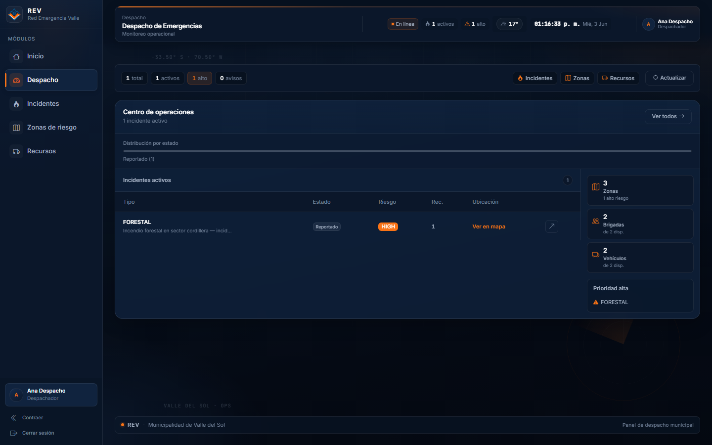

Fig. 14 — Panel Despacho (`/`)

<!--
Notas del expositor:
Demo en vivo recomendada: Inicio → Despacho → Incidentes con filtro alto riesgo → Zonas mapa → Portal reporte.
Pregunta: «¿Brigadista puede crear incidentes?» → No; canManageIncidents solo Admin/Despachador (useAuth.ts).
-->

---

<!-- _class: visual -->

# Reporte público y canal ciudadano

## Integración frontend ↔ BFF ↔ ms-incidentes

| Canal | Ruta | Backend |
|-------|------|---------|
| Login — Reportar | `/login` | POST público |
| Portal | `/portal` | Sin registro |
| Despacho | `/api/**` | JWT |


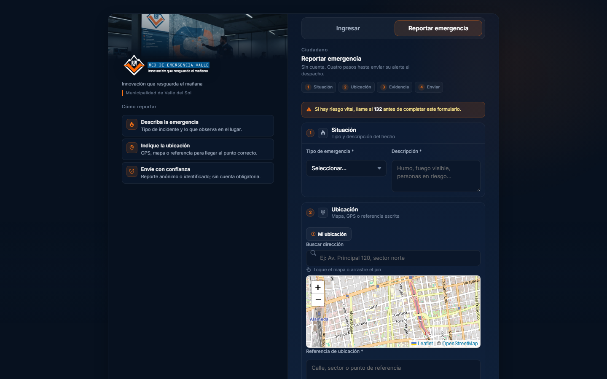

Fig. 16 — Reporte georreferenciado

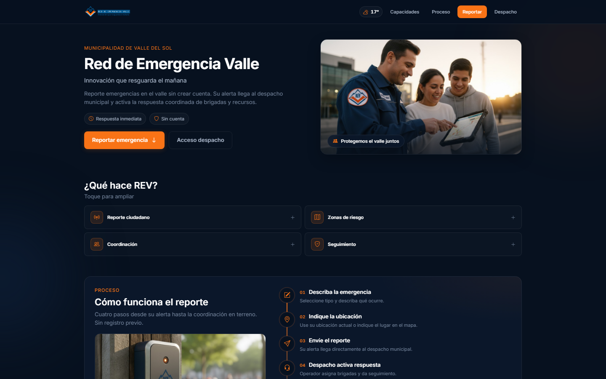

Fig. 16b — Portal ciudadano

El reporte público crea incidentes en <code>REPORTADO</code>; el despachador correlaciona y asigna recursos.

---

<!-- _class: visual -->

# Capturas operativas del sistema

## Evidencias UX integradas al informe (figuras 14–15b)

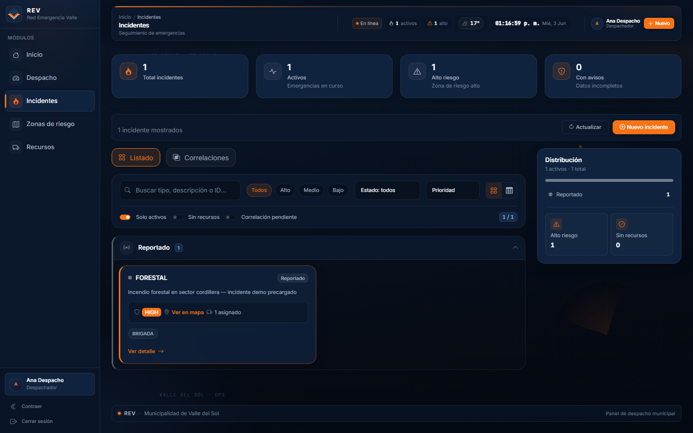

Incidentes — filtros, listado y rail (`/incidentes`)

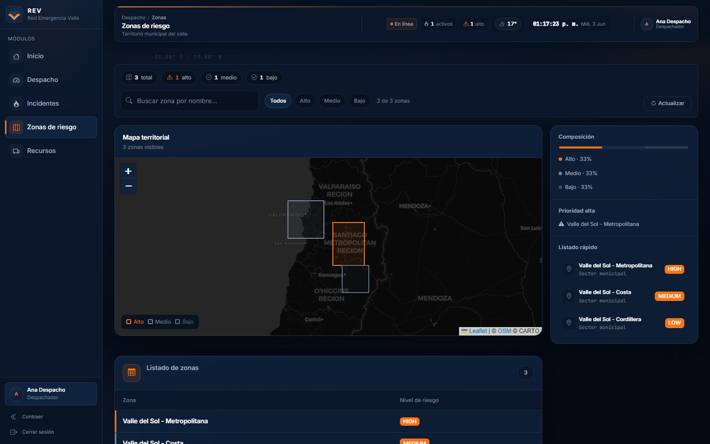

Zonas — mapa Leaflet + riesgo territorial (`/zonas`)

Stack Docker local · datos reales · <code>docs/informe-evidencias/</code>

---

# Diseño UX/UI y Design System

## Sistema visual monocromático institucional

--rev-bg#07111F

--rev-orange#F97316

--rev-surface#10233E

TipografíaInter · Segoe UI

| Componente | Uso en REV |
|------------|------------|
| `RevLogo` | Identidad en shell y login |
| `KpiCard` / `ModuleHub` | Métricas y layout módulo |
| `DegradedAlert` | Modo información parcial |
| `OperationalAmbient` | Fondo cartográfico |

**Principios de diseño**

- Paleta oscura → menos fatiga en sala de despacho
- Naranja único acento → jerarquía clara
- Glass cards + grid 8px → consola operacional
- CSS por módulo: `incidentes.css`, `zonas.css`, `portal.css`

<!--
Notas del expositor:
Referenciar theme.css como single source of truth. BootSplash y OperationalAmbient refuerzan identidad REV al arranque.
Pregunta: «¿Accesibilidad?» → Contraste alto, aria-labels en navegación, roles en tabs recursos; weather vía Open-Meteo sin API key.
-->

---

<!-- _class: diagram -->

# Roles y permisos

## Matriz verificada — realm Keycloak `rev`

| Acción | Desp. | Brig. | Admin |
|--------|:-----:|:-----:|:-----:|
| Navegación completa | ✓ | ✓ | ✓ |
| Ver módulos operativos | ✓ | ✓ | ✓ |
| **Crear incidente** | ✓ | ✗ | ✓ |
| **Asignar recurso** | ✓ | ✗ | ✓ |
| Consola Keycloak | ✗ | ✗ | ✓ |
| Portal público | ✓ | ✓ | ✓ |


<code>useAuth.ts</code> · usuarios dev: despachador / brigadista / admin

<!--
Notas del expositor:
Seguridad real en Gateway: AuthenticationFilter valida JWT y roles Despachador/Admin/Brigadista. UI oculta botones; Gateway bloquea API.
Pregunta: «¿Por qué Brigadista accede al panel?» → Visibilidad de incidentes activos y recursos; diferencia está en escritura.
-->

---

<!-- _class: diagram -->

# Seguridad

## ¿Cómo protege REV la información?

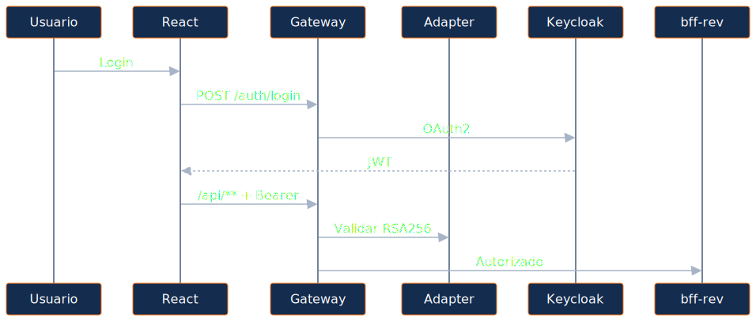

| Capa | Mecanismo |
|------|-----------|
| Identidad | Keycloak realm `rev` |
| Token | JWT RSA256 |
| Perímetro | `AuthenticationFilter` |
| Público | `/api/public/**` acotado |

Control en Gateway + adapter; MS sin <code>@PreAuthorize</code> (documentado).

<!--
Notas del expositor:
Explicar por qué adapter separado: Gateway no implementa lógica OAuth; adapter concentra login, roles, refresh (refresh aún no en UI).
Pregunta: «¿Es seguro el portal público?» → Solo creación de incidente; misma validación de negocio; sin acceso a datos agregados del despacho.
-->

---

<!-- _class: diagram -->

# Continuidad operacional y resiliencia

## ¿Qué ocurre cuando un servicio falla?


| Parámetro | Valor |
|-----------|-------|
| `slidingWindowSize` | 10 |
| `failureRateThreshold` | 50% |
| `waitDurationInOpenState` | 5s |

UX: «Información parcial» — el despachador sigue operando con incidentes visibles.

<!--
Notas del expositor:
Demo opcional: detener ms-recursos y refrescar dashboard — KPI «Con avisos» sube, DegradedAlert visible.
Pregunta: «¿Por qué no Hystrix?» → Resilience4j 2.2.0 en parent POM; estándar actual Spring Boot 4.
-->

---

<!-- _class: diagram dense -->

# Persistencia y base de datos

## Database per Service + Flyway (informe cap. 11)

| MS | Base de datos | Motor |
|----|---------------|-------|
| ms-incidentes | `rev_incidentes` | PostgreSQL 16 |
| ms-zonas-riesgo | `rev_zonas` | PostGIS 16 |
| ms-recursos | `rev_recursos` | PostgreSQL 16 |


<code>ddl-auto=validate</code> + Flyway · sin FK cross-service entre BD.

---

<!-- _class: diagram -->

# Observabilidad y trazabilidad

## Estado actual vs roadmap (informe cap. 10)

| Capacidad | Estado |
|-----------|--------|
| Actuator | ✓ Implementado |
| Spring Boot Admin | ✓ :8099 |
| Auditoría negocio | Parcial |
| Logging centralizado | Parcial |
| Prometheus / ELK | Proyección |


<code>degraded: true</code> conecta resiliencia backend con UX operacional.

---

<!-- _class: diagram -->

# Estrategia Git y trabajo colaborativo

## GitFlow simplificado (informe cap. 7)

| Rama | Propósito |
|------|-----------|
| `main` | Estable — demo EVA2 |
| `dev` | Integración diaria |
| `feature/*` | PR hacia `dev` |


Commits atómicos <code>[ TIPO ]:</code> · CI en GitHub Actions

---

<!-- _class: dense -->

# Evidencias técnicas del informe

## Galería figuras 1–20 — trazabilidad al repositorio

Fig. 1–7Patrones diseñoCap. 5

Fig. 8–9Git branchingCap. 7

Fig. 10–12SeguridadCap. 9

Fig. 13Flyway SQLCap. 11

Fig. 14–16bCapturas UXCap. 12–13

Fig. 17–20Infra DockerCap. 13

Referencia: <strong>informe-tecnico-integral-rev.html</strong> — diagramas Mermaid, código y paginación PDF.

---

<!-- _class: dense -->

# Tecnologías utilizadas

## Stack verificado y justificación

| Capa | Tecnología | Detalle |
|------|------------|---------|
| **Frontend** | React + Vite + TS | React 18, Vite 5 |
| **UI** | Bootstrap 5 + Icons | Grid accesible |
| **Mapas** | Leaflet | ZonasPage sin licencias |
| **Backend** | Java 21 + Spring Boot 4 | Spring Cloud 2025.1 |
| **Resiliencia** | Resilience4j 2.2.0 | Circuit Breaker en BFF |
| **BD** | PostgreSQL 16 + PostGIS | 3 bases aisladas |
| **Infra** | Docker Compose | 12 servicios |
| **Seguridad** | Keycloak 24 | realm `rev` |
| **Monitor** | Spring Boot Admin | :8099 vía Eureka |

<!--
Notas del expositor:
Monorepo Maven rev-parent centraliza versiones Spring Cloud 2025.1.1. Frontend empaquetado NPM en frontend/rev-dashboard/.
Pregunta: «¿Por qué WebClient y no Feign?» → BFF usa WebClient reactivo con @LoadBalanced — documentado en client services.
-->

---

<!-- _class: diagram -->

# Flujo funcional del sistema

## Recorrido operativo de punta a punta

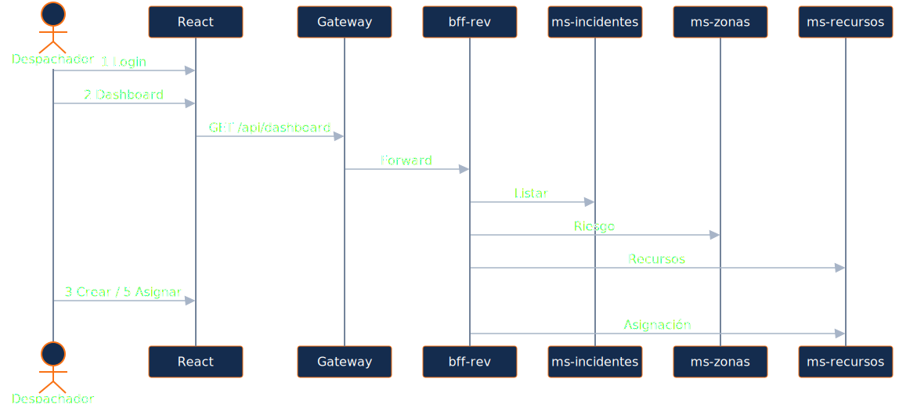

| Paso | Pantalla |
|------|----------|
| 1 | `LoginPage` |
| 2 | `DashboardPage` |
| 3 | Modal incidentes |
| 4 | `ZonasPage` mapa |
| 5 | Asignar recurso |

Ciudadano: <code>PortalPage</code> → POST público sin login.

<!--
Notas del expositor:
Recorrer demo en 2 minutos siguiendo la secuencia. Mencionar incidentCreatedTick en UiContext que refresca listas tras crear.
Pregunta: «¿Transición REPORTADO → EN_PROGRESO desde UI?» → No en UI; existe PUT en backend — gap §6.1 informe.
-->

---

# Resultados obtenidos

## Técnicos · Operacionales · Municipales

### Resultados técnicos
- Monorepo con 3 MS + BFF + Gateway + IAM
- 6+ patrones de diseño trazables a clases
- Circuit Breaker + cache aside operativos
- Arquetipo Maven custom documentado
- Tests en Factory, zonas y fallbacks BFF
- CI en GitHub Actions (`main`, `dev`)

### Resultados operacionales
- Dashboard unificado multi-fuente
- Portal ciudadano sin fricción
- Mapa de zonas de riesgo
- Asignación brigada/vehículo desde UI
- KPIs: activos, alto riesgo, con avisos
- Modo información parcial ante fallos

**Beneficio municipal:** coordinación más rápida, menor carga cognitiva del despachador y canal vecinal directo con mapa OSM.

<!--
Notas del expositor:
Relacionar cada resultado con objetivos slide 3. Honestidad académica: gap UI vs backend es fortaleza (consciencia madurez), no debilidad oculta.
Pregunta: «¿Qué falta?» → Transiciones estado UI, CRUD zonas, refresh token — todos listados en informe §10.3.
-->

---

<!-- _class: dense -->

# Conclusiones

## Respuestas técnicas de cierre

Solución moderna
Microservicios reales
Discovery · BFF · IAM · React

Arquitectura adecuada
Picos · territorio · seguridad
PostGIS · JWT · Circuit Breaker

Valor municipal
Conectividad que salva vidas
Despacho + terreno + comunidad

| Criterio | Decisión REV |
|----------|--------------|
| Picos de crisis | MS escalables por dominio |
| Datos sensibles | Gateway perimetral + JWT |
| Fallos parciales | degraded + DegradedAlert |

<!--
Notas del expositor:
Cierre argumentativo sólido — citar principios SOLID visibles: DIP (WeatherDataPort), OCP (State handlers), SRP (capas MS).
Pregunta: «¿Reescribirían algo?» → Seguridad en MS con @PreAuthorize como defensa en profundidad; observabilidad ELK/Prometheus.
-->

---

<!-- _class: diagram dense -->

# Evolución futura

## Proyecciones documentadas (informe cap. 14.4)

| Prioridad | Evolución |
|-----------|-----------|
| **Alta** | UI transiciones de estado |
| **Alta** | Mapa PostGIS avanzado |
| **Media** | CRUD zonas/recursos Admin |
| **Baja** | IoT climático real |


Cada MS puede replicarse detrás de Eureka sin reescribir el frontend.

<!--
Notas del expositor:
No prometer features no documentadas. IoT y móvil están en proyección «baja» — visión, no compromiso de entrega.
Pregunta: «¿Microservicios no son overkill?» → Para EVA2 y demo municipal es pedagógico; producción justifica si cargas son heterogéneas — aquí sí (incidentes vs geo vs logística).
-->

---

<!-- _class: lead closing -->

# Conectividad que salva vidas

## Resumen ejecutivo final

<strong>REV</strong> entrega una plataforma de emergencias municipal basada en microservicios Spring Cloud, React, Keycloak y Resilience4j.

| Entregable EVA2 | Artefacto |
|-----------------|-----------|
| Informe técnico integral | `informe-tecnico-integral-rev.html` |
| Frontend NPM | `frontend/rev-dashboard/` |
| BFF + 3 microservicios | `bff-rev` + 3 MS |
| Evidencias fig. 1–20 | `docs/informe-evidencias/` |
| Git + CI | `main` / `dev` · GitHub Actions |

### ¿Preguntas?

Red de Emergencia Valle · Duoc UC · DSY1106 · EVA2 · Mayo 2026

<!--
Notas del expositor:
Agradecer. Tener listo: Eureka :8761, dashboard :5173, IDE con IncidentStateFactory abierto, docker compose ps.
Preguntas difíciles anticipadas: (1) gap UI/backend — honestidad + roadmap §10.3; (2) seguridad solo en Gateway — perimetro + mejora futura; (3) FakeWeather — adapter pattern deliberado.
Duración objetivo total: 15 min defensa EVA2 ≈ 40 s por slide si se condensa; slides densos permiten seleccionar profundidad por pregunta del docente.
-->
