<!-- _class: cover-official -->
<!-- _paginate: false -->
<!-- _footer: "" -->

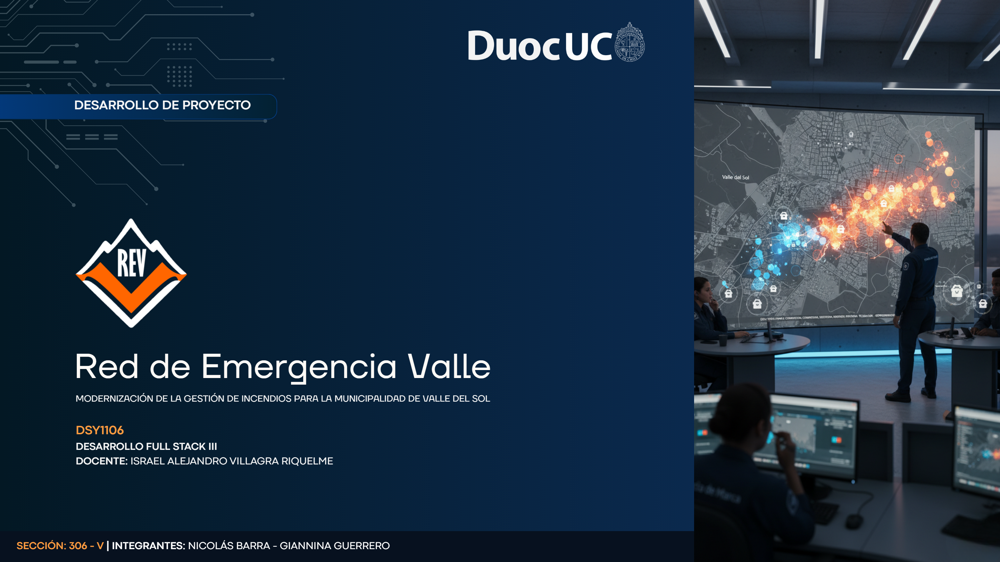

<!--
Notas del expositor:
Abrir con el lema institucional. REV no es solo un proyecto académico: responde a un problema real de gestión de emergencias en Valle del Sol. Mencionar que todo lo que verán está verificado en el repositorio rev-fullstack.
Posible pregunta: «¿Por qué microservicios y no un monolito?» → Picos de demanda en crisis, despliegue independiente por dominio, resiliencia perimetral.
-->

---

<!-- _class: dense -->

# Plataforma REV — valor operacional

<h2 class="rev-sub"><svg class="rev-ico" viewBox="0 0 16 16"><path d="M2 4.5h12M2 8h12M2 11.5h8"/><circle cx="13" cy="11.5" r="1.5"/></svg>Capacidades desplegadas para la municipalidad</h2>

<svg viewBox="0 0 16 16"><rect x="2" y="2" width="5" height="5" rx="1"/><rect x="9" y="2" width="5" height="5" rx="1"/><rect x="5.5" y="9" width="5" height="5" rx="1"/></svg>

Despacho unificadoUn panel · tres dominiosIncidentes · Zonas · Recursos

<svg viewBox="0 0 16 16"><path d="M8 1.5 14 4v4c0 3.5-2.5 6-6 6.5C4.5 14 2 11.5 2 8V4l6-2.5Z"/></svg>

Perímetro seguroGateway + KeycloakJWT · roles · canal público acotado

<svg viewBox="0 0 16 16"><path d="M8 2v4M8 10v4M2 8h4M10 8h4"/></svg>

ResilienciaCircuit Breaker + cacheOperación parcial ante fallos

<svg viewBox="0 0 16 16"><circle cx="8" cy="5" r="2.5"/><path d="M3 14c0-3 2.2-5 5-5s5 2 5 5"/></svg>

Canal ciudadanoPortal sin registroReporte georreferenciado 24/7

<svg viewBox="0 0 16 16"><path d="M8 1.5C5.5 1.5 3.5 3.5 3.5 6c0 4 4.5 8.5 4.5 8.5S12.5 10 12.5 6c0-2.5-2-4.5-4.5-4.5Z"/><circle cx="8" cy="6" r="1.5"/></svg>

Territorio inteligentePostGIS + mapa LeafletRiesgo por coordenadas

<svg viewBox="0 0 16 16"><rect x="2" y="3" width="12" height="10" rx="1.5"/><path d="M5 7h6M5 10h4"/></svg>

Despliegue reproducible12 servicios DockerJava 21 · React · Eureka

**Propuesta de valor:** REV conecta sala de despacho, terreno y comunidad en una arquitectura **cloud-native** que escala por dominio y mantiene continuidad operacional durante picos de crisis.

---

<!-- _class: dense -->

# Problema identificado

<h2 class="rev-sub"><svg class="rev-ico" viewBox="0 0 16 16"><path d="M8 1.5 14 4v4c0 3.5-2.5 6-6 6.5C4.5 14 2 11.5 2 8V4l6-2.5Z"/><path d="M8 5v3M8 11h.01"/></svg>Contexto municipal y brecha arquitectónica</h2>

Valle del Sol requiere coordinar <strong>incendios, incidentes urbanos y alertas ciudadanas</strong> con picos impredecibles. Los sistemas monolíticos colapsan cuando la demanda heterogénea crece en minutos.

| Limitación | Impacto operacional |
|------------|---------------------|
| Acoplamiento monolítico | Un fallo detiene todo el despacho |
| Escalado uniforme | No prioriza incidentes críticos |
| Interfaces fragmentadas | Latencia en decisiones del operador |
| Canales ciudadanos lentos | Retraso en activación de brigadas |

<strong>Escenario</strong>Incendio forestal + reportes costeros simultáneos

<strong>Ventana crítica</strong>Primeros 15 min definen alcance y víctimas

<strong>REV responde</strong>Escalado independiente por dominio de negocio

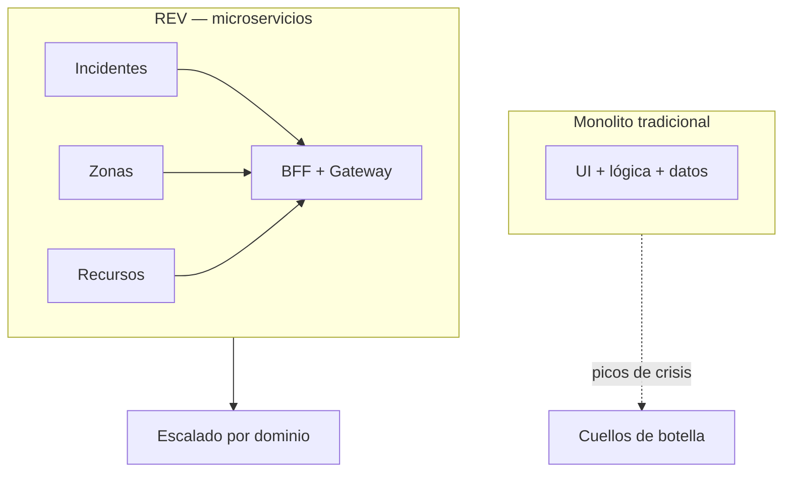

No es «falta de software»: es <strong>arquitectura rígida</strong> frente a urgencia territorial. REV separa responsabilidades para absorber crisis sin tumbar el despacho.

<!--
Notas del expositor:
Conectar con el informe-sistema-rev.md §1: modelos monolíticos no absorben picos. Ejemplo concreto: durante un incendio forestal en zona metropolitana + reportes costeros simultáneos.
Pregunta probable: «¿Qué pasa si cae un servicio?» → Anticipar slide 16 (Circuit Breaker + degraded).
-->

---

<!-- _class: dense -->

# Objetivos del proyecto

<h2 class="rev-sub"><svg class="rev-ico" viewBox="0 0 16 16"><path d="M2 12 6 4l4 5 4-7"/><path d="M2 14h12"/></svg>Objetivos de negocio alineados a la arquitectura</h2>

| Tipo | Objetivo | Componente que lo materializa |
|------|----------|-------------------------------|
| **General** | Plataforma integral de gestión de emergencias municipales | Monorepo: React + Gateway + BFF + 3 MS |
| **Específico 1** | Gestionar ciclo de vida de incidentes con reglas de negocio | `ms-incidentes` + Factory/State |
| **Específico 2** | Evaluar riesgo territorial por coordenadas | `ms-zonas-riesgo` + PostGIS |
| **Específico 3** | Coordinar brigadas, vehículos y herramientas | `ms-recursos` + asignación vía BFF |
| **Específico 4** | Vista unificada para el despachador | `bff-rev` + `DashboardFacadeService` |
| **Específico 5** | Canal ciudadano sin autenticación | Portal `/portal` + `POST /api/public/incidentes` |

Cada objetivo materializa un **bounded context** autónomo: base de datos propia, equipo evolutivo independiente y escalado selectivo. El BFF orquesta la vista; los microservicios ejecutan las reglas de negocio.

<!--
Notas del expositor:
Enfatizar trazabilidad objetivo → microservicio. EVA2 exige BFF + 2 MS + arquetipos: REV entrega BFF + 3 MS + arquetipo Maven custom.
Pregunta: «¿Dónde está la transición de estados en UI?» → Backend completo (PUT transicion); UI aún solo visualiza — gap documentado en informe §6.
-->

---

# Visión general de REV

<h2 class="rev-sub"><svg class="rev-ico" viewBox="0 0 16 16"><circle cx="5.5" cy="5" r="2"/><circle cx="10.5" cy="5" r="2"/><path d="M1.5 13c0-2.2 1.8-4 4-4s4 1.8 4 4M8.5 13c0-1.6 1-3 2.5-3.5"/></svg>Actores, dominios y flujo de valor</h2>

| Actor | Rol |
|-------|-----|
| Despachador | Crea incidentes, asigna recursos |
| Brigadista | Consulta estado y riesgo |
| Administrador | Operación + Keycloak |
| Ciudadano | Reporta vía portal público |

Tres dominios <strong>sin BD compartida</strong>. El BFF compone <code>DashboardResponse</code> en una sola llamada: incidente + riesgo territorial + recursos asignados + estado <code>degraded</code>.

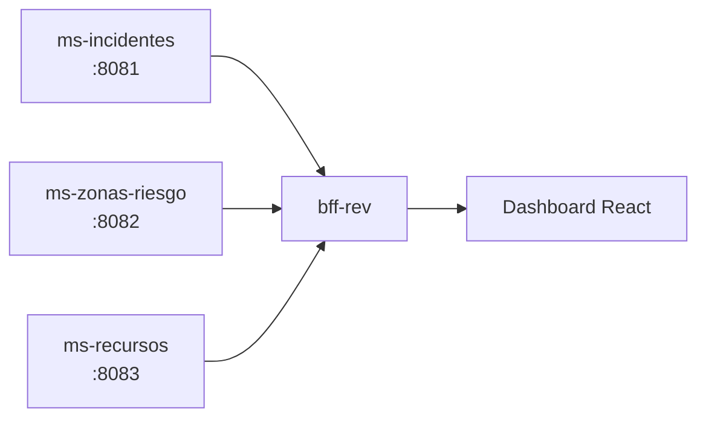

<!--
Notas del expositor:
Explicar interacción: al listar incidentes, el BFF enriquece cada uno con nivel de riesgo (coordenadas → ms-zonas) y recursos asignados (ms-recursos).
Pregunta: «¿Por qué separar recursos de incidentes?» → Diferente ritmo de cambio, equipos distintos, escalado independiente (DDD).
-->

---

<!-- _class: diagram-top diagram-focus -->

# Arquitectura general

<h2 class="rev-sub"><svg class="rev-ico" viewBox="0 0 16 16"><rect x="2" y="2" width="5" height="5" rx="1"/><rect x="9" y="2" width="5" height="5" rx="1"/><rect x="5.5" y="9" width="5" height="5" rx="1"/><path d="M4.5 7v1.5M11.5 7v1.5M8 7v2"/></svg>Capas del ecosistema cloud-native</h2>

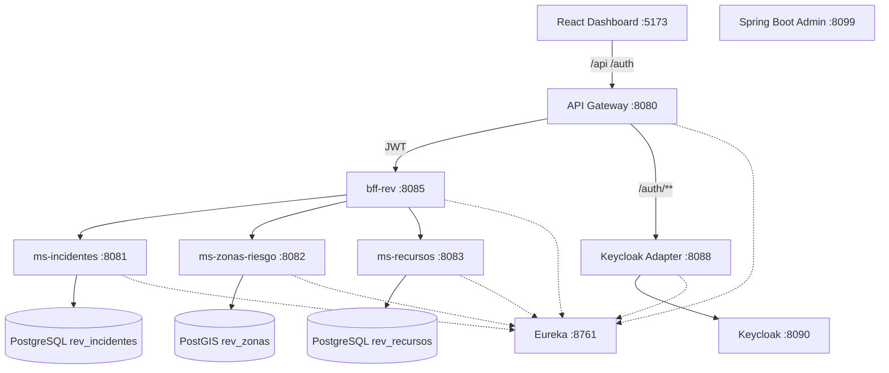

<strong>Perímetro</strong> Gateway + JWT
<strong>Datos</strong> 3 BD aisladas
<strong>Discovery</strong> Eureka lb://
<strong>Monitor</strong> SBA :8099

Flujo: <strong>cliente → Gateway → BFF → dominios → datos</strong> · entrada única para operadores y ciudadanos.

<!--
Notas del expositor:
Recorrer capas: cliente → perímetro → orquestación → dominio → datos. Puerto único de entrada para el frontend: 8080 (Gateway). Vite proxy en dev.
Pregunta: «¿Por qué Keycloak Adapter y no JWT directo en Gateway?» → Separación de responsabilidades; adapter valida RSA256 con JWK del realm rev.
-->

---

<!-- _class: dense -->

# Microservicios implementados

<h2 class="rev-sub"><svg class="rev-ico" viewBox="0 0 16 16"><path d="M3 3h4v4H3zM9 3h4v4H9zM3 9h4v4H3zM9 9h4v4H9z"/></svg>Tres microservicios · tres bases de datos</h2>

| Microservicio | Puerto | BD | Responsabilidad |
|---------------|--------|-----|-----------------|
| **ms-incidentes** | 8081 | `rev_incidentes` | Ciclo de vida del incidente |
| **ms-zonas-riesgo** | 8082 | `rev_zonas` | Territorio y evaluación de riesgo |
| **ms-recursos** | 8083 | `rev_recursos` | Logística operacional |

<svg viewBox="0 0 16 16"><path d="M8 2 3 13h10z"/><path d="M8 6v3M8 11h.01"/></svg>

ms-incidentes
:8081 · rev_incidentes

Factory + State en ciclo de vida. Cambios de estado no impactan zonas ni recursos.

<svg viewBox="0 0 16 16"><path d="M8 1.5C5.5 1.5 3.5 3.5 3.5 6c0 4 4.5 8.5 4.5 8.5S12.5 10 12.5 6c0-2.5-2-4.5-4.5-4.5Z"/><circle cx="8" cy="6" r="1.5"/></svg>

ms-zonas-riesgo
:8082 · PostGIS

Evaluación territorial y clima vía <code>WeatherDataPort</code>. Evolución geo sin tocar incidentes.

<svg viewBox="0 0 16 16"><rect x="1.5" y="5" width="9" height="6" rx="1"/><path d="M10.5 7H13l1.5 3v1h-4"/><circle cx="4" cy="12" r="1.3"/><circle cx="12" cy="12" r="1.3"/></svg>

ms-recursos
:8083 · rev_recursos

Brigadas y vehículos con <code>incidente_id</code> UUID — sin FK cross-service entre BD.

Separación deliberada: reglas de <strong>incidentes</strong> evolucionan sin redesplegar zonas ni logística. Contrato REST vía Eureka.

<!--
Notas del expositor:
Cada MS tiene Flyway, Actuator, springdoc-openapi, Eureka client. ddl-auto=validate en los tres.
Pregunta: «¿Cómo se comunican?» → REST síncrono vía WebClient en BFF con nombres Eureka MS-INCIDENTES, etc.
-->

---

<!-- _class: dense -->

# Infraestructura de plataforma

<h2 class="rev-sub"><svg class="rev-ico" viewBox="0 0 16 16"><rect x="2" y="3" width="12" height="10" rx="1.5"/><path d="M5 7h6M5 10h4"/><path d="M5 3V2M11 3V2"/></svg>Infraestructura transversal y despliegue</h2>

<svg viewBox="0 0 16 16"><rect x="2" y="3" width="12" height="10" rx="1.5"/><path d="M5 7h6M5 10h4"/></svg>

Docker Compose
12 servicios

Stack reproducible: BD, IAM, discovery y apps Java en un solo comando.

<svg viewBox="0 0 16 16"><circle cx="8" cy="8" r="2"/><path d="M8 2v2M8 12v2M2 8h2M12 8h2"/></svg>

Eureka :8761
Discovery

Registro dinámico de microservicios y balanceo <code>lb://</code> desde el BFF.

<svg viewBox="0 0 16 16"><path d="M8 1.5 14 4v4c0 3.5-2.5 6-6 6.5C4.5 14 2 11.5 2 8V4l6-2.5Z"/></svg>

Keycloak + SBA
:8090 · :8099

IAM realm <code>rev</code> y monitoreo centralizado de salud vía Actuator.

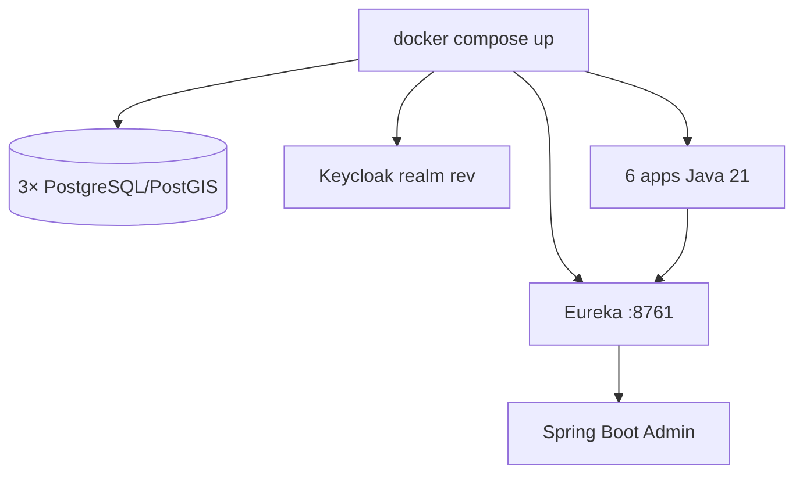

Arranque: <code>.\scripts\dev-up.ps1 -DockerApps</code>

<!--
Notas del expositor:
Mencionar orden de dependencias en compose: BD/Keycloak → Eureka → SBA → MS → BFF → Gateway.
Pregunta: «¿Por qué JRE Alpine 21?» → Imágenes livianas, alineado a sostenibilidad documentada en informe §2.2.
-->

---

<!-- _class: dense -->

# Patrones arquitectónicos

<h2 class="rev-sub"><svg class="rev-ico" viewBox="0 0 16 16"><path d="M2 4h12v8H2z"/><path d="M5 7h6M5 10h3"/></svg>Patrones arquitectónicos aplicados en producción</h2>

| Patrón | Aplicación en REV | Beneficio |
|--------|-------------------|-----------|
| **Microservices** | 3 MS + BFF + Gateway | Escalado independiente |
| **API Gateway** | `api-gateway` :8080 | Seguridad centralizada |
| **BFF** | `DashboardFacadeService` | Una llamada al dashboard |
| **Service Discovery** | Eureka + `lb://BFF-REV` | Sin hardcodear hosts |
| **Circuit Breaker** | Resilience4j en BFF | Operación parcial ante fallos |
| **Database per Service** | 3 PostgreSQL/PostGIS | Autonomía de datos |

**Cache-aside:** `ZonaRiesgoCache` sirve datos de riesgo cuando `ms-zonas-riesgo` no responde.

<!--
Notas del expositor:
Diferenciar patrón arquitectónico (estilo del sistema) vs patrón de diseño (clase Java). Gateway Filter = AuthenticationFilter.java.
Pregunta: «¿Endpoint público sin JWT?» → /api/public/** para portal ciudadano; ruta sin AuthenticationFilter en application.yml.
-->

---

<!-- _class: diagram-top diagram-focus dense -->

# Patrones de diseño implementados

<h2 class="rev-sub"><svg class="rev-ico" viewBox="0 0 16 16"><path d="M4 3h8v3H4z"/><path d="M3 9h10v4H3z"/><path d="M6 6v3"/></svg>Patrones de diseño con impacto en el negocio</h2>

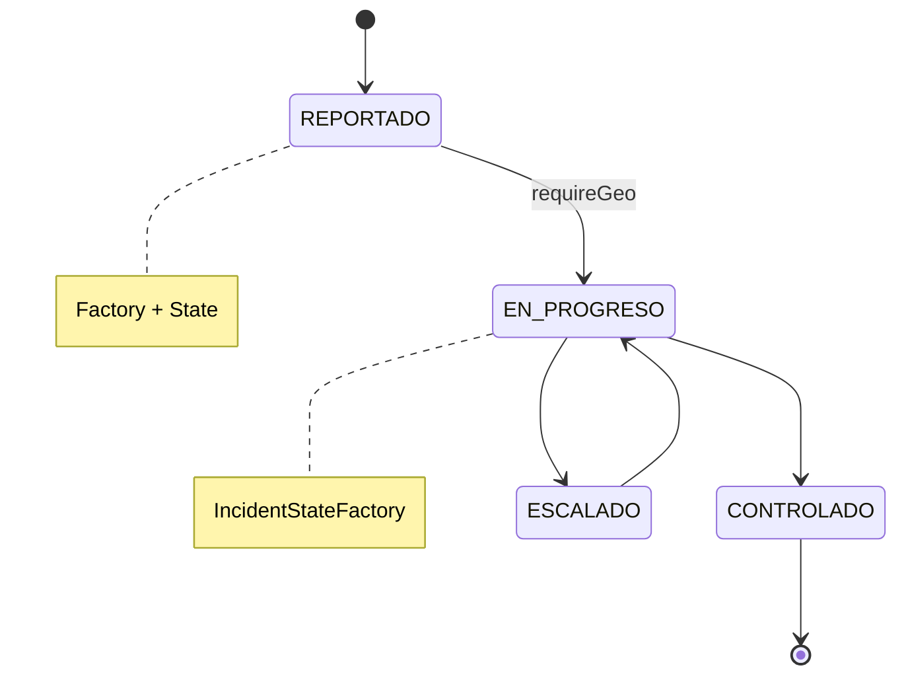

| Patrón | Implementación |
|--------|----------------|
| **Factory + State** | `IncidentStateFactory` |
| **Adapter** | `FakeWeatherAdapter` |
| **Facade** | `DashboardFacadeService` |
| **Repository** | Spring Data JPA |

<code>ReportadoState</code> exige georreferenciación para pasar a <code>EN_PROGRESO</code>.

<!--
Notas del expositor:
Mostrar en IDE IncidentStateFactory si hay proyector. Enfatizar doble patrón Factory+State en ms-incidentes.
Pregunta: «¿FakeWeatherAdapter es un hack?» → No; es adaptador consciente para demo; puerto permite IoT futuro (documentado §10.3 informe).
-->

---

<!-- _class: diagram-top diagram-focus -->

# Arquetipos utilizados

<h2 class="rev-sub"><svg class="rev-ico" viewBox="0 0 16 16"><path d="M3 2h7l3 3v9H3z"/><path d="M10 2v3h3"/></svg>Arquetipo para escalar el ecosistema municipal</h2>

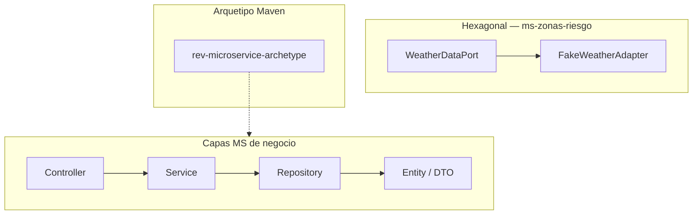

| Capa | Ejemplo |
|------|---------|
| Controller | `IncidenteController` |
| Service | `IncidenteService` |
| Repository | `IncidenteRepository` |

Estandariza nuevos MS municipales sin reconfigurar Eureka, Actuator ni Flyway.

<!--
Notas del expositor:
Los 3 MS actuales fueron implementados manualmente pero replican el arquetipo. Comando mvn archetype:generate documentado en patrones-y-arquitectura-rev.md §3.2.
Pregunta EVA2: «¿Cuántos arquetipos Maven?» → Uno custom en archetypes/; estructura de capas como arquetipo organizacional.
-->

---

<!-- _class: diagram-top diagram-focus dense -->

# DDD y Bounded Contexts

<h2 class="rev-sub"><svg class="rev-ico" viewBox="0 0 16 16"><circle cx="4" cy="4" r="2"/><circle cx="12" cy="4" r="2"/><circle cx="8" cy="12" r="2"/><path d="M6 5.5 7 10M10 5.5 9 10"/></svg>Bounded contexts y capa anti-corrupción</h2>

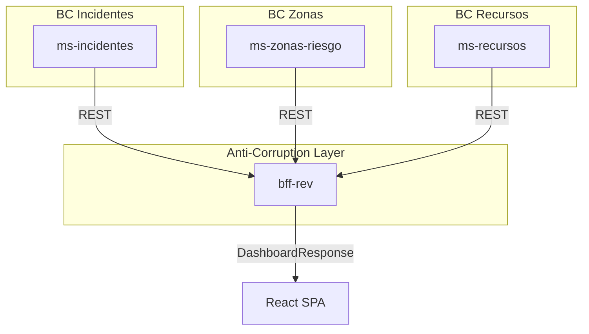

| Ventaja | Ejemplo REV |
|---------|-------------|
| Lenguaje ubicuo | «Estado» vs «Nivel» |
| Evolución independiente | CRUD zonas sin migrar incidentes |
| Fallas contenidas | Circuit Breaker por MS |

Contrato UI: <code>{ incidente, zonaRiesgo, recursos, degraded }</code>

<!--
Notas del expositor:
Asignacion.incidente_id es UUID sin FK cross-DB — integración eventual, típica en microservicios.
Pregunta: «¿Es DDD completo?» → Bounded contexts sí; agregados simplificados; mejora futura: carpeta domain/ explícita (patrones doc §10).
-->

---

<!-- _class: visual -->

# Frontend y experiencia de usuario

<h2 class="rev-sub"><svg class="rev-ico" viewBox="0 0 16 16"><rect x="2" y="3" width="12" height="9" rx="1"/><path d="M2 6h12"/></svg>Consola operacional para sala de despacho</h2>

| Módulo | Ruta | Capacidad |
|--------|------|-----------|
| **Inicio** | `/inicio` | KPIs y panorama |
| **Despacho** | `/` | Tabla activos y alertas |
| **Incidentes** | `/incidentes` | Filtros, cards, rail |
| **Zonas** | `/zonas` | Mapa Leaflet |
| **Recursos** | `/recursos` | Brigadas y vehículos |
| **Portal** | `/portal` | Reporte ciudadano |

- **Una llamada al BFF** — `fetchDashboard()`
- **ModuleHub** — KPIs + toolbar + rail
- **StateView** — loading / error / empty
- **Lenguaje operacional** — «Con avisos», «Información parcial»

Panel Despacho — KPIs, alertas y tabla de incidentes activos

<!--
Notas del expositor:
Demo en vivo recomendada: Inicio → Despacho → Incidentes con filtro alto riesgo → Zonas mapa → Portal reporte.
Pregunta: «¿Brigadista puede crear incidentes?» → No; canManageIncidents solo Admin/Despachador (useAuth.ts).
-->

---

<!-- _class: dense slide-diag-media slide-media-portal -->

# Reporte público y canal ciudadano

<h2 class="rev-sub"><svg class="rev-ico" viewBox="0 0 16 16"><path d="M2 8h3M11 8h3"/><path d="M5 6l3 2-3 2M11 6l-3 2 3 2"/></svg>Portal → Gateway → ms-incidentes</h2>

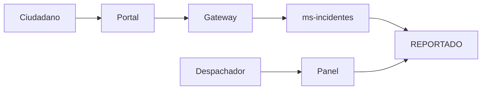

<strong>Login</strong> /login · POST público
<strong>Portal</strong> /portal · sin registro
<strong>Despacho</strong> /api/** · JWT

Canal vecinal — reporte sin fricción

El ciudadano activa la cadena en segundos: georreferencia → <code>REPORTADO</code> → visibilidad inmediata en despacho.

---

<!-- _class: visual -->

# Capturas operativas del sistema

<h2 class="rev-sub"><svg class="rev-ico" viewBox="0 0 16 16"><rect x="2" y="3" width="5" height="4" rx=".5"/><rect x="9" y="3" width="5" height="4" rx=".5"/><rect x="5.5" y="9" width="5" height="4" rx=".5"/></svg>Módulos críticos en operación real</h2>

Incidentes — filtros, listado y rail (`/incidentes`)

Zonas — mapa Leaflet + riesgo territorial (`/zonas`)

Capturas del stack Docker local con datos reales de despacho

---

# Diseño UX/UI y Design System

<h2 class="rev-sub"><svg class="rev-ico" viewBox="0 0 16 16"><circle cx="8" cy="8" r="5"/><path d="M8 3v10M3 8h10"/></svg>Design system para entornos de misión crítica</h2>

--rev-bg#07111F

--rev-orange#F97316

--rev-surface#10233E

TipografíaInter · Segoe UI

| Componente | Uso en REV |
|------------|------------|
| `RevLogo` | Identidad en shell y login |
| `KpiCard` / `ModuleHub` | Métricas y layout módulo |
| `DegradedAlert` | Modo información parcial |
| `OperationalAmbient` | Fondo cartográfico |

**Principios de diseño**

- Paleta oscura → menos fatiga en sala de despacho
- Naranja único acento → jerarquía clara
- Glass cards + grid 8px → consola operacional
- CSS por módulo: `incidentes.css`, `zonas.css`, `portal.css`

<!--
Notas del expositor:
Referenciar theme.css como single source of truth. BootSplash y OperationalAmbient refuerzan identidad REV al arranque.
Pregunta: «¿Accesibilidad?» → Contraste alto, aria-labels en navegación, roles en tabs recursos; weather vía Open-Meteo sin API key.
-->

---

<!-- _class: dense -->

# Roles y permisos

<h2 class="rev-sub"><svg class="rev-ico" viewBox="0 0 16 16"><path d="M8 1.5 14 4v4c0 3.5-2.5 6-6 6.5C4.5 14 2 11.5 2 8V4l6-2.5Z"/></svg>Control de acceso por rol operativo</h2>

| Acción | Desp. | Brig. | Admin |
|--------|:-----:|:-----:|:-----:|
| Navegación completa | ✓ | ✓ | ✓ |
| Ver módulos operativos | ✓ | ✓ | ✓ |
| **Crear incidente** | ✓ | ✗ | ✓ |
| **Asignar recurso** | ✓ | ✗ | ✓ |
| Consola Keycloak | ✗ | ✗ | ✓ |
| Portal público | ✓ | ✓ | ✓ |

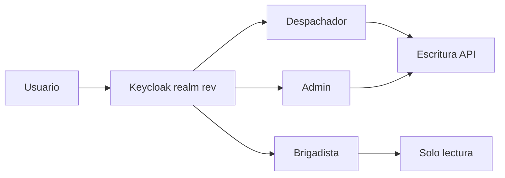

<code>useAuth.ts</code> · usuarios dev: despachador / brigadista / admin

<!--
Notas del expositor:
Seguridad real en Gateway: AuthenticationFilter valida JWT y roles Despachador/Admin/Brigadista. UI oculta botones; Gateway bloquea API.
Pregunta: «¿Por qué Brigadista accede al panel?» → Visibilidad de incidentes activos y recursos; diferencia está en escritura.
-->

---

<!-- _class: diagram-top diagram-focus dense -->

# Seguridad

<h2 class="rev-sub"><svg class="rev-ico" viewBox="0 0 16 16"><rect x="4" y="7" width="8" height="6" rx="1"/><path d="M5.5 7V5a3.5 3.5 0 0 1 5 0v2"/></svg>Perímetro de seguridad y autenticación</h2>

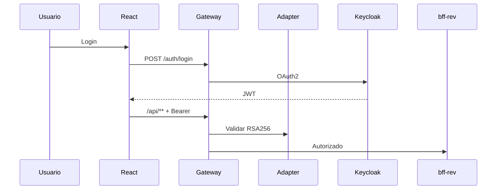

<strong>IAM</strong> Keycloak rev
<strong>Token</strong> JWT RSA256
<strong>Perímetro</strong> AuthenticationFilter
<strong>Público</strong> /api/public/**

Control centralizado en Gateway + adapter — perímetro antes del BFF y microservicios.

<!--
Notas del expositor:
Explicar por qué adapter separado: Gateway no implementa lógica OAuth; adapter concentra login, roles, refresh (refresh aún no en UI).
Pregunta: «¿Es seguro el portal público?» → Solo creación de incidente; misma validación de negocio; sin acceso a datos agregados del despacho.
-->

---

<!-- _class: diagram-top diagram-focus -->

# Continuidad operacional y resiliencia

<h2 class="rev-sub"><svg class="rev-ico" viewBox="0 0 16 16"><path d="M13 3 3 13M3 3l10 10"/><path d="M8 2v2M8 12v2M2 8h2M12 8h2"/></svg>Continuidad operacional ante fallos parciales</h2>

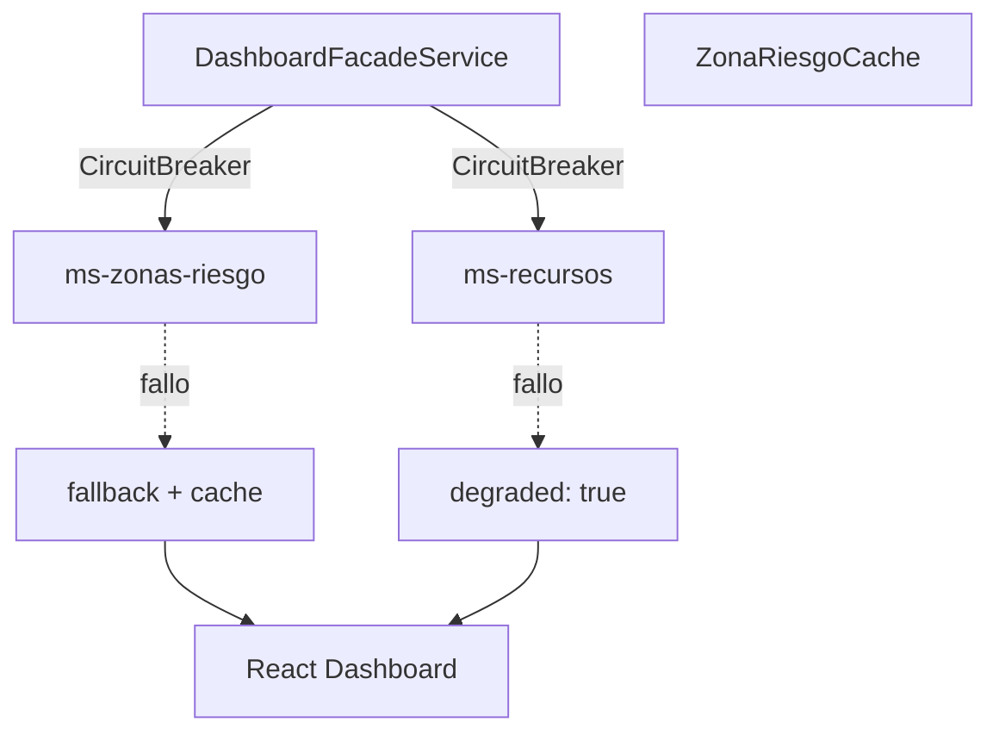

<strong>Ventana</strong> 10 req
<strong>Umbral</strong> 50% fallos
<strong>Cooldown</strong> 5s open
<strong>UX</strong> Información parcial

El despachador mantiene visibilidad de incidentes aunque zonas o recursos fallen temporalmente.

<!--
Notas del expositor:
Demo opcional: detener ms-recursos y refrescar dashboard — KPI «Con avisos» sube, DegradedAlert visible.
Pregunta: «¿Por qué no Hystrix?» → Resilience4j 2.2.0 en parent POM; estándar actual Spring Boot 4.
-->

---

<!-- _class: dense slide-diag-media slide-media-persist -->

# Persistencia y base de datos

<h2 class="rev-sub"><svg class="rev-ico" viewBox="0 0 16 16"><ellipse cx="8" cy="4.5" rx="5" ry="2"/><path d="M3 4.5v4c0 1.1 2.2 2 5 2s5-.9 5-2v-4M3 8.5v4c0 1.1 2.2 2 5 2s5-.9 5-2v-4"/></svg>Persistencia aislada y migraciones versionadas</h2>

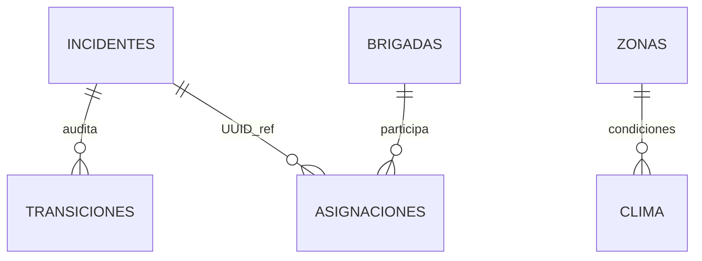

| MS | Base de datos | Motor |
|----|---------------|-------|
| ms-incidentes | `rev_incidentes` | PostgreSQL 16 |
| ms-zonas-riesgo | `rev_zonas` | PostGIS 16 |
| ms-recursos | `rev_recursos` | PostgreSQL 16 |

<code>ddl-auto=validate</code> + Flyway · integridad por servicio, sin FK entre BD.

Datos aislados — integridad por microservicio

---

<!-- _class: dense slide-diag-media -->

# Observabilidad y trazabilidad

<h2 class="rev-sub"><svg class="rev-ico" viewBox="0 0 16 16"><path d="M2 12 5 7l3 3 3-5 3 7"/><path d="M2 14h12"/></svg>Observabilidad operativa y evolución</h2>

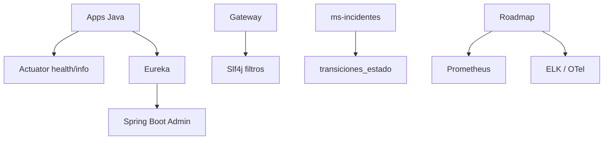

<strong>Actuator</strong> implementado
<strong>SBA</strong> :8099
<strong>Roadmap</strong> Prometheus · ELK

<code>degraded: true</code> conecta resiliencia backend con UX operacional.

---

<!-- _class: dense slide-diag-media slide-media-git -->

# Estrategia Git y trabajo colaborativo

<h2 class="rev-sub"><svg class="rev-ico" viewBox="0 0 16 16"><circle cx="4" cy="4" r="1.5"/><circle cx="4" cy="12" r="1.5"/><circle cx="12" cy="8" r="1.5"/><path d="M4 5.5v5M5.5 4h4a2 2 0 0 1 2 2v0"/></svg>Colaboración, versiones y calidad continua</h2>

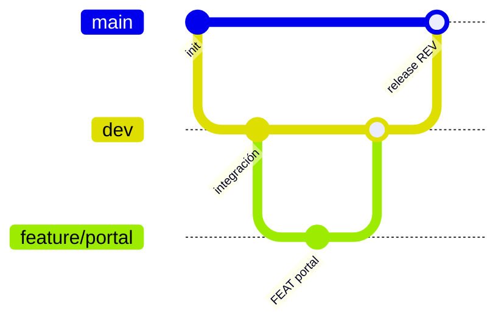

<strong>main</strong> release municipal
<strong>dev</strong> integración diaria
<strong>feature/*</strong> PR → dev

Commits atómicos <code>[ TIPO ]:</code> · CI en GitHub Actions

Trabajo colaborativo — versiones y CI

---

<!-- _class: dense -->

# Trazabilidad técnica

<h2 class="rev-sub"><svg class="rev-ico" viewBox="0 0 16 16"><path d="M3 3h10v10H3z"/><path d="M6 7h4M6 10h6"/><path d="M6 3v2"/></svg>De la arquitectura al código desplegado</h2>

<svg viewBox="0 0 16 16"><path d="M2 4h12v8H2z"/><path d="M5 7h6M5 10h3"/></svg>

PatronesFactory · Adapter · FacadeClases verificables en repo

<svg viewBox="0 0 16 16"><path d="M8 1.5 14 4v4c0 3.5-2.5 6-6 6.5C4.5 14 2 11.5 2 8V4l6-2.5Z"/></svg>

SeguridadJWT + Gateway FilterKeycloak realm rev

<svg viewBox="0 0 16 16"><ellipse cx="8" cy="4.5" rx="5" ry="2"/><path d="M3 4.5v4c0 1.1 2.2 2 5 2s5-.9 5-2v-4"/></svg>

DatosFlyway + PostGIS3 esquemas aislados

<svg viewBox="0 0 16 16"><rect x="2" y="3" width="12" height="9" rx="1"/><path d="M5 13h6"/></svg>

UX operacionalDashboard + PortalExperiencia municipal

<svg viewBox="0 0 16 16"><rect x="2" y="3" width="12" height="10" rx="1.5"/><path d="M5 7h6M5 10h4"/></svg>

InfraDocker Compose12 servicios reproducibles

<svg viewBox="0 0 16 16"><path d="M4 8.5 6.5 11 12 5"/></svg>

CalidadTests + CIFactory · BFF · Zonas

Cada decisión arquitectónica tiene **evidencia ejecutable**: código fuente, despliegue local y comportamiento observable en el dashboard municipal.

---

<!-- _class: dense tech-refined -->

# Tecnologías utilizadas

<h2 class="rev-sub"><svg class="rev-ico" viewBox="0 0 16 16"><path d="M2 5h12v7H2z"/><path d="M5 5V3h6v2"/></svg>Stack tecnológico y criterio de selección</h2>

<svg viewBox="0 0 16 16"><rect x="2" y="3" width="12" height="9" rx="1"/><path d="M5 13h6"/></svg>
Frontend

React 18 + Vite 5 + TSBootstrap 5 · Leaflet

<svg viewBox="0 0 16 16"><path d="M3 3h4v4H3zM9 3h4v4H9zM3 9h4v4H3zM9 9h4v4H9z"/></svg>
Backend

Java 21 · Spring Boot 4Spring Cloud 2025.1

<svg viewBox="0 0 16 16"><ellipse cx="8" cy="4.5" rx="5" ry="2"/><path d="M3 4.5v4c0 1.1 2.2 2 5 2s5-.9 5-2v-4"/></svg>
Datos

PostgreSQL 16 + PostGIS3 bases aisladas · Flyway

<svg viewBox="0 0 16 16"><path d="M8 2v4M8 10v4M2 8h4M10 8h4"/></svg>
Resiliencia

Resilience4j 2.2.0Circuit Breaker en BFF

<svg viewBox="0 0 16 16"><path d="M8 1.5 14 4v4c0 3.5-2.5 6-6 6.5C4.5 14 2 11.5 2 8V4l6-2.5Z"/></svg>
Seguridad

Keycloak 24realm rev · JWT Gateway

<svg viewBox="0 0 16 16"><rect x="2" y="3" width="12" height="10" rx="1.5"/><path d="M5 7h6M5 10h4"/></svg>
Infra

Docker ComposeSBA :8099 · Eureka

Criterio: **madurez enterprise**, ecosistema abierto y despliegue containerizado reproducible.

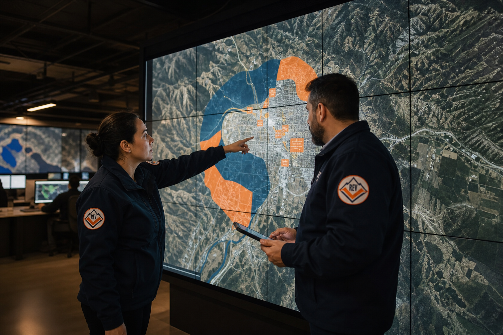
Territorio inteligente — visión geo institucional

<!--
Notas del expositor:
Monorepo Maven rev-parent centraliza versiones Spring Cloud 2025.1.1. Frontend empaquetado NPM en frontend/rev-dashboard/.
Pregunta: «¿Por qué WebClient y no Feign?» → BFF usa WebClient reactivo con @LoadBalanced — documentado en client services.
-->

---

<!-- _class: diagram-top diagram-focus dense -->

# Flujo funcional del sistema

<h2 class="rev-sub"><svg class="rev-ico" viewBox="0 0 16 16"><path d="M2 8h2l2-4 2 8 2-5 2 3h2"/></svg>Flujo operativo de punta a punta</h2>

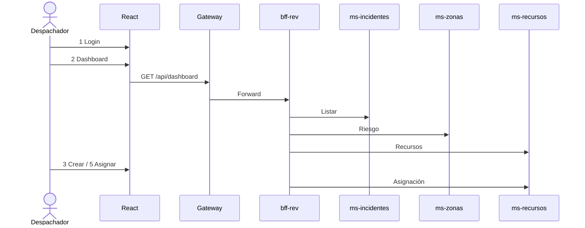

<strong>1</strong> LoginPage
<strong>2</strong> DashboardPage
<strong>3</strong> Modal incidentes
<strong>4</strong> ZonasPage
<strong>5</strong> Asignar recurso

Ciudadano: <code>PortalPage</code> → POST público sin login.

<!--
Notas del expositor:
Recorrer demo en 2 minutos siguiendo la secuencia. Mencionar incidentCreatedTick en UiContext que refresca listas tras crear.
Pregunta: «¿Transición REPORTADO → EN_PROGRESO desde UI?» → No en UI; existe PUT en backend — gap §6.1 informe.
-->

---

<!-- _class: dense visual resultados-refined -->

# Resultados obtenidos

<h2 class="rev-sub"><svg class="rev-ico" viewBox="0 0 16 16"><path d="M8 2l1.8 3.6 4 .6-2.9 2.8.7 4-3.6-1.9-3.6 1.9.7-4L2.2 6.2l4-.6z"/></svg>Impacto técnico, operacional y municipal</h2>

Técnicos

- Monorepo 3 MS + BFF + Gateway + IAM
- 6+ patrones trazables a clases Java
- Circuit Breaker + cache aside operativos
- Arquetipo Maven y tests BFF

Operacionales

- Dashboard unificado multi-fuente
- Portal ciudadano sin fricción
- Mapa de zonas de riesgo en vivo
- Asignación brigada/vehículo desde UI

<strong>Beneficio municipal:</strong> coordinación más rápida, menor carga cognitiva y canal vecinal directo.

Coordinación institucional — centro de operaciones

<!--
Notas del expositor:
Relacionar cada resultado con objetivos slide 3. Honestidad académica: gap UI vs backend es fortaleza (consciencia madurez), no debilidad oculta.
Pregunta: «¿Qué falta?» → Transiciones estado UI, CRUD zonas, refresh token — todos listados en informe §10.3.
-->

---

<!-- _class: dense conclusion-refined -->

# Conclusiones

<h2 class="rev-sub"><svg class="rev-ico" viewBox="0 0 16 16"><path d="M4 8.5 6.5 11 12 5"/></svg>Síntesis ejecutiva para la municipalidad</h2>

<svg viewBox="0 0 16 16"><path d="M3 3h4v4H3zM9 3h4v4H9zM3 9h4v4H3zM9 9h4v4H9z"/></svg>

Solución modernaMicroservicios realesDiscovery · BFF · IAM

<svg viewBox="0 0 16 16"><path d="M8 1.5C5.5 1.5 3.5 3.5 3.5 6c0 4 4.5 8.5 4.5 8.5S12.5 10 12.5 6c0-2.5-2-4.5-4.5-4.5Z"/><circle cx="8" cy="6" r="1.5"/></svg>

Arquitectura adecuadaPicos · territorioPostGIS · JWT · CB

<svg viewBox="0 0 16 16"><path d="M8 2l1.8 3.6 4 .6-2.9 2.8.7 4-3.6-1.9-3.6 1.9.7-4L2.2 6.2l4-.6z"/></svg>

Valor municipalConectividad que salva vidasDespacho + comunidad

| Criterio | Decisión REV |
|----------|--------------|
| Picos de crisis | MS escalables por dominio |
| Datos sensibles | Gateway perimetral + JWT |
| Fallos parciales | degraded + DegradedAlert |

Despacho institucional — misión crítica municipal

<!--
Notas del expositor:
Cierre argumentativo sólido — citar principios SOLID visibles: DIP (WeatherDataPort), OCP (State handlers), SRP (capas MS).
Pregunta: «¿Reescribirían algo?» → Seguridad en MS con @PreAuthorize como defensa en profundidad; observabilidad ELK/Prometheus.
-->

---

<!-- _class: dense slide-diag-media slide-media-roadmap -->

# Evolución futura

<h2 class="rev-sub"><svg class="rev-ico" viewBox="0 0 16 16"><path d="M2 12h12"/><path d="M4 9l3-5 3 3 3-6"/></svg>Hoja de ruta y madurez del producto</h2>

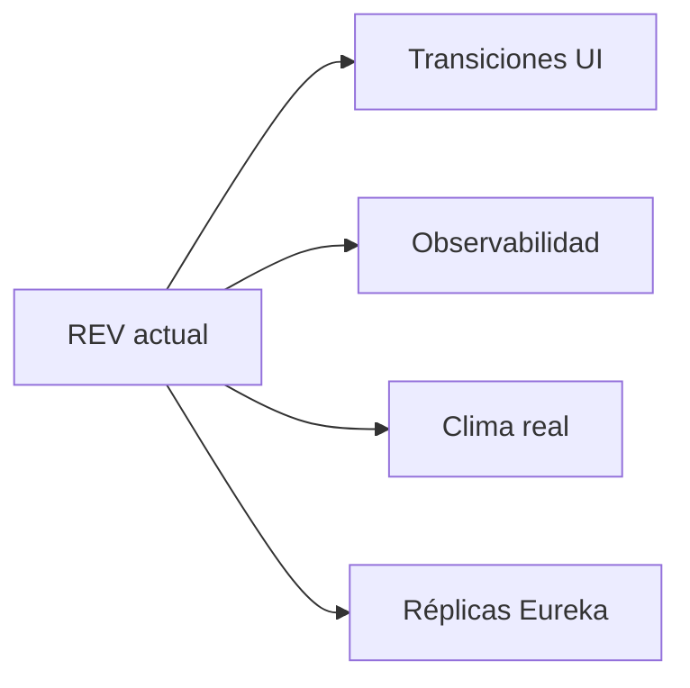

<strong>Alta</strong> transiciones UI · PostGIS
<strong>Media</strong> CRUD zonas/recursos
<strong>Baja</strong> IoT climático real

Escalado horizontal por MS vía Eureka — sin reescribir el frontend municipal.

Visión futura — madurez y escalado

<!--
Notas del expositor:
No prometer features no documentadas. IoT y móvil están en proyección «baja» — visión, no compromiso de entrega.
Pregunta: «¿Microservicios no son overkill?» → Para EVA2 y demo municipal es pedagógico; producción justifica si cargas son heterogéneas — aquí sí (incidentes vs geo vs logística).
-->

---

<!-- _class: closing-premium -->

# Conectividad que salva vidas

Red de Emergencia Valle

<strong>REV</strong> integra despacho, territorio y comunidad en una plataforma cloud-native lista para operar: microservicios Spring Cloud, dashboard React, IAM Keycloak y resiliencia Resilience4j.

DespachoUnificado

CiudadaníaPortal 24/7

SeguridadJWT + Gateway

ResilienciaModo degradado

<svg viewBox="0 0 16 16" fill="none" stroke="currentColor" stroke-width="1.8"><circle cx="8" cy="8" r="6"/><path d="M6 8h4M8 6v4"/></svg>
¿Preguntas?

Municipalidad de Valle del Sol · Modernización de gestión de emergencias

<!--
Notas del expositor:
Agradecer. Tener listo: Eureka :8761, dashboard :5173, IDE con IncidentStateFactory abierto, docker compose ps.
Preguntas difíciles anticipadas: (1) gap UI/backend — honestidad + roadmap §10.3; (2) seguridad solo en Gateway — perimetro + mejora futura; (3) FakeWeather — adapter pattern deliberado.
Duración objetivo total: 15 min defensa EVA2 ≈ 40 s por slide si se condensa; slides densos permiten seleccionar profundidad por pregunta del docente.
-->
