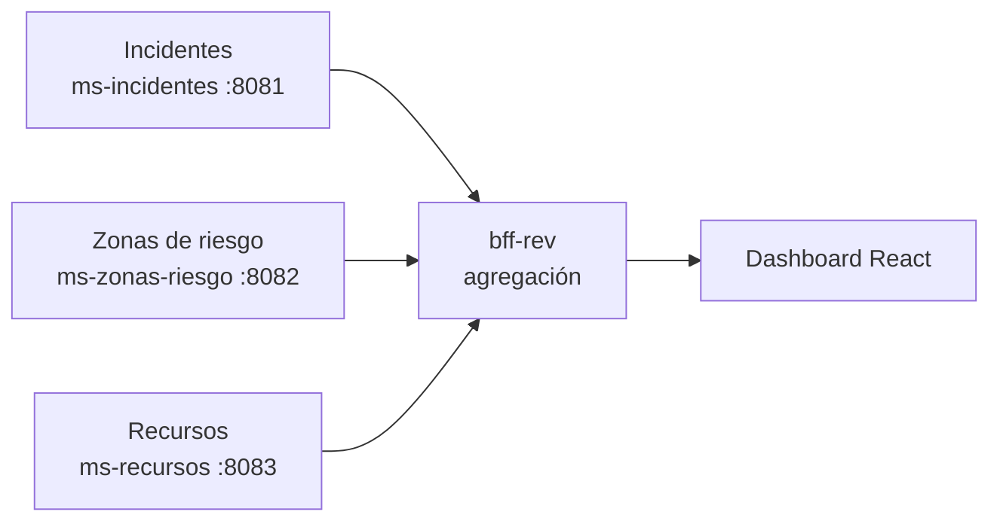
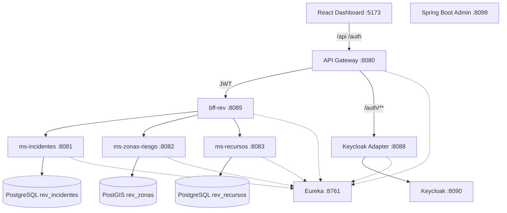
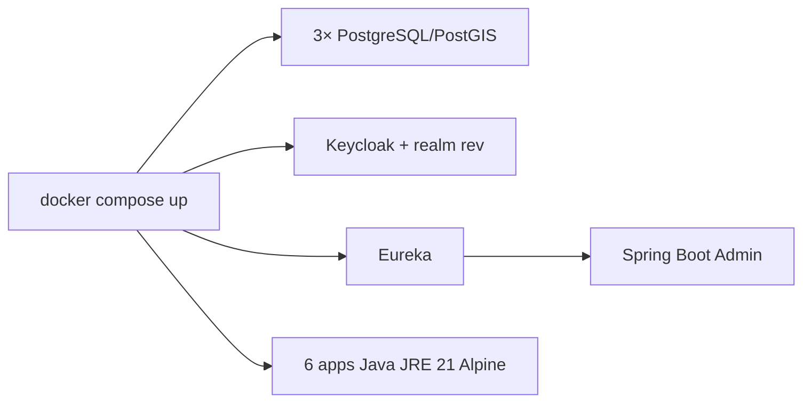
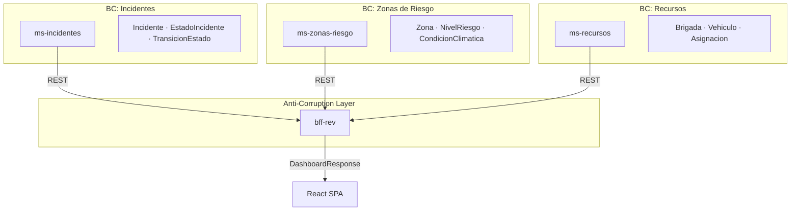
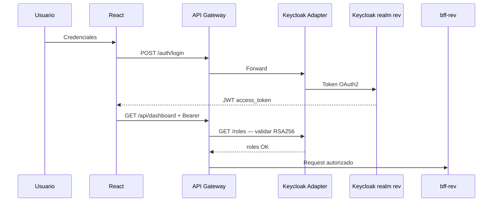
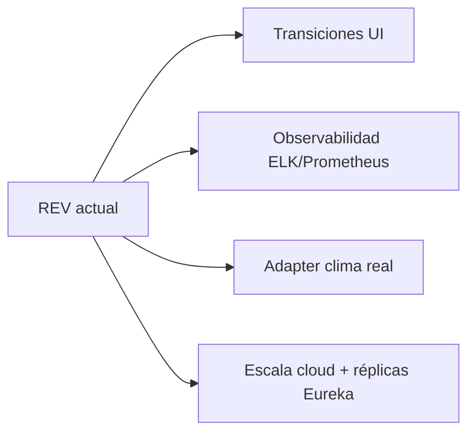

<!-- _class: lead -->

# RED DE EMERGENCIA VALLE

## REV — Municipalidad de Valle del Sol

<p class="tagline">Conectividad que salva vidas</p>

<p class="subtitle">Innovación que resguarda el mañana</p>

**Integrantes:** Nicolás Barra · Giannina Guerrero  
**Asignatura:** DSY1106 — Arquitecturas Modernas, Patrones y Ecosistemas de Microservicios  
**Institución:** Duoc UC · Ingeniería en Informática · **Mayo 2026**

<div class="highlight">

REV es una plataforma de **misión crítica** que integra despacho municipal, brigadas y ciudadanía en un ecosistema de microservicios. Reduce la carga cognitiva del operador, acelera la respuesta ante emergencias y mantiene operatividad parcial cuando un servicio secundario falla.

</div>

<!--
Notas del expositor:
Abrir con el lema institucional. REV no es solo un proyecto académico: responde a un problema real de gestión de emergencias en Valle del Sol. Mencionar que todo lo que verán está verificado en el repositorio rev-fullstack.
Posible pregunta: «¿Por qué microservicios y no un monolito?» → Picos de demanda en crisis, despliegue independiente por dominio, resiliencia perimetral.
-->

---

# Problema identificado

## ¿Por qué es necesario REV?

Los municipios enfrentan **picos impredecibles de demanda** durante incendios forestales, incidentes urbanos y emergencias estructurales. Los sistemas monolíticos tradicionales presentan limitaciones críticas:

| Limitación | Impacto operacional |
|------------|---------------------|
| Acoplamiento de datos y lógica | Un fallo puede tumbar todo el sistema |
| Escalado uniforme | No se prioriza el dominio crítico (incidentes) |
| Interfaces fragmentadas | El despachador pierde tiempo reuniendo información |
| Canales ciudadanos lentos | Demoras en la activación de brigadas |

**Consecuencias para el municipio:** tiempos de respuesta más largos, decisiones con información incompleta, riesgo territorial no evaluado antes de enviar equipos, y menor confianza ciudadana.

<blockquote>

En REV, el problema no es «falta de software», sino **falta de arquitectura adaptable** a la urgencia operacional municipal.

</blockquote>

<!--
Notas del expositor:
Conectar con el informe-sistema-rev.md §1: modelos monolíticos no absorben picos. Ejemplo concreto: durante un incendio forestal en zona metropolitana + reportes costeros simultáneos.
Pregunta probable: «¿Qué pasa si cae un servicio?» → Anticipar slide 16 (Circuit Breaker + degraded).
-->

---

# Objetivos del proyecto

## Alineación objetivo ↔ arquitectura

| Tipo | Objetivo | Componente que lo materializa |
|------|----------|-------------------------------|
| **General** | Plataforma integral de gestión de emergencias municipales | Monorepo: React + Gateway + BFF + 3 MS |
| **Específico 1** | Gestionar ciclo de vida de incidentes con reglas de negocio | `ms-incidentes` + Factory/State |
| **Específico 2** | Evaluar riesgo territorial por coordenadas | `ms-zonas-riesgo` + PostGIS |
| **Específico 3** | Coordinar brigadas, vehículos y herramientas | `ms-recursos` + asignación vía BFF |
| **Específico 4** | Vista unificada para el despachador | `bff-rev` + `DashboardFacadeService` |
| **Específico 5** | Canal ciudadano sin autenticación | Portal `/portal` + `POST /api/public/incidentes` |

<div class="highlight">

Cada objetivo específico corresponde a un **bounded context** con base de datos propia. La orquestación no duplica reglas: el BFF agrega; los MS deciden.

</div>

<!--
Notas del expositor:
Enfatizar trazabilidad objetivo → microservicio. EVA2 exige BFF + 2 MS + arquetipos: REV entrega BFF + 3 MS + arquetipo Maven custom.
Pregunta: «¿Dónde está la transición de estados en UI?» → Backend completo (PUT transicion); UI aún solo visualiza — gap documentado en informe §6.
-->

---

# Visión general de REV

## Propósito, usuarios y dominios

**Propósito:** conectar despacho, terreno y comunidad en una red de respuesta coordinada.

| Actor | Rol en REV |
|-------|------------|
| Despachador | Operador principal — crea incidentes, asigna recursos |
| Brigadista | Consulta operacional — ve estado, riesgo y disponibilidad |
| Administrador | Operación + consola Keycloak |
| Ciudadano | Reporta vía portal público sin cuenta |



Los tres dominios **no comparten base de datos**. El BFF consulta cada MS y entrega un `DashboardResponse` unificado con incidente, riesgo y recursos.

<!--
Notas del expositor:
Explicar interacción: al listar incidentes, el BFF enriquece cada uno con nivel de riesgo (coordenadas → ms-zonas) y recursos asignados (ms-recursos).
Pregunta: «¿Por qué separar recursos de incidentes?» → Diferente ritmo de cambio, equipos distintos, escalado independiente (DDD).
-->

---

# Arquitectura general

## Ecosistema verificado en el monorepo



| Beneficio arquitectónico | Cómo lo aporta REV |
|--------------------------|-------------------|
| Perímetro seguro | Gateway valida JWT antes del BFF |
| Desacoplamiento | MS independientes + BD por servicio |
| Descubrimiento dinámico | Eureka + rutas `lb://` |
| Observabilidad | Actuator + Spring Boot Admin :8099 |

<!--
Notas del expositor:
Recorrer capas: cliente → perímetro → orquestación → dominio → datos. Puerto único de entrada para el frontend: 8080 (Gateway). Vite proxy en dev.
Pregunta: «¿Por qué Keycloak Adapter y no JWT directo en Gateway?» → Separación de responsabilidades; adapter valida RSA256 con JWK del realm rev.
-->

---

# Microservicios implementados

## Responsabilidad, datos y beneficio de la separación

| Microservicio | Puerto | BD | Responsabilidad | Datos principales |
|---------------|--------|-----|-----------------|-------------------|
| **ms-incidentes** | 8081 | `rev_incidentes` | Ciclo de vida del incidente | `Incidente`, `TransicionEstado` |
| **ms-zonas-riesgo** | 8082 | `rev_zonas` (PostGIS) | Territorio y evaluación de riesgo | `Zona`, `CondicionClimatica` |
| **ms-recursos** | 8083 | `rev_recursos` | Logística operacional | `Brigada`, `Vehiculo`, `Herramienta`, `Asignacion` |

<div class="columns">

<div>

**Beneficio ms-incidentes**  
Reglas de transición encapsuladas (Factory + State). Cambios en estados no afectan zonas ni recursos.

</div>

<div>

**Beneficio ms-zonas-riesgo**  
PostGIS + adaptador climático (`WeatherDataPort`). Evolución territorial sin tocar incidentes.

</div>

</div>

**Beneficio ms-recursos:** asignaciones referencian `incidente_id` como UUID lógico — desacoplamiento cross-service sin FK entre bases de datos.

<!--
Notas del expositor:
Cada MS tiene Flyway, Actuator, springdoc-openapi, Eureka client. ddl-auto=validate en los tres.
Pregunta: «¿Cómo se comunican?» → REST síncrono vía WebClient en BFF con nombres Eureka MS-INCIDENTES, etc.
-->

---

# Infraestructura de plataforma

## Componentes transversales del ecosistema

| Componente | Qué hace | Por qué existe | Problema que resuelve |
|------------|----------|----------------|----------------------|
| **Docker Compose** | Orquesta 12 servicios (`docker-compose.yml`) | Entorno reproducible dev/demo | «Funciona en mi máquina» |
| **Eureka :8761** | Registro de instancias | `@EnableDiscoveryClient` en cada app | IPs/puertos dinámicos |
| **Keycloak :8090** | IAM — realm `rev` | Roles Despachador, Brigadista, Admin | Identidad centralizada |
| **Spring Boot Admin :8099** | UI de salud de servicios | Descubre vía Eureka | Visibilidad operacional |



**Arranque documentado:** `.\scripts\dev-up.ps1 -DockerApps` — perfil `apps` levanta el stack completo.

<!--
Notas del expositor:
Mencionar orden de dependencias en compose: BD/Keycloak → Eureka → SBA → MS → BFF → Gateway.
Pregunta: «¿Por qué JRE Alpine 21?» → Imágenes livianas, alineado a sostenibilidad documentada en informe §2.2.
-->

---

# Patrones arquitectónicos

## De la teoría a la implementación REV

| Patrón | Definición breve | Aplicación en REV | Beneficio |
|--------|------------------|-------------------|-----------|
| **Microservices** | Servicios autónomos por capacidad de negocio | 3 MS + BFF + Gateway | Escalado y despliegue independiente |
| **API Gateway** | Punto de entrada único | `api-gateway` :8080 | Enrutamiento + seguridad centralizada |
| **BFF** | API adaptada al cliente | `bff-rev` — `DashboardFacadeService` | Una llamada para el dashboard React |
| **Service Discovery** | Localización dinámica | Eureka + `lb://BFF-REV` | Sin hardcodear hosts |
| **Circuit Breaker** | Aislar fallos en cascada | Resilience4j en BFF | Despacho sigue operando parcialmente |
| **Database per Service** | BD exclusiva por MS | 3 instancias PostgreSQL/PostGIS | Autonomía de datos |

<div class="highlight">

El patrón **Cache-aside** complementa el Circuit Breaker: `ZonaRiesgoCache` sirve datos de riesgo cuando `ms-zonas-riesgo` no responde.

</div>

<!--
Notas del expositor:
Diferenciar patrón arquitectónico (estilo del sistema) vs patrón de diseño (clase Java). Gateway Filter = AuthenticationFilter.java.
Pregunta: «¿Endpoint público sin JWT?» → /api/public/** para portal ciudadano; ruta sin AuthenticationFilter en application.yml.
-->

---

# Patrones de diseño implementados

## Trazabilidad clase → problema → beneficio

| Patrón | Problema | Implementación REV | Beneficio |
|--------|----------|-------------------|-----------|
| **Factory Method** | Seleccionar handler según estado | `IncidentStateFactory` | Registro automático vía Spring `List<IncidentStateHandler>` |
| **State** | Reglas distintas por estado | `ReportadoState`, `EnProgresoState`, `ControladoState`, `EscaladoState` | OCP — nuevos estados sin tocar servicio |
| **Adapter** | Fuente climática intercambiable | `WeatherDataPort` ← `FakeWeatherAdapter` | DIP — `ZonaService` no conoce la implementación |
| **Facade** | Cliente no debe orquestar 3 MS | `DashboardFacadeService`, `OperacionesFacadeService` | Contrato único para React |
| **Repository** | Desacoplar persistencia | `IncidenteRepository`, `ZonaRepository`, `BrigadaRepository`… | Spring Data JPA |
| **Builder** | DTOs compuestos legibles | `@Builder` en `DashboardResponse`, `WeatherDataDto` | Sin constructores telescópicos |

**Regla de negocio verificada:** `ReportadoState` exige georreferenciación para pasar a `EN_PROGRESO` (`requireGeo` en `BaseIncidentState`).

**Tests:** `IncidentStateFactoryTest`, `ZonaServiceTest`, tests BFF con fallbacks.

<!--
Notas del expositor:
Mostrar en IDE IncidentStateFactory si hay proyector. Enfatizar doble patrón Factory+State en ms-incidentes.
Pregunta: «¿FakeWeatherAdapter es un hack?» → No; es adaptador consciente para demo; puerto permite IoT futuro (documentado §10.3 informe).
-->

---

# Arquetipos utilizados

## Estructura reutilizable del monorepo

### Arquetipo de microservicio Spring Cloud

Capas verificadas en cada MS de negocio:

`Controller → Service → Repository → Entity/DTO → Exception`

| Capa | Ejemplo ms-incidentes |
|------|----------------------|
| Controller | `IncidenteController` |
| Service | `IncidenteService` |
| Repository | `IncidenteRepository` |
| Entity | `Incidente`, `TransicionEstado` |

### Arquetipo Maven propio

**Ruta:** `archetypes/rev-microservice-archetype/`  
Genera MS con `@EnableDiscoveryClient`, `application.properties` y metadata Maven alineada al parent `rev-parent`.

### Arquetipo hexagonal (parcial)

Solo en **ms-zonas-riesgo:** `port/WeatherDataPort` + `adapter/FakeWeatherAdapter`.

<div class="highlight">

**Justificación:** estandarizar nuevos servicios del municipio (p. ej. `ms-notificaciones`) sin reconfigurar Eureka, Actuator ni Flyway desde cero.

</div>

<!--
Notas del expositor:
Los 3 MS actuales fueron implementados manualmente pero replican el arquetipo. Comando mvn archetype:generate documentado en patrones-y-arquitectura-rev.md §3.2.
Pregunta EVA2: «¿Cuántos arquetipos Maven?» → Uno custom en archetypes/; estructura de capas como arquetipo organizacional.
-->

---

# DDD y Bounded Contexts

## Tres subdominios = tres microservicios autónomos



| Ventaja del desacoplamiento | Ejemplo en REV |
|----------------------------|----------------|
| Lenguaje ubicuo por contexto | «Estado» solo en incidentes; «Nivel» en zonas |
| Evolución independiente | CRUD zonas sin migrar tabla incidentes |
| Equipos paralelos | Squad territorial vs squad logístico |
| Fallas contenidas | Circuit Breaker por dependencia en BFF |

El BFF traduce tres modelos de dominio a un contrato UI: `{ incidente, zonaRiesgo, recursos, degraded }`.

<!--
Notas del expositor:
Asignacion.incidente_id es UUID sin FK cross-DB — integración eventual, típica en microservicios.
Pregunta: «¿Es DDD completo?» → Bounded contexts sí; agregados simplificados; mejora futura: carpeta domain/ explícita (patrones doc §10).
-->

---

# Frontend y experiencia de usuario

## Módulos operativos verificados en UI

| Módulo | Ruta | Capacidad real |
|--------|------|----------------|
| **Inicio** | `/inicio` | KPIs, panorama por estado, prioridades, showcase REV |
| **Despacho** | `/` | Tabla activos, tiles zonas/recursos, alertas |
| **Incidentes** | `/incidentes` | Filtros, vista cards/tabla, rail distribución |
| **Zonas** | `/zonas` | Mapa Leaflet + listado (solo lectura) |
| **Recursos** | `/recursos` | Brigadas, vehículos, herramientas (solo lectura) |
| **Portal** | `/portal` | Reporte ciudadano sin JWT |


**Principios UX aplicados:**
- **Una llamada al BFF** — `fetchDashboard()`; el cliente no orquesta MS
- **ModuleHub** — KPIs + toolbar + rail en incidentes y recursos
- **StateView** — loading / error / empty unificados
- **Lenguaje operacional** — «Con avisos», «Información parcial» (no jerga técnica)

<!--
Notas del expositor:
Demo en vivo recomendada: Inicio → Despacho → Incidentes con filtro alto riesgo → Zonas mapa → Portal reporte.
Pregunta: «¿Brigadista puede crear incidentes?» → No; canManageIncidents solo Admin/Despachador (useAuth.ts).
-->

---

# Diseño UX/UI y Design System

## Sistema visual monocromático institucional

| Token | Valor | Uso |
|-------|-------|-----|
| `--rev-bg` | `#07111F` | Fondo principal |
| `--rev-bg-secondary` | `#0B172A` | Paneles |
| `--rev-orange` | `#F97316` | Acento, CTAs, alertas |
| `--rev-text-secondary` | `#A7B4C7` | Texto de apoyo |
| Tipografía | Inter, Segoe UI | Legibilidad en turnos largos |

**Componentes reutilizables:** `RevLogo`, `KpiCard`, `IncidentCard`, `RiskBadge`, `ModuleHub`, `DegradedAlert`, `WeatherChip`, `OperationalAmbient`.

**Justificación de diseño:**
- Paleta oscura reduce fatiga visual en sala de despacho
- Naranja único acento → jerarquía clara sin semáforos multicolor
- Glass cards + fondo ambiental → sensación de «consola operacional» sin distraer
- Bootstrap 5 + tokens CSS → consistencia sin reinventar grid

**Hojas por módulo:** `incidentes.css`, `zonas.css`, `recursos.css`, `portal.css`, `inicio.css` — coherencia con variación por dominio.

<!--
Notas del expositor:
Referenciar theme.css como single source of truth. BootSplash y OperationalAmbient refuerzan identidad REV al arranque.
Pregunta: «¿Accesibilidad?» → Contraste alto, aria-labels en navegación, roles en tabs recursos; weather vía Open-Meteo sin API key.
-->

---

# Roles y permisos

## Matriz verificada — realm Keycloak `rev`

| Pantalla / acción | Despachador | Brigadista | Admin |
|-------------------|:-----------:|:----------:|:-----:|
| Login y navegación completa | ✓ | ✓ | ✓ |
| Ver dashboard, incidentes, zonas, recursos | ✓ | ✓ | ✓ |
| **Crear incidente** / modal registrar | ✓ | ✗ | ✓ |
| **Asignar recurso** en detalle | ✓ | ✗ | ✓ |
| Enlace consola Keycloak (sidebar) | ✗ | ✗ | ✓ |
| Portal ciudadano (público) | ✓ | ✓ | ✓ |

**Lógica frontend:** `useAuth.ts` → `canManageIncidents = roles.includes('Admin') || roles.includes('Despachador')`

**Usuarios dev:** `despachador` / `brigadista` / `admin` — clave `rev123` (importados en `docker/keycloak/rev-realm.json`)

<div class="highlight">

El **Brigadista** consulta la misma información operacional pero no ejecuta acciones que modifican el estado del sistema — coherente con su rol en terreno.

</div>

<!--
Notas del expositor:
Seguridad real en Gateway: AuthenticationFilter valida JWT y roles Despachador/Admin/Brigadista. UI oculta botones; Gateway bloquea API.
Pregunta: «¿Por qué Brigadista accede al panel?» → Visibilidad de incidentes activos y recursos; diferencia está en escritura.
-->

---

# Seguridad

## ¿Cómo protege REV la información?



| Capa | Mecanismo |
|------|-----------|
| Identidad | Keycloak realm `rev`, cliente `rev-frontend` |
| Token | JWT RSA256 — JWK Set en `JwtService.java` |
| Perímetro | `AuthenticationFilter` en rutas `/api/**` |
| Público controlado | `/api/public/**` sin JWT — solo POST incidente portal |
| Datos | UUID como identidad de incidente; sin secretos en frontend |

**Nota técnica:** los MS de negocio no usan `@PreAuthorize`; el control de acceso está en Gateway + adapter (decisión documentada).

<!--
Notas del expositor:
Explicar por qué adapter separado: Gateway no implementa lógica OAuth; adapter concentra login, roles, refresh (refresh aún no en UI).
Pregunta: «¿Es seguro el portal público?» → Solo creación de incidente; misma validación de negocio; sin acceso a datos agregados del despacho.
-->

---

# Continuidad operacional y resiliencia

## ¿Qué ocurre cuando un servicio falla?

```mermaid
flowchart TD
    BFF[DashboardFacadeService]
    ZR[ms-zonas-riesgo]
    RC[ms-recursos]
    CACHE[ZonaRiesgoCache]
    UI[React Dashboard]

    BFF -->|@CircuitBreaker zonasRiesgo| ZR
    BFF -->|@CircuitBreaker recursos| RC
    ZR -.->|fallo| FB1[zonasRiesgoFallback]
    RC -.->|fallo| FB2[recursosFallback]
    FB1 --> CACHE
    FB2 --> DEG[degraded: true]
    DEG --> UI
    UI --> A[DegradedAlert / KPI Con avisos]
```

| Config Resilience4j | Valor |
|---------------------|-------|
| `slidingWindowSize` | 10 |
| `failureRateThreshold` | 50% |
| `waitDurationInOpenState` | 5s |

**Experiencia usuario:** mensaje «Información parcial» — el despachador **sigue trabajando** con incidentes visibles aunque falte riesgo o recursos actualizados.

<!--
Notas del expositor:
Demo opcional: detener ms-recursos y refrescar dashboard — KPI «Con avisos» sube, DegradedAlert visible.
Pregunta: «¿Por qué no Hystrix?» → Resilience4j 2.2.0 en parent POM; estándar actual Spring Boot 4.
-->

---

# Tecnologías utilizadas

## Stack verificado y justificación

| Capa | Tecnología | Versión / detalle | Por qué se eligió |
|------|------------|-------------------|-------------------|
| **Frontend** | React + Vite + TypeScript | React 18, Vite 5 | SPA rápida, HMR, build optimizado |
| **UI** | Bootstrap 5 + Bootstrap Icons | — | Componentes accesibles, grid probado |
| **Mapas** | Leaflet + React-Leaflet | ZonasPage | Visualización territorial sin licencias |
| **Backend** | Java + Spring Boot + Spring Cloud | Java 21, Boot 4.0.x | Estándar enterprise, ecosistema maduro |
| **Resiliencia** | Resilience4j | 2.2.0 | Circuit Breaker declarativo en BFF |
| **BD** | PostgreSQL 16 + PostGIS | 3 BD separadas | Database per service; capacidad geo |
| **Migraciones** | Flyway | Por MS | Esquema versionado, ddl-auto=validate |
| **Infra** | Docker Compose | 12 servicios | Reproducibilidad dev/EVA2 |
| **Discovery** | Netflix Eureka | :8761 | Load balancing `lb://` |
| **Seguridad** | Keycloak 24 | realm `rev` | IAM estándar, roles municipales |
| **Monitor** | Spring Boot Admin | :8099 | Salud centralizada vía Eureka |
| **Calidad** | JUnit 5 + JaCoCo | Parent POM | Cobertura en flujos críticos |

<!--
Notas del expositor:
Monorepo Maven rev-parent centraliza versiones Spring Cloud 2025.1.1. Frontend empaquetado NPM en frontend/rev-dashboard/.
Pregunta: «¿Por qué WebClient y no Feign?» → BFF usa WebClient reactivo con @LoadBalanced — documentado en client services.
-->

---

# Flujo funcional del sistema

## Recorrido operativo de punta a punta

```mermaid
sequenceDiagram
    actor Op as Despachador
    participant FE as React
    participant GW as Gateway
    participant BFF as bff-rev
    participant MI as ms-incidentes
    participant MZ as ms-zonas-riesgo
    participant MR as ms-recursos

    Op->>FE: 1. Login /auth/login
    Op->>FE: 2. Dashboard GET /api/dashboard/incidentes
    FE->>GW->>BFF->>MI: Listar + agregar
    BFF->>MZ: Riesgo por coordenadas
    BFF->>MR: Recursos por incidente
    Op->>FE: 3. Nuevo incidente POST /api/incidentes
    Op->>FE: 4. Zonas GET /api/zonas — mapa
    Op->>FE: 5. Asignar POST /api/recursos/asignar
    BFF->>MR: Crear asignación
```

| Paso | Acción | Endpoint / pantalla |
|------|--------|---------------------|
| 1 | Autenticación | `LoginPage` → JWT en localStorage |
| 2 | Visión del día | `DashboardPage` / `InicioPage` |
| 3 | Registrar emergencia | Modal en `IncidentesPage` |
| 4 | Validar territorio | `ZonasPage` — mapa Leaflet |
| 5 | Despachar brigada | `AssignResourceModal` en detalle |

**Flujo ciudadano paralelo:** `PortalPage` → `POST /api/public/incidentes` (sin paso 1).

<!--
Notas del expositor:
Recorrer demo en 2 minutos siguiendo la secuencia. Mencionar incidentCreatedTick en UiContext que refresca listas tras crear.
Pregunta: «¿Transición REPORTADO → EN_PROGRESO desde UI?» → No en UI; existe PUT en backend — gap §6.1 informe.
-->

---

# Resultados obtenidos

## Técnicos · Operacionales · Municipales

<div class="columns">

<div>

### Resultados técnicos
- Monorepo con 3 MS + BFF + Gateway + IAM
- 6+ patrones de diseño trazables a clases
- Circuit Breaker + cache aside operativos
- Arquetipo Maven custom documentado
- Tests en Factory, zonas y fallbacks BFF
- CI en GitHub Actions (`main`, `dev`)

</div>

<div>

### Resultados operacionales
- Dashboard unificado multi-fuente
- Portal ciudadano sin fricción
- Mapa de zonas de riesgo
- Asignación brigada/vehículo desde UI
- KPIs: activos, alto riesgo, con avisos
- Modo información parcial ante fallos

</div>

</div>

### Beneficios para el municipio
Coordinación más rápida · Menor carga cognitiva del despachador · Canal vecinal directo · Base escalable para nuevos servicios (notificaciones, IoT climático) **documentados en proyecciones §10.3**

<!--
Notas del expositor:
Relacionar cada resultado con objetivos slide 3. Honestidad académica: gap UI vs backend es fortaleza (consciencia madurez), no debilidad oculta.
Pregunta: «¿Qué falta?» → Transiciones estado UI, CRUD zonas, refresh token — todos listados en informe §10.3.
-->

---

# Conclusiones

## Respuestas técnicas de cierre

### ¿Por qué REV es una solución moderna?
Porque implementa **microservicios reales** con discovery, BFF, resiliencia, IAM y frontend desacoplado — no una simulación monolítica con etiquetas.

### ¿Por qué la arquitectura seleccionada es adecuada?
| Criterio municipal | Decisión REV |
|------------------|--------------|
| Picos de crisis | MS escalables por dominio |
| Datos sensibles | JWT + Gateway perimetral |
| Territorio | PostGIS + evaluación por coords |
| Ciudadanía | API pública acotada |
| Fallos parciales | Circuit Breaker + degraded |

### ¿Qué valor aporta al contexto municipal?
**Conectividad que salva vidas:** une despacho, terreno y comunidad con información accionable en una sola interfaz, manteniendo operación parcial bajo estrés del sistema.

<!--
Notas del expositor:
Cierre argumentativo sólido — citar principios SOLID visibles: DIP (WeatherDataPort), OCP (State handlers), SRP (capas MS).
Pregunta: «¿Reescribirían algo?» → Seguridad en MS con @PreAuthorize como defensa en profundidad; observabilidad ELK/Prometheus.
-->

---

# Evolución futura

## Solo mejoras documentadas en el proyecto (informe §10.3)

| Prioridad | Evolución | Fundamento en código/doc |
|-----------|-----------|--------------------------|
| **Alta** | UI de transiciones de estado | `PUT /incidentes/{id}/transicion` ya existe |
| **Alta** | Mapa interactivo PostGIS avanzado | PostGIS habilitado; UI usa bounding boxes |
| **Media** | CRUD zonas y recursos desde Admin | Endpoints POST/PUT en MS sin UI |
| **Media** | Desasignación de recursos | `DELETE /recursos/asignar/{id}` sin UI |
| **Media** | Logout/refresh token real | Adapter tiene `/refresh`; UI borra token local |
| **Media** | Seguimiento reporte ciudadano | Extensión portal público |
| **Baja** | App móvil brigadistas | Proyección informe |
| **Baja** | IoT climático real | Sustituir `FakeWeatherAdapter` |



**Escalabilidad:** cada MS puede replicarse detrás de Eureka sin reescribir el frontend.

<!--
Notas del expositor:
No prometer features no documentadas. IoT y móvil están en proyección «baja» — visión, no compromiso de entrega.
Pregunta: «¿Microservicios no son overkill?» → Para EVA2 y demo municipal es pedagógico; producción justifica si cargas son heterogéneas — aquí sí (incidentes vs geo vs logística).
-->

---

<!-- _class: lead -->

# Conectividad que salva vidas

## Resumen ejecutivo final

**REV** entrega una plataforma de emergencias municipal basada en **microservicios Spring Cloud**, **React**, **Keycloak** y **resiliencia Resilience4j**, con patrones Factory, State, Adapter, Facade y Repository verificados en código.

| Entregable académico | Estado |
|---------------------|--------|
| Componente NPM frontend | `frontend/rev-dashboard/` |
| BFF + 3 microservicios | `bff-rev` + 3 MS |
| Arquetipo Maven | `rev-microservice-archetype/` |
| Documentación | `docs/informe-sistema-rev.md`, `patrones-y-arquitectura-rev.md` |
| Estrategia Git | `main` + `dev` — CONTRIBUTING.md |

---

### ¿Preguntas?

**Red de Emergencia Valle** · Duoc UC · DSY1106 · Mayo 2026

<p class="subtitle">Repositorio: rev-fullstack · Municipalidad de Valle del Sol</p>

<!--
Notas del expositor:
Agradecer. Tener listo: Eureka :8761, dashboard :5173, IDE con IncidentStateFactory abierto, docker compose ps.
Preguntas difíciles anticipadas: (1) gap UI/backend — honestidad + roadmap §10.3; (2) seguridad solo en Gateway — perimetro + mejora futura; (3) FakeWeather — adapter pattern deliberado.
Duración objetivo total: 15 min defensa EVA2 ≈ 40 s por slide si se condensa; slides densos permiten seleccionar profundidad por pregunta del docente.
-->
